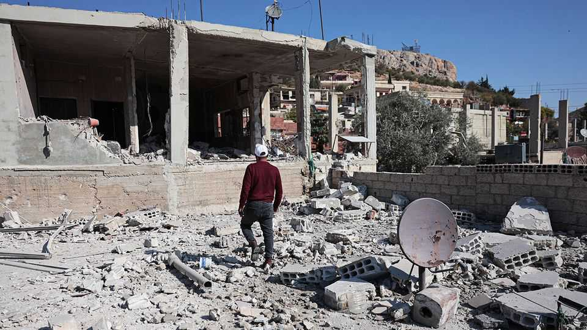
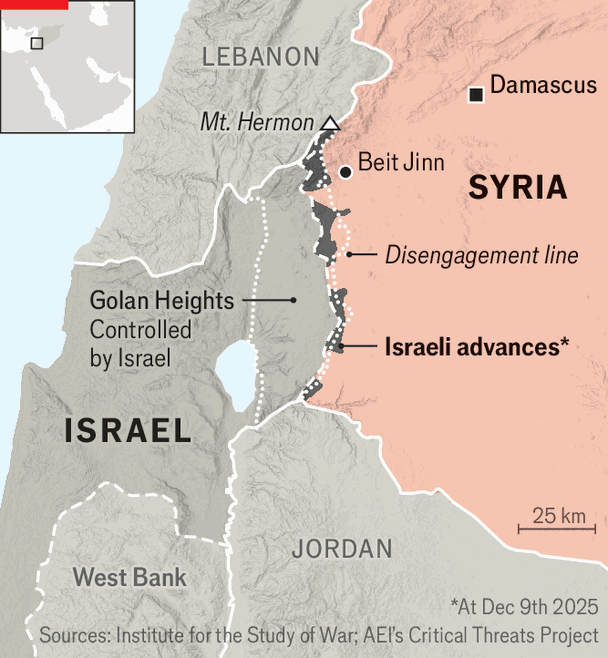

Middle East & Africa | A dangerous border
Israel refuses to withdraw from Syria
That may create more enemies for the Jewish state
December 11th 2025

Within hours of Bashar al-Assad, the Syrian dictator, fleeing Damascus in December last year, Israeli troops were on the move. They occupied territory in southern Syria stretching from the highest peak of Mount Hermon to the border triangle between Israel, Syria and Jordan at the mouth of the Jordan Valley. Israel wanted to fill what it feared could quickly become a chaotic power- vacuum and prevent any sudden attacks on Israelis living in the Golan

Heights. They have dug a deep trench on the Golan which is supposed to stop marauders on pickup trucks, like those who came from Gaza on October 7th. Israel is also building links with Druze villages worried about their future under Syria’s new government. Israel has its own Druze minority, many of whose members are high up in the Israel Defence Forces (idf) and have relatives in Syria.

A year on, the idf is still there. Israel has built ten fortified outposts inside Syria which an Israeli officer says are “designed to last for years to come”. It

has appointed civilian liaisons with local (mainly Druze) villages; in some it is providing medical and other services. And yet the idf is also conducting raids on some of those villages. On November 28th soldiers arrived in one, Beit Jinn, to arrest two members of a Lebanese Islamist militia which Israel claims was planning terror attacks. A gunfight ensued and 20 locals were killed.

Israel insists that hostile militias operate in the area. “There’s an enemy which is constantly changing shape on the other side and we don’t always know how to read it,” says an Israeli officer serving there.

Israel is still suspicious of the intentions and capabilities of Ahmed al-Sharaa’s government in Damascus. “We’re seeing Turkey operating freely in northern Syria and Iran and Hizbullah trying to re-establish their smuggling routes to Lebanon,” says an Israeli intelligence analyst.

In November Mr Netanyahu visited idf troops inside Syria. “This is a mission that can develop at any moment,” he said ominously. It was a warning to Mr Sharaa, who called for Israel to withdraw during his recent meeting with Donald Trump.

The Trump administration is urging Israel to engage with Mr Sharaa. It is trying to broker a security deal under which Israel would withdraw to the “disengagement” line on the Golan which Israel and Syria agreed in 1974. On December 1st Mr Trump posted online: “It is very important that Israel maintain a strong and true dialogue with Syria, and that nothing takes place that will interfere with Syria’s evolution into a prosperous state.”

“Netanyahu is missing a historic opportunity here to establish new security arrangements from a position of strength,” says an Israeli former minister. But with elections looming and the trauma of October 7th lingering, Mr Netanyahu seems unwilling to relinquish Israel’s buffer zone.

“For now there doesn’t seem to be a real threat to Israel on the Golan and Sharaa’s government is trying to rein in militias,” says Carmit Valensi, head of the Syria programme at the Institute for National Security Studies in Tel Aviv. But its actions there “could create real enemies for Israel and become a self- fulfilling prophecy”. ■

Sign up to the Middle East Dispatch, a weekly newsletter that keeps you in the loop on a fascinating, complex and consequential part of the world.

This article was downloaded by zlibrary from https://www.economist.com//middle-east- and-africa/2025/12/11/israel-refuses-to-withdraw-from-syria

Europe

Russia is not as resilient as it wants you to think Albania is trying to charm its way into the EU Talks stall between Turkey’s government and the Kurds Europe bans Russia’s gas exports, but still buys its gas-based fertiliser Ukraine struggles to cope with America’s destructive peace plans Ukraine’s trains, the country’s lifeline, have money problems