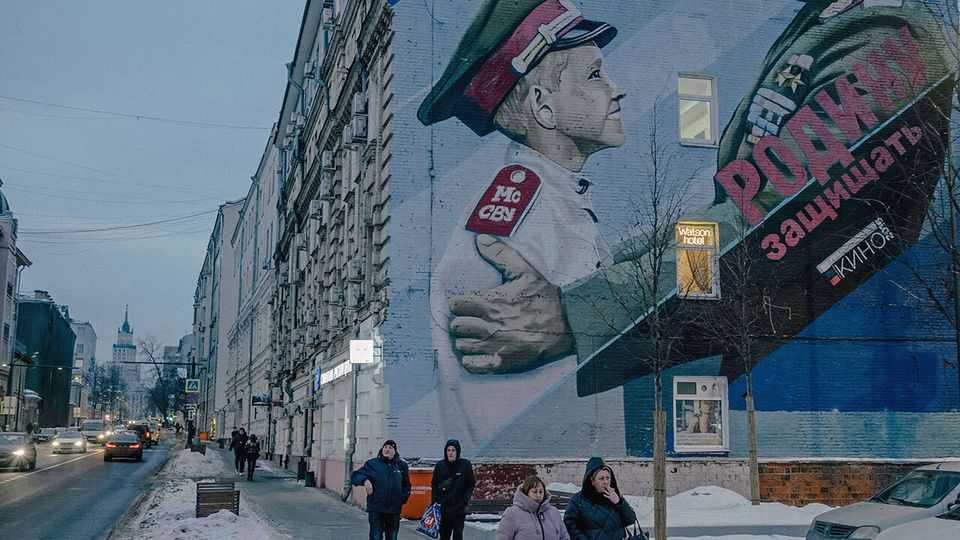

Europe | Biting the bullet
Russia is not as resilient as it wants you to think
But Vladimir Putin will keep fighting, and claiming victory prematurely
December 11th 2025

Listen to Vladimir Putin, and one would think Russia is marching to victory in Ukraine and overcoming whatever minor economic challenges it faces, thanks to the support of its patriotic people. On November 30th state television showed Mr Putin visiting a command post wearing military fatigues, receiving reports on the latest offensive. “The Russian troops are advancing virtually everywhere,” Mr Putin told his generals. Two days later he told an investment conference that “our country and our economy are successfully tackling” any problems. Russia, he added, was ready for a war with Europe.

In reality, Russia’s situation is far less comfortable. Its army’s progress is bloody and slow. Its economic problems are mounting. The public mood on the war has soured, an oddly important factor in Mr Putin’s dictatorship, which relies on the perception of massive support to ensure obedience. Mr Putin’s propaganda and his relentless drone attacks are largely aimed at convincing Europe and America that supporting Ukraine is futile. Recent statements from Donald Trump suggest this is working. In fact he has failed even to conquer Donbas in four years of trying. And for Russians, the gap between image and reality is widening.

On the battlefield, Russia sends small groups to infiltrate Ukrainian positions and make videos before they are destroyed. The actual advances, judging by open-source intelligence and Russian military bloggers, are much less impressive. Ukrainian forces, bleeding and short of men, still hold positions in Pokrovsk, a front-line city that Russia claimed to have taken weeks ago.

Russia’s economy is not buckling, but it is starting to show strains. Next year will be the hardest since Russia’s full-scale invasion. Over the past year oil and gas revenues have fallen by 22%. The economic momentum from a vast increase in military spending has stalled. The budget deficit is nearing 3% of GDP. That is modest by European standards, but Russia receives little foreign investment and cannot borrow on international markets, says Alexandra Prokopenko of the Carnegie Russia Eurasia Centre, a Berlin-based think-tank. To finance Mr Putin’s war the government is forced to borrow at home, which can be inflationary, and to raise taxes.

The Kremlin spends half its budget on the armed forces, the military-industrial complex, domestic security and debt service. War makes the economy busier but poorer, Ms Prokopenko argues. It sustains jobs and industrial activity, but produces few lasting assets or productivity gains.

Higher taxes further burden the civilian economy, already suffering from double-digit interest rates and labour shortages. Tank factories are working overtime while car producers cut shifts. The industrial and military sectors have plateaued. The government has resorted to extracting money from its own population, which breaks the political deal that Mr Putin implicitly offered the Russian people.

At a conference in October organised by Re:Russia, a think-tank in Vienna, experts within Russia and outside described changes in both the economy and public opinion over the past year. Oleg Vyugin, a former deputy head of Russia’s central bank, said the Kremlin was initially able to raise defence spending, maintain living standards and financially reward those engaged in the war. But it can no longer continue the war without inflicting pain.

Russians are starting to notice. In a recent survey, says Vladimir Zvonovsky, a sociologist in the Russian city of Samara, the number of those saying their

well-being was deteriorating was triple those saying it was improving. It is now at the highest level since the start of the war.

This does not mean Mr Putin is looking for peace. But it shifts the terms on which he can continue the war. The share of war zealots never exceeded 25% of the Russian population, nor did that of active opponents, says Elena Koneva, a sociologist; the silent majority thinks about daily life, not ideology. Opinion polls may count them as supporters, but that support is superficial, says Sam Greene, a Russia expert at King’s College London: “Saying that you support the war is the best way of preventing the war impinging on your life.” They express not a personal opinion, but whatever they think is the dominant one in their circle.

Yet the perception of what is dominant has flipped. In May 2023 Russians thought by a margin of 57% to 39% that most people in their inner social circle supported the war. In October 2025, in contrast, they thought by a margin of 55% to 45% that those in their inner circle mostly opposed the war or were evenly divided. Unwillingness to take part in the war is now more socially acceptable than enthusiasm, says Kirill Rogov, the founder of Re:Russia.

The change is even more clear in attitudes towards veterans of the “special military operation”. Official propaganda portrays them as war heroes. But a

recent survey by Levada, an independent pollster, found that only 40% of Russians see them that way; the majority see them as threatening, or as victims. The war, which by January will have lasted longer than Russia’s battle against the Nazis in 1941-45, inspires neither pride nor optimism.

Instead, frustration is growing. In a recent experiment pollsters divided respondents into two random groups, asking one what they would like and the other what they expect. Fully 88% of the first group said they wished for the war to end and for the focus to shift to social and economic issues. But only 47% expected Mr Putin to achieve that.

The Kremlin, which constantly conducts its own polls, is well aware of such sentiments. It is also aware that ending the war or reducing military spending will not solve Russia’s economic problems. Because the economy has become dependent on military production, peace is likely in the short term to bring new troubles, along with traumatised soldiers returning home. Rather than ending the war, Mr Putin is doubling down, which requires ever greater ideological control and repression. ■

To stay on top of the biggest European stories, sign up to Café Europa, our weekly subscriber-only newsletter.

This article was downloaded by zlibrary from https://www.economist.com//europe/2025/12/10/russia-is-not-as-resilient-as-it-wants- you-to-think