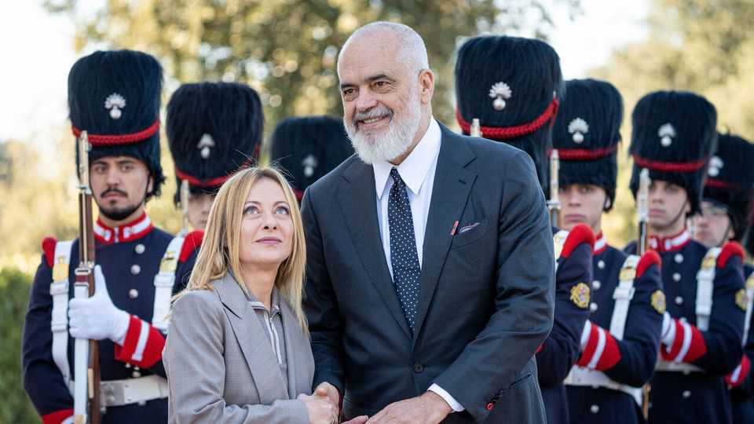

Europe | Working the bouncers
Albania is trying to charm its way into the EU
Edi Rama, the prime minister, is held back by his country’s corruption problems
December 11th 2025

FOR EDI RAMA these are the best of times and the worst of times—but mostly the best. In May Albania’s prime minister was elected to a fourth consecutive term. His country’s GDP has grown by 160% in euro terms since he came to power in 2013. The war in Ukraine has accelerated its long- stagnant bid to join the European Union, along with those of Ukraine and other candidates. European officials say negotiations might wrap up as early as 2027 and that Albania could join by 2030.

At the same time, Albania’s population has shrunk from 2.9m to 2.4m during Mr Rama’s tenure. Corruption remains widespread, and SPAK, the country’s independent anti-corruption authority, has indicted several of his top allies. One former protégé, the mayor of Tirana, is governing the city from his jail cell. And there are allegations that the ruling party used fines and administrative harassment to press people to vote for them in May.

“Bullshit,” responds Mr Rama. The towering prime minister, wearing a black T-shirt, a modishly long jacket and an array of red bracelets, is sipping an espresso at a hotel in Vienna, where he is about to speak at an international conference. No previous Albanian leader has been so well-known abroad. Mr Rama speaks warmly of “Viktor” (Orban), Hungary’s right-wing prime minister, and is on good terms with leftists such as Spain’s Pedro Sánchez and Denmark’s Mette Frederiksen. He collaborated with Giorgia Meloni, Italy’s populist-right prime minister, on her stalled plan to ship asylum-seekers to camps in Albania. On November 13th in Rome the two governments signed 16 agreements on subjects ranging from energy to security.

Nonetheless, Mr Rama is seething. SPAK recently indicted Belinda Balukku, his deputy prime minister, for allegedly rigging a tender for an infrastructure project. She denies the charges. Mr Rama says he does not know whether she is guilty, but denounces a court’s decision to suspend her from office: “This is unheard of in the history of Europe!”

After SPAK jailed Tirana’s mayor on charges of corruption (which he denies), Mr Rama tried to have him dismissed from his post. The courts stopped that, forcing the mayor to run the city from behind bars. Mr Rama finds this absurd. He calls the anti-corruption authority “inexperienced, sometimes overzealous and sometimes simply wrong. But it’s part of the process,” he adds. Albania, he says, is building an independent judiciary. If his allies expect to be rescued, they are mistaken: “I am not married to them.”

One reason for Mr Rama’s professed commitment to the rule of law is the lure of EU membership. But that requires assent from all 27 member states. Some sceptics doubt Albania’s clean-government credentials. Many on the populist right, meanwhile, oppose admitting what would be the EU’s first majority- Muslim country on nativist grounds. Good relations with Mr Orban and Ms Meloni may not be enough. Mr Rama says he is reaching out to the leadership

of France’s populist-right National Rally, but it remains dead set against letting new states in.

Mr Rama says he would temporarily forgo Albania having a veto on EU proposals and give up its right to a European commissioner, if that would help win over sceptics. Meanwhile he is building other bridges. Jared Kushner, Donald Trump’s son-in-law, has received clearance to build a beach resort in Albania. Mr Rama has also been courting the Gulf states. “Their attachment to culture is stunning,” he says. “What Florence did for Europe in the Renaissance is what they are doing for the world today.” When trying to join a club, it is wise to imply that you have options.■

To stay on top of the biggest European stories, sign up to Café Europa, our weekly subscriber-only newsletter.

This article was downloaded by zlibrary from https://www.economist.com//europe/2025/12/11/albania-is-trying-to-charm-its-way-into- the-eu