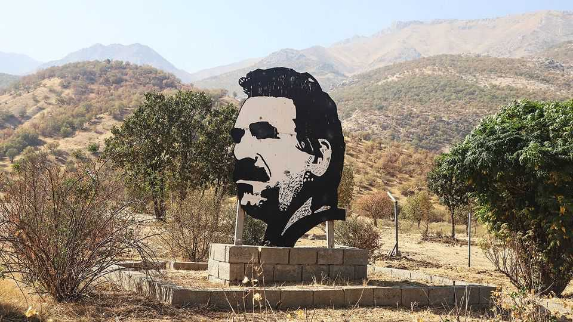

Europe | Stumbling towards peace
Talks stall between Turkey’s government and the Kurds
The prize is the ending of four decades of war between the army and the PKK
December 11th 2025

In recent months Turkey’s peace talks with the Kurdistan Workers’ Party (PKK), an armed Kurdish group that has been locked in a war with the country’s army for four decades, have picked up steam. In a historic first, members of a Turkish parliamentary commission overseeing the process met Abdullah Ocalan, the group’s imprisoned leader, on November 24th. Weeks earlier, the PKK had announced that its fighters were withdrawing from south- east Turkey.

But the process faces an impasse. Each side claims the other must make the next move. Turkish officials say concessions are only possible once the PKK disarms completely. These include a possible amnesty for thousands of PKK fighters based in Iraq, as well as activists locked up in Turkey on terrorism charges. The PKK, for its part, says it will take no new steps until Mr Ocalan, in prison since 1999, is set free.

That is a pipe dream for now. Opinion polls show most Turks oppose giving the PKK’s founder a main role in the current talks. His release would be even harder to swallow, and would set off a nationalist backlash. Turkey’s president, Recep Tayyip Erdogan, does not want to risk that.

Letting out Selahattin Demirtas, a Kurdish politician and former presidential candidate, would have been a less controversial gesture of goodwill. Turkey has kept him jailed since 2016, in defiance of rulings by the European Court of Human Rights. Before his imprisonment Mr Demirtas was among Mr Erdogan’s most vocal and effective critics, and the Turkish strongman fears that if released he would simply pick up where he left off. Mr Demirtas is doing nothing to assuage those fears. “I will leave here with my head held high,” he recently wrote from his cell, “or remain here until the last day of my life.”

Meanwhile, the peace process is revealing fissures between Mr Erdogan and Devlet Bahceli, his main coalition partner. Mr Bahceli, chair of the Nationalist Movement Party (MHP), wants to push the talks forward and free Mr Demirtas and other Kurdish leaders. Mr Erdogan wants to be able to wash his hands of the process if it unravels. Mr Bahceli, aged 77, wants peace with the PKK as his legacy. For Mr Erdogan, it is a means to an end. He may seek to stay in power past the end of his current term in 2028, though this would require constitutional changes or an early election.

Turkey had hoped that the PKK’s pledge to disarm would compel Kurdish insurgents in Syria to dismantle the statelet they have patched together in the country’s north-east. Things seemed to be moving in that direction in March, when the Kurdish-led Syrian Democratic Forces (SDF) agreed to integrate with the government in Damascus. But the SDF is in no hurry to make good on the deal. Its reluctance has hardened since forces loyal to Syria’s government carried out brutal attacks on Alawites and Druze, two of the country’s other big minority groups.

Turkey, which sees the SDF as the PKK in sheep’s clothing, has had no patience for such concerns, at least not publicly. Mr Erdogan’s government has renewed calls on the SDF to abide by the March agreement, or to face Turkish tanks. On December 8th columns of Turkish army vehicles entered northern Syria in what appeared to be a show of force, though the country’s armed forces called it “routine” manoeuvres. A new Turkish offensive against the SDF is unlikely, as it would spell doom for the peace process. But it is not inconceivable.

The large number of different players and competing concerns is making the government’s talks with the PKK hard to manage. “The next phase will be the riskiest,” Numan Kurtulmus, a senior member of Mr Erdogan’s ruling party, said recently. Kurdish politicians are more sanguine, saying the process has already delivered results. The PKK has agreed to dissolve. Turkey has stopped the mass arrests and dismissals of Kurdish mayors and activists. “There are hiccups, but the process is on track,” says Tuncer Bakirhan, head of Peoples’ Equality and Democracy, the country’s main Kurdish party. Turkey’s estimated 15m Kurds, and the millions of Kurds in Syria, can only hope he is right. ■

To stay on top of the biggest European stories, sign up to Café Europa, our weekly subscriber-only newsletter.

This article was downloaded by zlibrary from https://www.economist.com//europe/2025/12/11/talks-stall-between-turkeys-government- and-the-kurds