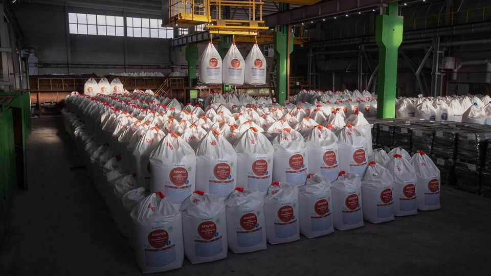
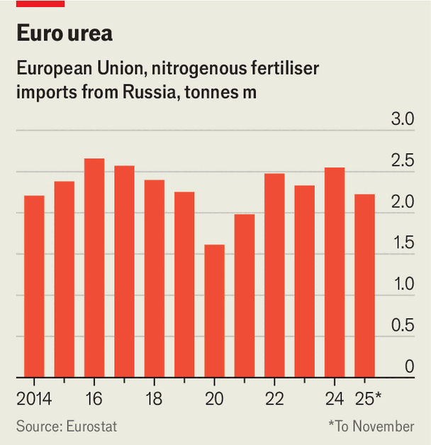

Europe | From Russia with gas
Europe bans Russia’s gas exports, but still buys its gas-based fertiliser
The EU’s rising tariffs may not solve the problem
December 11th 2025

The EU has slashed imports of Russian natural gas, and committed on December 3rd to end them by September 2027. But it still buys Russian fertiliser made from natural gas—more of it, for some types, than before Russia’s full-scale invasion of Ukraine. Plant food is a less lucrative export than energy for the Kremlin, but it makes Europe’s food security dependent on its enemy. And rising EU tariffs intended to render Russian fertiliser uncompetitive may not do the job.

Before February 2022, Russia supplied about 30% of all fertilisers bought by European farmers. Imports dipped after the invasion, and Europe put sanctions on a number of executives at Russian fertiliser companies. But the companies themselves, and the commodities they sell, were exempt. Imports rebounded: by the second quarter of 2025 Russia’s share of the European market had risen to a third. In June the bloc imported a million tonnes, the highest monthly tally in a decade.

Russian fertilisers are cheap, plentiful and nearby. Nitrogenous ones—the most-used kind—are made by combining hydrogen from natural gas with

nitrogen to make ammonia, and turning that into plant food. Russia also has huge deposits of phosphorus and potassium, used in other kinds of fertiliser. It produces a fifth of all the fertiliser in the world.

Europe’s reluctance to stop buying from Russia is largely thanks to its farmers. Fertilisers constitute 15-30% of their input costs, which rose significantly from 2020-25, while grain and produce prices fell. In 2024 protesting farmers drove tractors into Brussels. The EU fears their wrath.

To replace Russian fertiliser, Europe could increase its own production. Before the invasion it had 120 fertiliser factories, which met about 70% of its need for nitrogenous fertilisers in 2020; but they relied on Russian natural gas or ammonia. After the invasion, Europe cut its production by 70%. Barely half of that capacity has returned, reckons an industry insider.

Alternatively, it could find other suppliers. Egypt and Algeria export nitrogen- based fertilisers, Morocco exports phosphorus-based ones and Trinidad & Tobago exports ammonia. But these countries are all more expensive than Russia.

Last July the EU imposed tariffs on Russia’s nitrogenous fertilisers, but gradually. They started at €40 ($46) per tonne, modest for products whose pre- tariff prices were $400-700 a tonne. The per-tonne rate goes up to €60 next July 1st and to €315 after mid-2028. But it can be dialled back if fertiliser costs rise too fast. Potassium and phosphorus have much lower tariffs: the commission argues, questionably, that buying them is less likely to fund Russia’s war machine because they are not made from natural gas purchased from Gazprom, the state-owned gas monopoly.

The tariffs should eventually price Russian nitrogenous fertiliser out of the market. But prices from other suppliers will also go up on January 1st, when the EU’s carbon border adjustment mechanism (CBAM) kicks in. The CBAM will hit fertilisers that use carbon-intensive processes to make ammonia. Farmers are planning a protest in Brussels on December 18th. ■

To stay on top of the biggest European stories, sign up to Café Europa, our weekly subscriber-only newsletter.

This article was downloaded by zlibrary from [https://www.economist.com//europe/2025/12/08/europe-bans-russias-gas-exports-but-still-](https://www.economist.com//europe/2025/12/08/europe-bans-russias-gas-exports-but-still-)

buys-its-gas-based-fertiliser