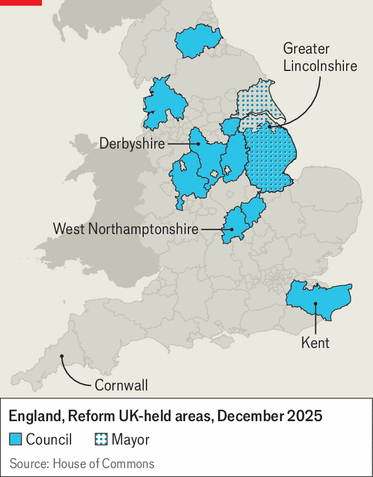

Britain | Contact with reality
Nigel Farage’s Reform UK has moderated in office
Aside from some eye-catching gestures, Reform councils have focused on potholes and budget holes
December 11th 2025

Seven MONTHS after becoming the leader of West Northamptonshire council, Mark Arnull of Reform UK is hard at work on next year’s budget. The outlook is not pretty. The council faces a shortfall of £50m ($67m), against spending commitments of around £960m. Even after the cabinet identified £20m of savings, he is left with a big hole that raising council tax will only partly fill. The job turns out to be a carousel of unpalatable choices.

“How much does parking go up by? Do we charge more money on the green- waste bins? What do we do with libraries?”

When Reform, Nigel Farage’s seven-year-old right-wing populist party, swept to power in ten local councils and two mayoralties in May (see map), there were two schools of thought about what might happen. One was that it would govern as Trumpian insurgents. The other was that, with 8m residents to serve, the upstarts would be exposed as amateurs and their ideas would melt. Neither was quite right. In office Reform’s radicalism has, so far, proved largely symbolic. And the party has tempered its ideas and tried to build a reputation for competence.

Five minutes into an interview with The Economist, Mr Arnull is rhapsodising about the optimal way to fill potholes (it involves “recycled rubber from aeroplane tyres and tar seals”). He claims to have doubled the number of holes being repaired on his patch. In Derbyshire Charlotte Hill, a former highways worker turned Reform councillor, publishes slick social-media videos touting her progress. Across all of its councils, the party boasts, more than 140,000 potholes have been repaired since May.

Reform councils have made other eye-catching moves. They have got rid of net-zero targets. They have flown St George’s and Union flags outside council buildings, and removed those deemed to represent woke causes, such as LGBT pride.

Bigger change has proved fiddlier. Nationally, Reform opposes diversity, equity and inclusion training. In West Northampton it goes on. “We did a piece of work… around statutory responsibilities to make sure we comply with the equalities act,” says Mr Arnull (not a phrase you can imagine hearing from a MAGA politician). Dame Andrea Jenkyns, Reform’s mayor of Greater Lincolnshire, promised to sack diversity officers, only to discover there were none.

A work-from-home ban has similarly hit the buffers. In West Northampton a council review found that it would cost £15m, due to a dearth of desks and staff’s unwillingness to give up hybrid work. “There’s a whole range of things that the administration considered and said, well, actually, it makes sense to keep things as they are,” says Martin Henry, the council’s interim chief executive (a non-elected role).

That is true of tax and spending, too. If you look at the budgets proposed by Reform councils thus far, says Tony Travers of the London School of

Economics, what is surprising is how similar they are to Labour and Conservative ones. Spending allocations—for schools, transport, social care and so on—have hardly changed.

Reform has promised to slash waste. But councils have already been cut to the bone. Reform councils seem able to point to only £70m in savings they have made, largely by renegotiating IT contracts. Despite a national pledge to cut tax, they all plan to increase council tax. Many are likely to raise it by 5%. Perilous finances have encouraged moderation: many councils are one wrong step away from bankruptcy.

Reform was expected to cause trouble on asylum-seekers. In August a court granted Conservative-run Epping council an interim injunction, meaning it could close a hotel housing them. “Epping has shown the way to win,” crowed Mr Farage.

That proved premature. Overturning the ruling in November, a judge said Epping had failed to follow proper enforcement procedures. The judgment suggests a blanket ruling that supports the closure of migrant hotels is unlikely, says Gavin Sneddon, a local-government expert. Instead, councils will have to prove that specific hotels are harmful to local communities and inconsistent with their planning policies, on a case-by-case basis.

“In contrast to Epping”, Mr Arnull says, West Northamptonshire has followed the enforcement process “to the letter”. The council has received replies from hotel owners and is considering how to proceed. Mr Arnull hopes to win the case, but acknowledges that it could take a long time. It hardly seems likely to become the acid test of Reform’s radicalism. Tory and Labour councils are pursuing similar cases. The Home Office says that it anyway wants to close them all by 2029.

All this offers clues to how Reform is changing as it lurches towards power, and the tensions its office-holders are navigating. Mr Farage wants voters to believe that his party has the boldness they seem to crave, but would not be a liability.

It still has its oddballs. Kent, Britain’s largest council with 1.6m residents and a £2.6bn budget, is being run colourfully and chaotically by Linden Kemkaran, a former TV anchor. In October Reform suspended four

councillors after a leaked video showed her shouting and swearing in a council meeting. In Cornwall Reform lost its majority due to infighting. “A Reform councillor can fart and it’s front page of the Guardian,” groans a party staffer.

But Mr Farage has been quick to purge those who create a stink. In November he suspended a councillor who posted controversial jokes in a WhatsApp group. Reform politicians have trumpeted populist messages, but they have notably fallen shy of breaking the law. National prominence also seems to have attracted more moderate figures, including some, like Mr Arnull, from the business world.

In the past two months Reform’s national polling has dipped for the first time since May, though it still enjoys a ten-point lead over Labour, according to our poll tracker. Mr Farage will hope to win lots more councils in May, when over 130 are up for election—and that power in the town halls will smooth his path to Number 10. ■

For more expert analysis of the biggest stories in Britain, sign up to Blighty, our weekly subscriber-only newsletter.

This article was downloaded by zlibrary from https://www.economist.com//britain/2025/12/10/nigel-farages-reform-uk-has-moderated-in- office