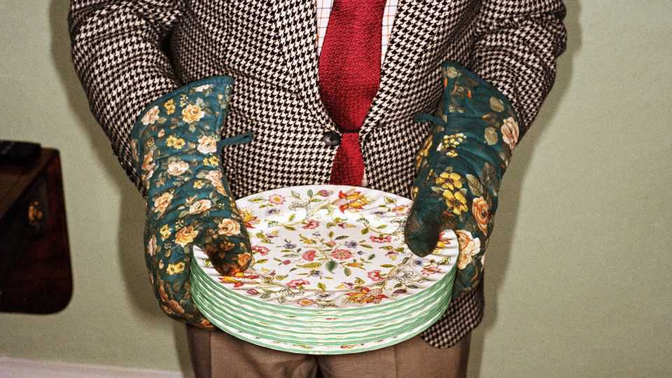

Britain | ’Tis the season to be stingy
Britain’s pitiful Christmas bonuses
What an obscure handout says about the British state
December 11th 2025

In November 1972 inflation was rampant but the meagre state pension had not kept up. Millions of old people were awaiting a miserable Christmas. The problems of the prime minister, Edward Heath, were compounded by two awkwardly timed by-elections in December. His solution was simple: give every pensioner a £10 holiday bung (worth £120, or $160, in 2025 prices). Sydney Bidwell, a Labour MP, complained that the sum was pitiful, allowing people to buy only “two or three bottles of whisky this Christmas”. For pensioners, though, such a sum was not trivial. It was a lot more than the

weekly state pension (£6.75 in 1972) and enough to buy over 20 chickens for roasting.

The bonus was meant to be a one-off, yet politicians have not dared kill it. This December the payment went to 18.5m people, mostly pensioners. But ministers have frozen it at £10, using inflation to drain its value. In 1972 prices it is worth 84p—not even enough for two chickens.

This is a case study in British policymaking. Politicians are reluctant to cut benefits but too tight-fisted to make them worthwhile, opting for the worst of both worlds. A more rational course would be to end the bonuses and spread the money through the year, making it easier for people to budget. Call that the responsible-uncle model of gift-giving.

Spain prefers the fun-uncle approach, paying pensioners a whole extra month’s pension for Christmas. This creates a warm buzz and recognises there are higher costs in winter, such as for heating (Britain does provide a separate winter-fuel payment). Spain might be robbing people of income in other months to pay them more at the end of the year, but it is larceny done in style.

Britain is the stingy uncle, who knows he has to get a present but puts no effort into it (think discounted aftershave). This stingy-uncle mentality can be seen more widely across the British state, from low unemployment benefits to poor-quality free health care. A better approach might be doing fewer things, but doing them properly. For the Christmas bonus, that would mean three bottles of whisky at least—or nothing at all.■

For more expert analysis of the biggest stories in Britain, sign up to Blighty, our weekly subscriber-only newsletter.

This article was downloaded by zlibrary from [https://www.economist.com//britain/2025/12/11/britains-pitiful-christmas-bonuses](https://www.economist.com//britain/2025/12/11/britains-pitiful-christmas-bonuses)