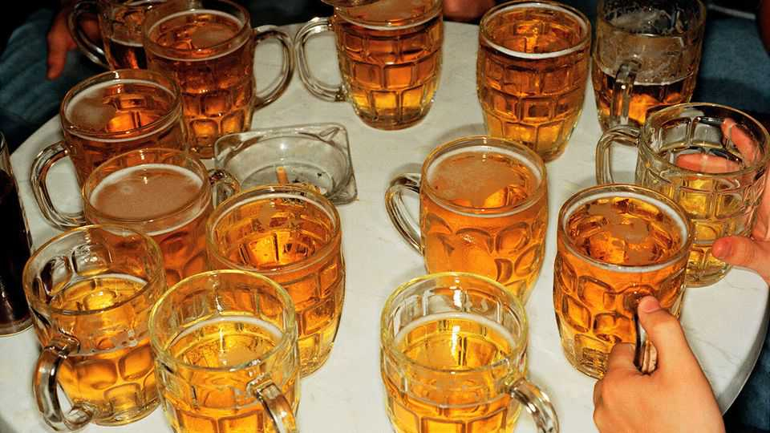

Britain | Changing the subject
A new breed of quizzer is wresting control of an old hobby
Quizzes are moving with the times
December 11th 2025

It was 11am on a bright cold Tuesday in south London and the stop-clocks were striking 25. Alex Douglas, a 46-year-old former rock musician, had been on the microphone in the Railway pub for 25 straight hours. The late-night drinkers had melted away, replaced by middle-class mums sipping coffees and feeding their babies. Mr Douglas was still on his feet, an endeavour he later compared to running a marathon while drinking 40 pints of lime and soda. “Which freshwater lake in South America is the highest navigable lake in the world?” he asked. “The term glossal pertains to which human organ?” He was

on his way to breaking the Guinness World Record for the longest non-stop stint as a quizmaster.

That a middle-aged man can stand in the back room of a Streatham boozer and pose 2,050 consecutive quiz questions over 38 hours and ten minutes, and still have dozens turn up to play along, is testament to quizzes’ enduring appeal. The popularity of online quizzes surged during the pandemic. When lockdown ended plenty of folk had a new hobby.

Many preferred to keep playing online, or were drawn to in-person quiz leagues. The biggest, the Quiz League of London (QLL), now hosts 53 teams of four players, in five fiercely competitive tiers.

League quizzing remains amateur: only the question-setters are paid. QLL features several former champions of “Mastermind”, the crown jewel of BBC quiz shows. That show’s modest prize, an engraved glass bowl, was famously won in 1980 by Fred Housego, a London black-cab driver whose working- class demeanour stood out from the classics teachers and retired civil servants. Now another new breed of quizzer has emerged—younger and more internet- savvy than the brainboxes of yore.

Foremost among them is Daoud Jackson. The 29-year-old is already racking up multiple titles. He is the winner of the 2025 World Quizzing Championships, not to be confused with the International Quizzing Championships, where he recently captained the four-man England team to cup glory ahead of Croatia and Belgium.

Mr Jackson honed his skills online. A British Muslim, he can barely recall visiting a pub before he started quizzing. He attributes much of his initial success to his “knowledge-based cultural capital” from his high-achieving parents. His first-class degree in history from Oxford was another solid foundation. But Mr Jackson is also a master of efficiency—training with flashcards, databases and bespoke software. “There are whole categories of things that could theoretically come up, but don’t. And so it’s not worth learning those,” he explains. Even Mr Jackson fears the coming generation of AI-savvy quizzers.

Quiz questions are also evolving. The Economist compared the current series of “Mastermind” with the one that concluded in 2015. We looked at the

general-knowledge round, in which contestants each have two and a half minutes to answer an array of questions. We found that the correct answer was a woman 23% of the time in 2025, compared with 16% a decade ago. Questions featured a woman by name 30% of the time in 2025, up from just 20%.

Making quizzes both diverse and accessible is hard. “Which US president?” has no correct female answer yet. In classical music, a favourite topic, there are not many historical female composers of renown—you can’t always ask about Clara Schumann (1819-96) just because few have heard of Hildegard of Bingen (1098-1179).

Mr Jackson and two fellow quizzers have started their own online league, Mimir’s Well, aimed at a global audience: quizzing is surprisingly popular in countries as varied as Estonia, India and Liberia. It seeks to avoid topics he considers “hackneyed”. Getting the balance right is tricky. Another online league is known for what some see as a forced equality of subject matter, difficulty be damned. The record-chasing Mr Douglas, who in his day job runs Inquizition, London’s largest pub-quiz provider, feels pressure to make his questions more diverse—up to a point. “If it goes too far, and you end up with 60% of your quiz hard to get because it’s so niche, people will just stop coming,” he warns. ■

For more expert analysis of the biggest stories in Britain, sign up to Blighty, our weekly subscriber-only newsletter.

This article was downloaded by zlibrary from https://www.economist.com//britain/2025/12/09/a-new-breed-of-quizzer-is-wresting- control-of-an-old-hobby