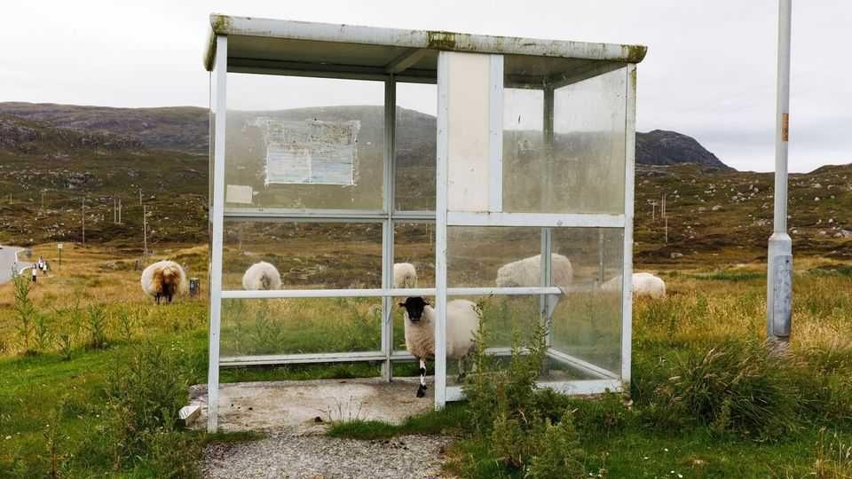
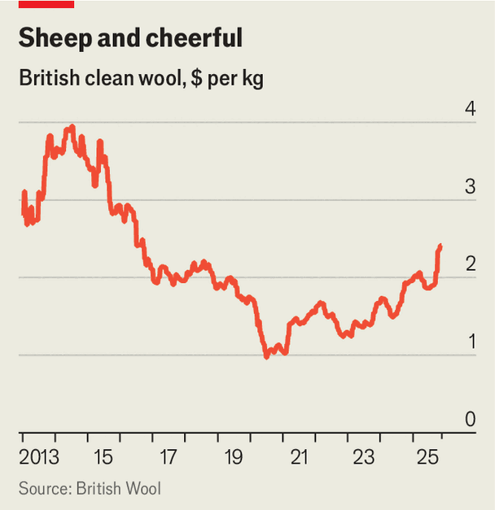

Britain | Ewe-turn
What’s behind the revival in the price of British wool
Partly, happier sheep—but mostly pent-up demand and reduced supply
December 11th 2025

Over the past year the price of British wool has been rising. On December 2nd, at the twice-monthly auction at Bradford, the average price of clean wool was at its highest in nearly a decade: £1.82 ($2.43) per kilogram, an increase of 26% since September. The last time Britain’s clip sold for these prices was back in 2016, amid a frenzy for double-faced woollen overcoats in China (see chart).

The industry has been in a long decline. Wool once made up nearly all of England’s export earnings. In medieval times, money from the trade helped build towns and churches. Sheep were bred for their fleece, and eaten only when their coats were lacking or they weren’t fit for breeding. But then cotton cloth became widely available, spun in the mills of Lancashire. And then synthetic fabrics. After polyester fibre was invented, Britain’s wool industry unravelled. In 1952 a kilogram of raw wool sold for £17.50 on average, in today’s prices. In 2022 that figure was just 73p.

Why the recent uptick? Mostly it is a result of a surge in pent-up demand combined with dwindling supply. But it also reflects changing tastes—and the fact that the sheep are a little bleat happier.

First, the pent-up demand. Because British sheep grow coarse wool suited to chilly weather, their fleeces make excellent carpets. (In milder Australia and New Zealand, Merino flocks grow finer, softer coats.) And unlike polyester, wool is fire-retardant, meaning it is perfect for plane and train seats. Now that the global hospitality industry is back after the pandemic, says Andrew Hogley of British Wool, which collects and sells nearly all the country’s wool, demand for carpets and transport upholstery is up. Over half of the wool sold at the Bradford auction is destined for hotels, cruise ships and casinos.

Tastes in fabrics may be shifting, too. A growing number of people are turning against plastic-based clothes that pollute the environment. Natural fabrics, like wool, are seen as more environmentally friendly alternatives. “There is a big movement around sustainability in the fashion sector,” says Margaret Ann Macleod from Harris Tweed Hebrides, a company that makes Harris Tweed from wool purchased in Bradford.

The bedding sector is also using more wool. Roughly a tenth of Britain’s clip will be used to make mattresses and pillows. Some will go to Japan, where it will be stuffed into futons.

The price of wool will have to rise further still for farmers to see profit, however. Wool is worth so little that sheep are mostly kept for eating and sheared out of necessity. Over the past five years shearing has cost more than the wool could be sold for. Frank Langrish, a farmer in Sussex, paid £18,000 to shear his flock last year and earned just £11,000 for the wool. Many have cut their flocks to save cash. Mr Langrish recently reduced his by a fifth.

Until 2020 English farmers could earn around £28,000 a year on average through the European Union’s “basic payment scheme”, based on how much land they used. Since Britain left the EU in 2020 that legacy arrangement is being phased out, and will be gone entirely in 2027. This year English subsidies have been capped at £7,200 for most farms and from 2026 they will be reduced to just £600. A new scheme now pays farmers based on how they farm, encouraging them to produce food and to restrict livestock grazing.

All this has resulted in fewer sheep. The flock in England shrank by 3.8% last year. “Farmland is under increasing pressure to provide public goods, and wool is not seen as that,” says Michael Priestley from the National Sheep Association. Mr Hogley reckons that wool supply has shrunk by almost a quarter over the last five years as a result of this and the fact that a lot of the stuff has been used for animal bedding and not even made it to market— another reason for the price rise.

Then there is the matter of sheep happiness. In 2018 severe winter weather hit Britain in March, when many ewes were pregnant. “Because of the stress, all the wool that year had a tender spot, where it broke easily,” says Mr Hogley. Recent sunny, dry weather has had the opposite effect. Sheep have been feeling more content, and have produced a whiter, higher-quality clip. That has nudged prices up, too. But by historical standards, British wool is still a baaagain. ■

For more expert analysis of the biggest stories in Britain, sign up to Blighty, our weekly subscriber-only newsletter.

This article was downloaded by zlibrary from https://www.economist.com//britain/2025/12/08/whats-behind-the-revival-in-the-price-of- british-wool