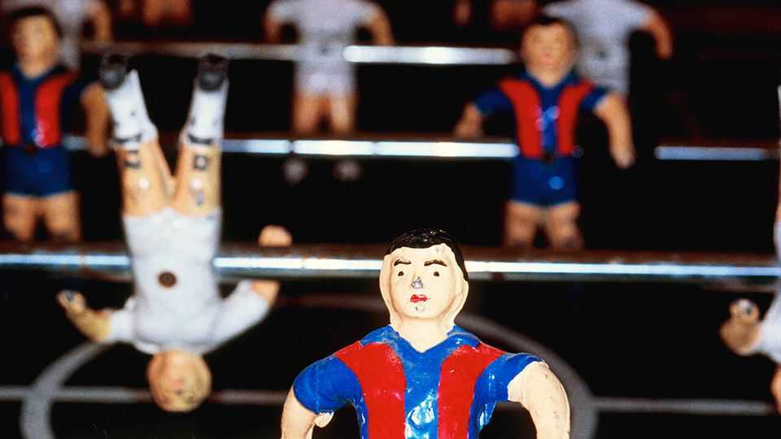

Britain | Bend it like Barnet
Pro-growth sports fans are getting organised in Britain
YIMBYs take on NIMBYs
December 11th 2025

“We are the Barnet! Super Barnet! From Underhill!” chants the crowd as Mark Shelton, a midfielder for the League Two club, raises his arms to the home stands. The celebration, for a goal Mr Shelton had scored against the visiting Milton Keynes Dons, might seem odd. For the stadium is not in Barnet, but in Harrow, and it is called the Hive, not Underhill. Barnet Football Club hasn’t played at Underhill, its home from 1907, since 2013, when it moved to the Hive, 8km away.

The club plotted a return by proposing a 7,000-seat stadium on Barnet Playing Fields. Fans formed 10,000-strong Bring Back Barnet (BBB) to rally behind it. But in July Barnet Council voted against them, after opposition from Save Barnet Playing Fields, a group protecting the green space. The club may appeal. Looking for Growth (LFG), a campaign group, has posted videos in support.

Elsewhere similar battles are on between YIMBYs (”yes in my back yard”) who want local economies to grow and green-minded NIMBYs (”not in my back yard”). Oxford United’s plans to build a 16,000-seat stadium on green- belt land pitted its supporters’ group, OxVox, against Friends of Stratfield Brake protecting “a wildlife haven”. Newcastle United, a Premier League club, wants to build a 70,000-seat stadium near Leazes Park (its current home, St James’s Park, has a capacity of 52,305). A petition by Save Newcastle Wildlife gathered 28,000 signatures. Bath Rugby’s plans to expand its stadium were opposed by a Green Party councillor whose worries included protecting an ancient tree.

For fans their stadium is “the container for community”, says Keith Doe, a BBB organiser. NIMBYs have an alternate vision of community. Leslie Martin organises Campy Growers, a gardening group based on Camperdown Fields, eight acres of Dundee she thinks vital to “reverse biodiversity decline”. Dundee Football Club looks at those acres and envisages a 12,500-seat stadium, an events campus and housing that it says will add £150m to the local economy.

Football YIMBYism is getting political. BBB will put up candidates in next year’s local elections. LFG is also plotting a national attack on NIMBY councils. It is building local chapters around the country, including the one in Barnet. Lawrence Newport, of LFG, says it will be turning up at council meetings: “We are going to ensure there are more roads, more rail and more buildings built.”

Fan pressure can help. Oxford’s plans were approved in August, after three years of back-and-forth; Bath’s went through in September. Due to their sensitive nature, final consent passed to Steve Reed, the Labour secretary of state for housing, who found both inoffensive.■

For more expert analysis of the biggest stories in Britain, sign up to Blighty, our weekly subscriber-only newsletter.

This article was downloaded by zlibrary from https://www.economist.com//britain/2025/12/11/pro-growth-sports-fans-are-getting- organised-in-britain

International

Inside the fight for MAGA’s foreign policy What’s worse for innovation: MAGA or Mao?