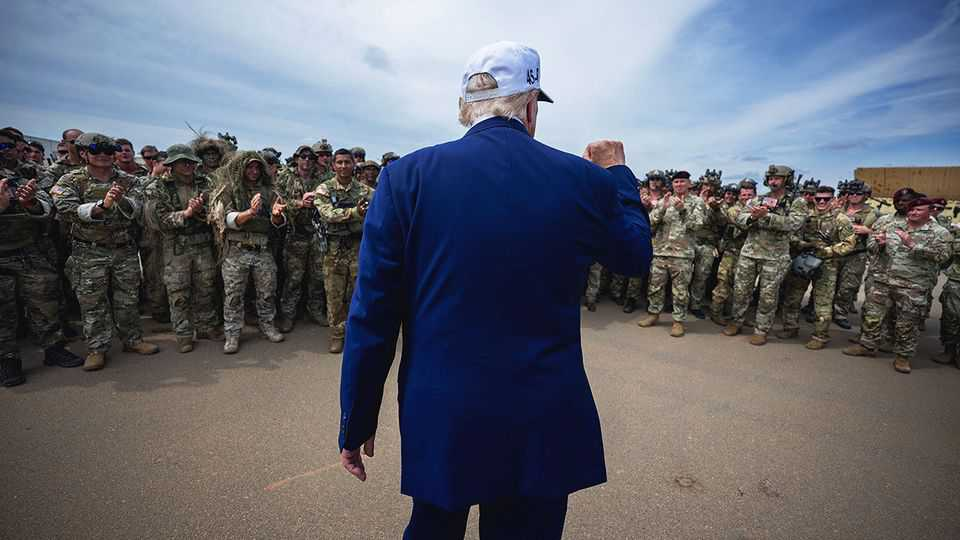
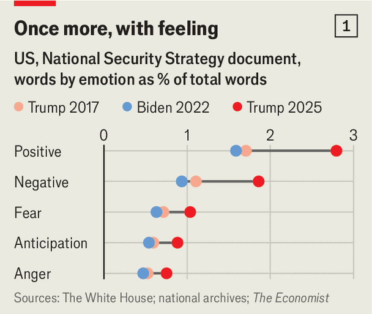
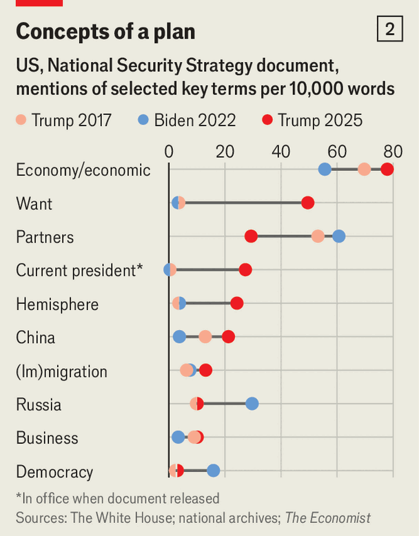
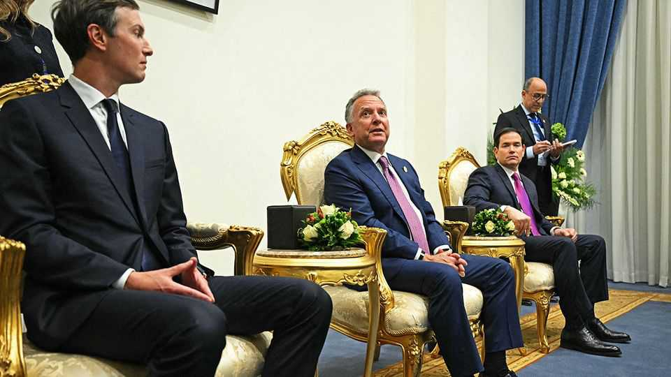

International | America First foreign policy
Inside the fight for MAGA’s foreign policy
Donald Trump’s court squabbles over the future of American power
December 11th 2025

RONALD REAGAN’S foreign policy of “peace through strength” has long been embraced by America’s Republican Party. But who is the keeper of the Gipper’s flame? The split between Donald Trump’s America First acolytes and the party’s shrunken band of internationalists is growing. That much was plain from the scene that played out beneath Reagan’s blue-liveried Air Force One, which graces his presidential library in Simi Valley, California.

On December 6th Pete Hegseth, America’s war secretary, told defence and foreign-policy bigwigs gathered there that the globalists had brought only disaster. Their quest for “global military hegemony” had led to “rudderless wars in the Middle East, land war in Europe and the economic rise of China”. Donald Trump, he argued, was Reagan’s true heir. Like Reagan, Mr Trump was building up America’s military strength but also talking to its enemies. As for military force, it was used only “in a focused, decisive manner”. He summed it up thus: “Out with Utopian idealism. In with hard-nosed realism.”

The speech was poor history. Reagan was a committed free-trader, unlike the tariff-loving Mr Trump; and he supported amnesty for illegal migrants, not mass deportation. Above all, Reagan believed in the power of freedom to bring down autocracy. He considered the Soviet Union an evil empire and championed its “captive nations”; Mr Trump is wooing Russia despite its invasion of Ukraine. “Ronald Reagan will be turning in his grave,” muttered one who attended the annual talkfest.

Even so, Mr Hegseth’s speech, and the publication two days earlier of Mr Trump’s 32-page National Security Strategy (NSS), offer the clearest summary yet of an “America First” foreign policy. They paint a dystopian vision for the world, in which a liberal international order gives way to grubby dealmaking and rule by the strong. Where previous presidents’ strategies vowed to make the world safe for democracy, Mr Trump’s version seems more inclined to make it safe for illiberalism.

Nowhere is this more apparent than in Europe, where allies are now denigrated for becoming increasingly “non-European” and condemning themselves to “civilisational erasure” through mass migration. The economic integration and collective rules of the European Union are presented as a threat greater even than Russia’s invasion of Ukraine and its growing partnership with China. “The adjustments that we see correspond in many ways to our vision,” said a delighted Kremlin spokesman, Dmitry Peskov.

The reaction of America’s European and Asian allies was strikingly muted. “Some of it is comprehensible, some of it is understandable. Some of it is unacceptable,” said the German chancellor, Friedrich Merz, on December 9th. Many are looking for silver linings. Beneath the ugly rhetoric, they note, core American priorities remain: America has not left NATO; it has reaffirmed its

readiness to defend Taiwan; and it talks about protecting allies under its nuclear umbrella.

There is debate over how seriously to treat the document published in the dead of night on December 4th/5th. Read it as polemic rather than policy, argue American insiders. “It will be forgotten in two weeks,” says one. Others disagree. The document will become the lodestar for the administration, predicts Rebecca Lissner, who helped draft Joe Biden’s NSS. Bureaucrats and military types will be tasked with implementing it.

The strategy has already given succour to critics of Europe. When the EU on December 5th fined X €120m ($140m) for breaching its digital-services rules, administration officials denounced it as an assault on America. X’s owner, Elon Musk, posted: “The EU should be abolished and sovereignty returned to individual countries.” Dmitry Medvedev, a former Russian president and now Mr Putin’s attack-dog, replied: “Exactly.”

The administration’s policies will depend less on the written document than on rivalries in Mr Trump’s court—and on Mr Trump’s varying moods. More than in past administrations, the president decides foreign policy. The NSS is, in a sense, his courtiers’ best attempt at divining Mr Trump’s mind, and reveals how competing factions hope to shape it.

The NSS amounts to “the first MAGA national security strategy”, says Ms Lissner. It is radically different from strategies of the past, including Mr Trump’s own document from his first term in 2017. It self-consciously dumps past ideologies, while struggling to define the new one: in its words, the strategy is pragmatic but not “pragmatist”; realistic but not “realist”; muscular but not “hawkish”; restrained but not “doveish”. The best label it can come up with is “flexible realism”.

The document was written and rewritten by a small group of aides, leaving a messy potpourri. There was little of the usual bureaucratic consultation to integrate and reconcile the views of various government departments.

It offers something for everyone in the Trump orbit: among them strident MAGA ideologues like J.D. Vance, the vice-president; traditional Republicans like Marco Rubio, the secretary of state and national security adviser; anti- immigrant populists like Stephen Miller, the homeland-security adviser; China

hawks like Elbridge Colby, the Pentagon’s under-secretary for policy; and the wheeler-dealers, including Scott Bessent, the treasury secretary, and the president’s personal and familial envoys, Steve Witkoff and Jared Kushner.

Mr Trump’s first-term NSS had turned America away from decades of small wars against jihadists to concentrate on “great-power competition” against China and Russia, in turn influencing Mr Biden’s NSS in 2022. But Trump II breaks with the consensus Trump I created. His latest NSS envisages a more Darwinian world. America now aims for a “balance of power” that, at times, smacks of spheres of influence. “The outsized influence of larger, richer, and stronger nations is a timeless truth of international relations,” it opines.

Our analysis of the three texts—Mr Trump’s two strategies and the Biden one —find more emotive and nationalist language in the latest iteration (see chart 1). “Democracy” appears less often; “economy” and “economic” much more

frequently (see chart 2). Language about working with “partners” has been replaced by America’s “wants”. “China” features more often in this NSS, but only in an economic rather than geopolitical context.

In 2017 China and Russia were regarded as “revisionist” states that “want to shape a world antithetical to US values and interests”. In much of the 2025 text, China is akin to Lord Voldemort: the omnipresent but unmentionable rival of the Harry Potter novels. The Russian threat, moreover, is now attributed to the demented minds of Europeans. The “rogue states” of 2017 have receded, too: in 2025 Iran is diminished after America’s strikes on its nuclear facilities; North Korea is not mentioned at all.

American security strategies have always acknowledged the need to defend the homeland. This edition makes it central to foreign policy, emphasising strong borders, the fight against mass immigration and the need to build a

“Golden Dome” air-defence system to protect the country. But the NSS goes much further. It extends the idea of protecting America to dominating the whole western hemisphere, now the foremost regional priority. Call it an “Americas First” strategy.

The NSS prefers a different term: the “Trump Corollary”. In 1823 James Monroe declared that attempts by European powers to interfere in the Americas would be deemed “dangerous to our peace and safety”. Teddy Roosevelt’s “corollary” in 1904 asserted that the United States could exercise “an international police power” over ill-governed or unstable neighbours.

Mr Trump’s corollary baldly calls for restoring “American pre-eminence in the western hemisphere” and protecting America’s “access to key geographies”. America, the NSS says, will “deny non-hemispheric competitors the ability to position forces or other threatening capabilities, or to own or control strategically vital assets”. It talks of using American leverage to push out foreign firms involved in building infrastructure, and give “sole- source contracts” to American ones.

The push to oust Venezuela’s strongman, Nicolás Maduro, and the bombing of alleged drug-smuggling boats, are the most dramatic results of the new doctrine. Many have chalked this policy up to Mr Rubio. He hopes that gunboat diplomacy will bring about Mr Maduro’s downfall, weakening other left-wing regimes, including those of Nicaragua and, above all, Cuba, the homeland of his parents. In south Florida the Venezuelan diaspora is already planning parties for the day Mr Maduro is toppled.

Beyond Mr Rubio, much of the MAGA elite is in violent agreement when it comes to primacy in the hemisphere. Messrs Vance and Miller see it as a battleground to stem the flow of migrants and drugs into the United States. Mr Hegseth said the Pentagon would guarantee “US military and commercial access to key terrain”, naming the Panama Canal, the Caribbean, the Gulf of Mexico (or the Gulf of America), the Arctic and Greenland. Neighbours must work with America on such matters; if not, the Pentagon “stands ready”.

China hawks, however, can be only aghast at tying up about a fifth of America’s deployed fleet in the Caribbean indefinitely. And isolationists such as Laura Loomer, an influential MAGA podcaster, fear America is heading towards another war of regime change, and thus to an Iraq-and Afghanistan-

style debacle. Mr Trump seems uncertain: he has rattled his sabre at Venezuela, but has not yet unsheathed it.

Trumpworld is more divided still over Asia. Dealmakers, led by Mr Bessent, want nothing to upset relations with China ahead of a summit between Mr Trump and its leader, Xi Jinping, in April, amid hopes of a big trade deal. By contrast, traditional Republicans, like Mr Rubio, and some Pentagon strategists, led by Mr Colby, regard China as the biggest threat to American power, and the defence of Taiwan as an essential means of constraining it.

This split cuts through the NSS. Its publication was apparently delayed by Mr Bessent’s insistence that hostility to China be toned down or dropped entirely. He appears to have got his way. Many passages seem to describe China (such as complaints of IP theft, state subsidies, foreign influence and controls on rare-earth elements) but avoid naming the country.

Even the commitment to defending Taiwan and ensuring “military overmatch” (meaning superiority), stops short of identifying the People’s Republic. The island’s importance is described not in terms of defending an embattled democracy, but of economics and geopolitics. America must not only preserve Taiwan’s advanced semiconductor industry but also hold the first island chain (which runs from Japan to Malaysia) in order to protect the second island

chain (which includes America’s big military bases on Guam) and keep open shipping lanes in the South China Sea. That goes beyond Mr Trump’s usual scepticism about Taiwan.

The document mentions China mainly in relation to trade, expressing hopes for “a genuinely mutually advantageous economic relationship with Beijing”. A bigger concession was Mr Trump’s announcement on December 8th that he would lift the ban on exporting Nvidia’s advanced H200 chips to China. Security hawks fear that will help China close the gap with America in artificial intelligence. Mr Trump has said that 25% of the proceeds will go to the government. Right now, Mr Trump favours the dealmakers.

When it comes to Europe, the NSS gives much to the pro-Kremlin lobby. It argues that Europeans’ “lack of self-confidence”—not the invasion of Ukraine —causes them to see Russia as an “existential threat”. America’s “core interest”, it says, is to “negotiate an expeditious cessation of hostilities in Ukraine”. It also calls for halting NATO’s expansion.

The NSS seeks a more MAGA-like Europe. It speaks of backing “healthy” European countries and “patriotic” parties, and of “cultivating resistance” to current policies, including on migration. Why the obsession with Europe’s ethnic make-up? Because, claims one administration official, Mr Trump cares about Europe; and because migration is changing the politics of European countries, not least in their criticism of Israel.

Traditional Republicans, like Mr Rubio, worry that a bad Ukraine peace deal would invite another Russian assault. He is in a tug-of-war with administration wheeler-dealers, notably Messrs Witkoff and Kushner, who see economic opportunity in an agreement. He is also at odds with Mr Vance, not least because both are rivals to succeed Mr Trump in 2028.

Republicans in Congress, meanwhile, are putting up resistance to Mr Trump. Several bipartisan bills, some sponsored by Lindsey Graham, a hawkish senator close to Mr Trump, threaten to impose tariffs on countries buying Russian oil and declare Russia a state sponsor of terrorism. A draft of the National Defence Authorisation Act, set to soon be approved, preserves a symbolic $400m a year worth of military aid to Ukraine and demands notice of any plans to stop intelligence-sharing. Moreover, it requires approval from

Congress to reduce American troop numbers in NATO and South Korea below certain levels.

How long can sensible Republicans hold the line? Mr Trump has lately joined in Europe-bashing, saying the Old Continent was “decaying”. Having for a time criticised Russia for refusing a ceasefire, Mr Trump has reverted to chastising Ukraine for turning down peace proposals and fighting on against the odds. Russia, he says, has the upper hand because it is the bigger country. “At some point, size will win,” he told Politico.

It is unlikely that there will be any one winner in Mr Trump’s circle, but rather a constant squabble between its competing factions, and a churn of personnel. Mr Rubio has survived longer than many had expected, by remaining scrupulously loyal to Mr Trump. But some think he may leave before the end of the term, and perhaps after the mid-term elections in November, either because of policy disagreements or to prepare to run for the 2028 election. Mr Hegseth, under pressure for potentially illegal strikes on drug boats, may go sooner.

The make-up of Mr Trump’s entourage may affect policy mainly at the margins. Ultimately, “everything comes from the top,” says a White House official. “We are no longer in the era of nameless bureaucrats dictating foreign policy.”

Public opinion may be a bigger constraint. The Reagan Institute’s poll, published shortly before its defence forum, found strong majorities for hawkish globalism: 64% of Americans want their country to take the lead in international affairs; 68% view NATO favourably (the highest since the survey began in 2018); 62% want Ukraine to prevail in its war with Russia; and 60% support committing American forces to defend Taiwan.

The Reagan spirit thus lives on. At the end of the conference in Simi Valley, it fell to the host, Roger Zakheim of the Reagan Institute, to remind MAGA devotees that “peace through strength” had a higher purpose than mere domination. As the Gipper explained in 1986, “American strength is once again a sheltering arm for freedom in a dangerous world.” ■

This article was downloaded by zlibrary from https://www.economist.com//international/2025/12/11/inside-the-fight-for-magas-foreign- policy