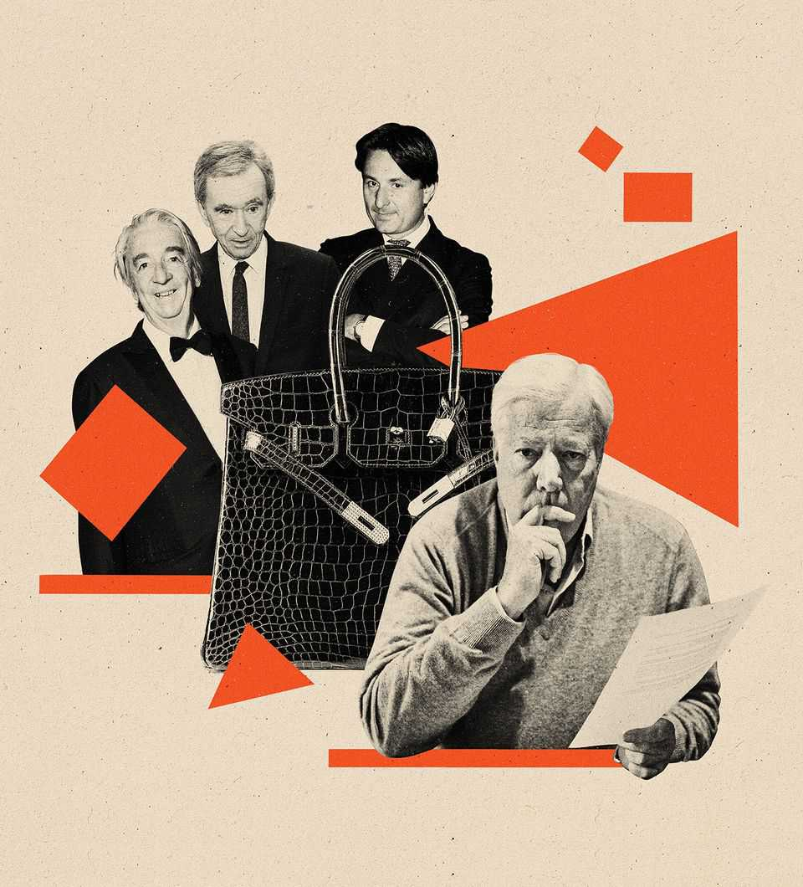
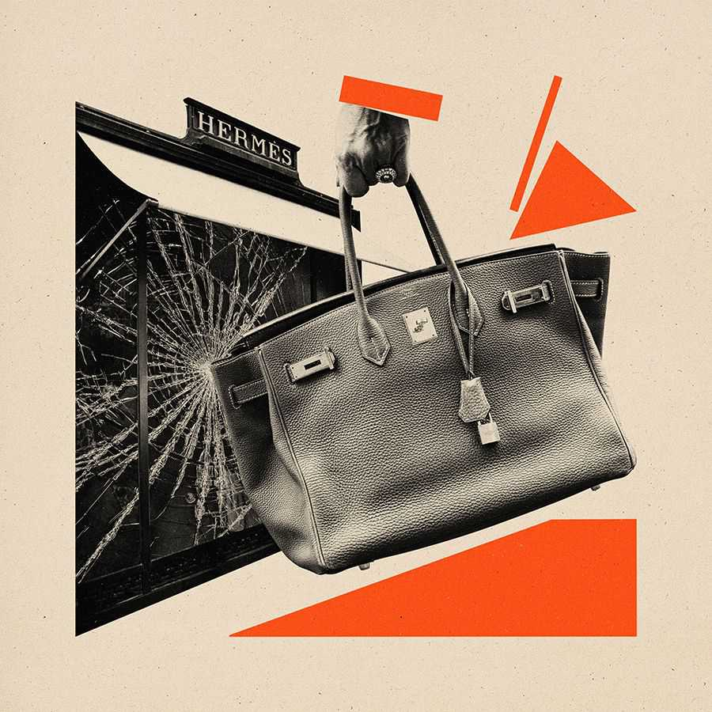
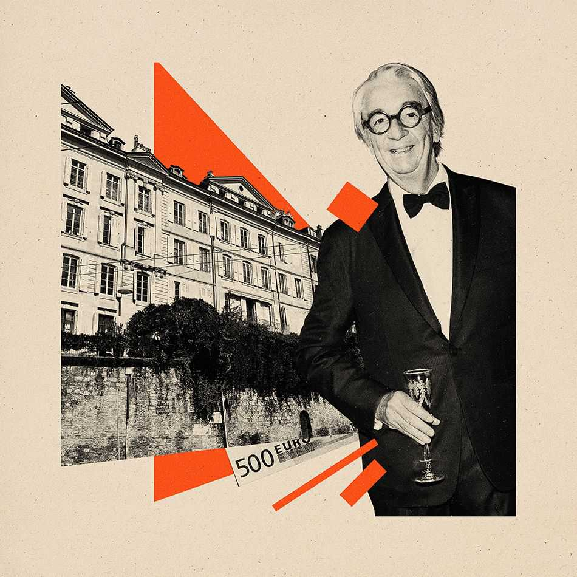
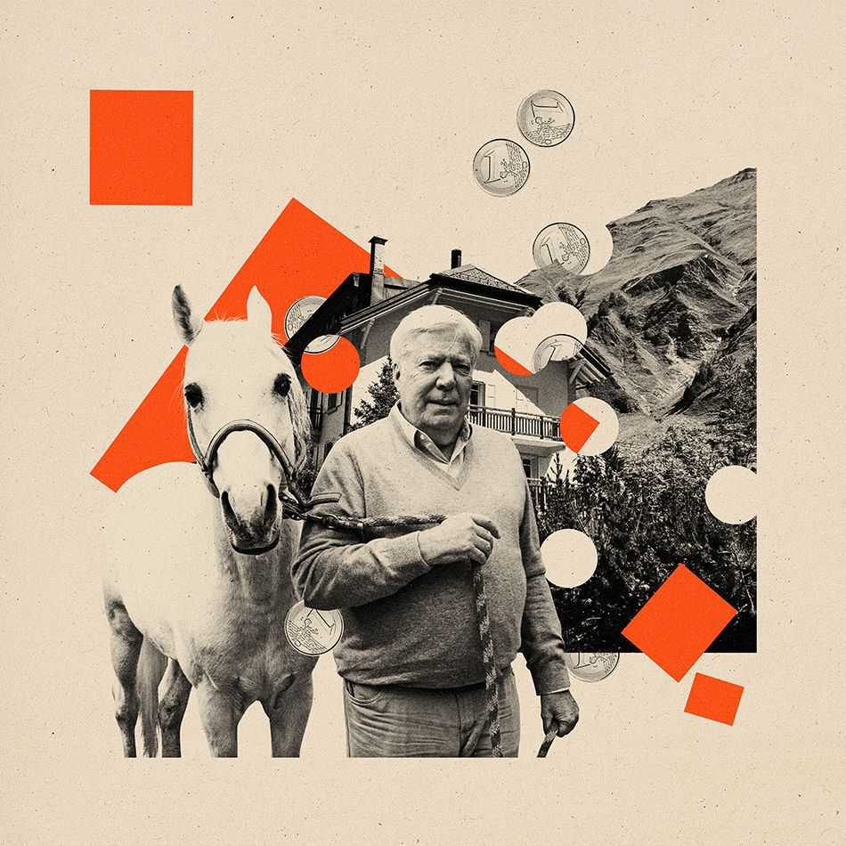
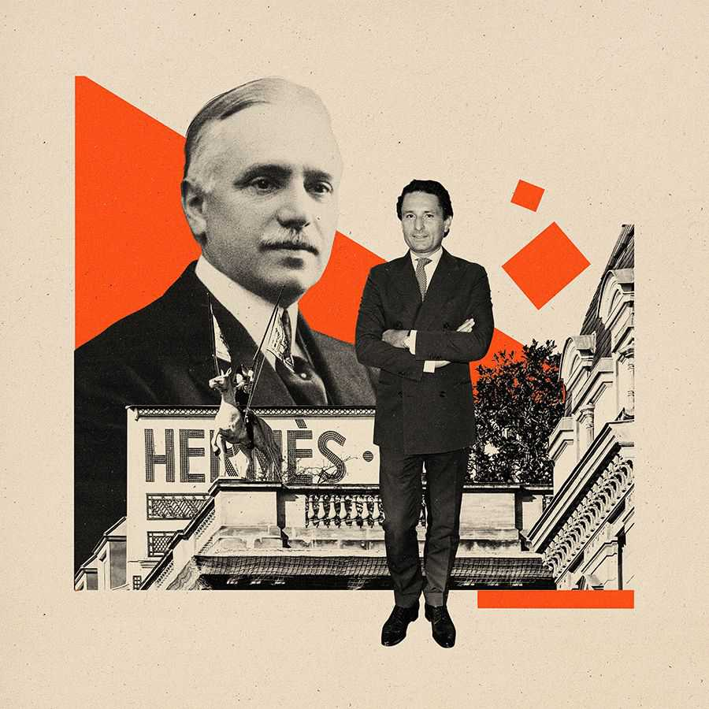

1843 | Luxury
The Hermès heist: how an heir to the luxury dynasty was swindled out of $15bn of shares
Nicolas Puech had a 6% stake in the French fashion house. Then his stock went missing
December 11th 2025

In September 2022 the board of the Isocrates foundation gathered in Florence for its annual meeting. This wasn’t your usual corporate shindig—the group lingered over meals in swanky restaurants, visited museums and wandered sun-dappled streets. One day, things would undoubtedly have to become more formal. The small foundation, which gave money to a number of humanitarian

causes, was in line to receive billions of euros when its benefactor died, which would make it one of the biggest philanthropic institutions in the world.

Its founder, Nicolas Puech, was the largest individual shareholder in Hermès, a luxury-goods firm. From 2004 he owned nearly 6% of the company, a stake that would now be worth €13bn ($15bn). Puech, who is part of the Hermès family, has no children. The entirety of his vast fortune was destined for the Isocrates foundation, which he had set up in 2011 on the advice of his Swiss banker of 24 years, Eric Freymond. Freymond had organised the trip to Florence, entertained the board members at his Tuscan mansion and remained at Puech’s side throughout—the foundation’s secretary, Nicolas Borsinger, described his behaviour as “intimate” and “obsequious”.

At the meeting, Puech barely spoke, weighing in only on the precise shade of green for the foundation’s new logo. “You didn’t get the impression this was his fortune,” said a source who was on the trip. What followed came as a shock to everyone involved. Freymond returned home to find a letter dismissing him from the board. By October Puech had revoked the powers he had granted Freymond to manage his money. He later filed a criminal complaint in Geneva, accusing Freymond of “massive fraud”. Puech had realised that his Hermès shares were nowhere to be found. Worse still, they had been missing for more than a decade. Hermès itself had no idea where they were.

Many of the fanciest luxury brands, such as Hermès, Ferragamo and Prada, remain family-run despite being publicly listed. Bernard Arnault and his family hold a controlling stake in LVMH, the world’s biggest luxury conglomerate. Brands work hard to cultivate an image of themselves as genteel clans with an insistence on tradition.

Hermès, which is more than 65% family-owned, prides itself on its centuries- old leatherwork techniques. It cannily limits production of its most coveted products, keeping prices high: a Birkin bag costs upwards of £10,000 ($13,350) in a shop and a multiple of that on the resale market. Selling mainly to the very rich—unlike say, Gucci, which also sells to the aspirational middle classes—insulates Hermès from the ups and downs of the luxury industry. Its customers are less likely to cut back on spending during periods of economic instability. This is why Hermès’s share price has risen by roughly 150% over the past five years (while other luxury stocks are up by 50% at most).

But the mystique that makes luxury houses so lucrative also carries risks. Family firms are often governed not by corporate codes but by decades-old loyalties, rivalries and unspoken understandings. Heirs think in generations, not quarters, and can be resistant to cost-cutting. Family businesses are also vulnerable to succession crises, mismanagement and takeover attempts— especially with sprawling dynasties where relatives are scattered across the globe.

The saga of Puech’s missing billions—almost certainly one of the biggest frauds in history—raises questions beyond who is to blame. Are Hermès’s shareholders being told the full story? And behind the runways and polished shopfronts, just how dirty is the fight among Europe’s luxury dynasties?

In 1837 an enterprising craftsman named Thierry Hermès opened a shop selling horse harnesses in Paris’s ninth arrondissement. Business was brisk but the firm really took off in the 1850s, after Napoleon III seized power and embarked on modernising the capital. Paris was transformed into an elegant metropolis with parks and wide boulevards, perfect for horse-drawn carriages. Speculators poured money into the city, building apartment blocks, hotels, theatres, restaurants and department stores. As Paris became a place for the newly minted bourgeoisie to see and be seen, the luxury industry took off. Napoleon III’s wife, Empress Eugénie, became an unofficial brand ambassador: she carried her belongings in Louis Vuitton cases and bedecked her horses in Hermès.

Each subsequent generation has steered Hermès in a slightly different direction. Under Thierry’s son, Charles-Emile Hermès, the firm began making saddles (legend has it that customers started to complain their horses were better dressed than they were). Charles-Emile’s son, Emile-Maurice Hermès, designed an oversized leather bag in which clients could carry their boots. In the early 1980s Emile-Maurice’s grandson, Jean-Louis Dumas, sat next to Jane Birkin, a British actress, on an aeroplane. When Birkin complained about the lack of roomy handbags on the market, Dumas sketched an initial design for what would become the Birkin bag.

The family still runs Hermès like a small atelier. Production expands only marginally each year, despite lengthy waiting lists, and each workshop is capped at 300 staff. Craftsmen, who are all well-versed in the label’s history,

refer to Emile-Maurice and Jean-Louis by their first names, as if they were talking about their own grandparents.

Today, the family is split into three branches, descended from Emile- Maurice’s daughters. The Dumases, who hold the top jobs, are discreet Protestant workhorses—Axel Dumas is the current chief executive. The Puechs share that reserve but largely stay out of operations. Until recently, it was the Guerrands—spread across Morocco, America and elsewhere—who were seen as the loose cannons of the family, their progeny finding themselves the subject of tabloid headlines in the early 2000s.

Being in charge of a family firm requires more than just business acumen. “One job of the CEO of Hermès”, said Stéphane Wargnier, who worked in communications at the company, “is to keep the family bonded.” At any moment there is an heir in need of cash and eager to sell their stake. Top executives organise trips to overseas store openings for far-flung relatives with the express aim of “making them feel part of the life of the firm”. Even those with tiny stakes are invited to glitzy parties and given Birkins as gifts.

Nicolas Puech, a great-great-grandson of Thierry Hermès, was born in a suburb of Paris in 1943. He and his siblings grew up roaming the Hermès headquarters on Rue du Faubourg Saint-Honoré, but Puech showed little interest in the business. He preferred partying with socialites and celebrities, including Yves Saint Laurent. Puech’s older brother, Bertrand, allegedly considered placing him under guardianship to stop him from squandering his fortune. (Nicolas Puech declined to comment on any of the matters raised in this article.)

Some say Puech’s extravagance made him a black sheep; others say relatives disapproved of the fact that he is gay. In any case, like many party animals, he mellowed with age. In the 1990s he retreated from public life and withdrew from his family. Eventually, he left France, shuttling between a farm outside Seville and a converted inn in the Swiss Alps.

In 1996 Puech’s mother died. Yvonne Puech (née Hermès), left a 4.7% stake in the company to her son. (In 2004 he acquired another 1% when his sister

Odile died.) According to court documents, Puech deposited the shares in three Swiss banks, on the advice of Freymond, whom he had met in 1989.

Freymond ushered Puech into Geneva’s beau monde. The pair holidayed together and bonded over their love of art. In 1998 Puech gave Freymond near-total control of his finances, including the right to sell assets on his behalf, and the following year granted him power of attorney. According to court documents, Puech placed “great trust” in his banker, signing papers without a glance and rarely checking his accounts. He got to know Freymond’s associates, including Farah Diba, the last empress of Iran, and Freymond’s friend and lawyer, François Besse, who began representing Puech too.

Puech and Freymond were, in some ways, an odd pair. Every source I spoke to used the same words to describe Puech: modest, private, gentle—if not particularly sharp. They told me that after leaving France he didn’t flash his cash (though he made exceptions for the occasional lavish birthday party, private air travel and a bordeaux-coloured Bentley).

Freymond, 15 years his junior, was a paid-up member of Geneva’s elite. In photographs he tends to sport tailored suits and owlish spectacles, and is often holding a glass of champagne. Freymond and his wife Caroline were renowned for throwing high-society parties at their house on the ramparts of Geneva’s old town and their 18th-century chalet near Gstaad. Those soirées helped Freymond nurture influential connections. After studying law and working at a private bank, he founded his own firm in 2001 called Semper Gestion, which grew to manage billions. Freymond oversaw the fortunes of French dancer Zizi Jeanmaire and Swiss Bond girl Ursula Andress. He also got to know several members of the Hermès clan, a number of whom became his clients. It wasn’t long before his little black book caught the attention of executives at LVMH.

Bernard Arnault, the founder of LVMH, is credited with transforming the luxury sector from a smattering of small labels into a multi-billion-dollar global industry. He has assembled his empire by taking over smaller businesses including Louis Vuitton, Dior, Moët & Chandon, and assorted watchmakers and jewellers, earning him the nickname, “the wolf in cashmere”. In 1999 Arnault tried to acquire Gucci, but failed. Then Hermès caught his eye.

It was a perilous moment for the company. Its chief executive, Jean-Louis Dumas, father of the Birkin, was ill with Parkinson’s and there was no clear succession plan. In 2001 and 2002 LVMH started quietly buying Hermès stock on public markets. Together these purchases came to just under the 5% limit at which French law requires investors to declare their holdings.

Arnault’s team got in touch with Freymond and the pair met in secret on several occasions to negotiate a deal. Puech often joined them. Freymond was tasked with identifying family members keen to sell their shares and discreetly transferring their stakes to Arnault. Puech’s part in the affair remains unclear. In court documents, Puech is quoted as saying he saw no “objection” to the deal but never agreed to sell his own stake (which would have been worth around €500m at the end of 2008).

These acquisitions were structured carefully to avoid disclosure. In 2008 LVMH entered into swap contracts with three French banks, which allowed Arnault to bet on the future price of Hermès shares. To manage the risk the banks bought Hermès shares themselves—some off-market. LVMH was meant to get cash when its bets came through, but the deal was changed so that the banks paid out in Hermès stock.

On October 23rd 2010 LVMH announced it held 14.2% of Hermès (that stake would rise to over 20% before the year was out). Hermès shares jumped more than 15% on the announcement. The Hermès family was blindsided. Arnault infuriated Hermès executives by denying he planned to take over the firm and describing the investment as “friendly”. Puech’s brother, Bertrand, who was chairman of Hermès at the time, told a reporter bitterly: “With friends like these, who needs enemies?” The group’s chief executive added: “If you want to seduce a beautiful woman, you don’t start by raping her from behind.”

LVMH never managed to accumulate enough Hermès stock to block decisions made by the family. The Hermès heirs rallied together to prevent a takeover. On December 5th 2010 they announced the creation of a new family holding company, H51, into which dozens of heirs deposited more than 50% of the firm’s capital, more or less locking up their equity for the next 20 years. (In 2022 the deadline was extended to 2041.)

Meanwhile, the French financial regulator, Autorité des Marchés Financiers (AMF), opened an investigation into the acquisition of Hermès stock by

LVMH. In June 2013 it concluded that the information LVMH had provided was insufficiently accurate, precise and sincere. The AMF fined LVMH €8m (€2m less than the maximum possible fine). This paled into insignificance next to the €3.8bn in capital gains that LVMH reported on its investment in Hermès, thanks to the rise in the company’s share price. (When asked to comment on the matters raised in this article, LVMH shared a press release that it issued last week after renewed interest in its dealings with Hermès: “LVMH and its shareholder [sic] firmly reiterate that they have never, at any time, diverted shares of Hermès International in any manner and that they hold no ‘hidden’ shares—contrary to the implications put forward by Mr Nicolas Puech, who has chosen to turn to the French courts after being dismissed on numerous occasions by the Swiss judiciary.” LVMH said that “baseless allegations” had been reported in recent media coverage, “seeking to reinterpret the circumstances under which LVMH acquired its stake in Hermès International more than 15 years ago”.)

After Arnault’s announcement in 2010, suspicion fell on Puech. His extended family had long regarded him as a harmless eccentric; now they saw him as closer to Judas. He claimed he still held his 6% stake in Hermès but refused to lock up his shares in H51. Instead, he announced he would be setting up a foundation and leaving it his stock when he died. But he gave his family the right of first refusal should he ever decide to sell his stake.

Despite Puech’s protests, his relatives were increasingly concerned that his stake had been handed to Arnault. But finding out what had happened to

Puech’s shares was complicated by the fact that they were bearer shares. Bearer shares used to be paper certificates, which belonged to whoever physically bore them at any given time. French law now requires them to be digitised. Unlike registered shares, however, companies don’t know the names of the holders of bearer shares (which makes them attractive to investors who want to stay anonymous). Companies communicate only with the intermediary, usually a bank, at which the stock is held.

Hermès used Euroclear France, a body in charge of tracking ownership of stocks and bonds, to ask the intermediaries holding its bearer shares to disclose the names of their owners. But Hermès didn’t get answers; a spokesperson for Euroclear told me that Swiss banks often fail to respond.

Hermès continues to pay dividends on Puech’s shares. Payments on bearer shares are made to the financial institutions that look after them, so the company has no way to know if these funds have ended up in Puech’s hands. In the past five years the payments on 6m Hermès shares would come to over €450m. From 2015 Hermès stopped mentioning Puech’s stake in annual reports, suggesting it had sufficient evidence that Puech no longer owned all those shares.

That same year Hermès filed a criminal complaint in France against Puech for using documents forged by Freymond. In essence, the company was accusing Puech of falsely claiming to possess Hermès stock. Freymond tried to stall the case by questioning points of procedure and allegedly advised Puech not to show up in court.

The failure of the tie-up with LVMH was a huge disappointment for Freymond, who had expected to pocket a small fortune for his services. According to Glitz, a French publication, he filed a complaint against Arnault claiming 10% of the capital gains LVMH made on its Hermès stock. Freymond reportedly employed private detectives to investigate what he believed to be backroom dealing by Arnault and provided evidence which he claimed showed that LVMH, despite Arnault’s denials, had indeed planned to take over Hermès. Freymond, says Glitz, withdrew his complaint in 2019.

Despite everything, Puech stood by his banker. Charlotte Bilger, a judge who oversaw Hermès’s criminal complaint for several years, told me that Puech was “in complete denial” and even wrote to the court asking her to stop

pursuing the case against Freymond. “He seemed to be someone who was easily manipulated,” said Bilger. She compared Puech to Prince Myshkin, the guileless hero of Fyodor Dostoyevsky’s novel, “The Idiot”.

In July I visited Ferret, a village in the Swiss Alps, in the hope of meeting Puech. I’d heard he retreats to his home there every summer, as soon as the snow melts and the winding road reopens. Standing on the green mountainside, silent except for the tinkling of cowbells, I could see why somebody tired of reporters, lawyers and his own relatives would make this his refuge. The village is made up of a handful of Toblerone-shaped houses with hanging baskets and names like Le Petit Paradis on hand-painted signs.

I introduced myself to some of Puech’s neighbours. One man said he wanted to respect Puech’s privacy and described him as “a nice man who wants a quiet life”. Another neighbour told me few people came and went from Puech’s property, apart from a man who worked as his caretaker.

I walked up to a big yellow house with pale-blue shutters that the land registry said belonged to Puech. A woman in a nautical-striped top with sharp blue eyes opened the door. “Sorry, I don’t speak French,” she said in English. She told me Puech was out and that she didn’t know when he’d return. “I’m just the cook,” she added, before shutting the door in my face.

Down the hill, a young stonemason was mending the front wall of a tiny chapel. He told me he had once worked on Puech’s outhouse under the supervision of his Moroccan caretaker, Jadil Butrak-Abderrazak.

Butrak is thought to have started working for Puech in the 1990s and at some point was joined by his partner, Maria Paz Pinero. Multiple sources told me Puech has an unusually close relationship with Butrak. They described Pinero as hot-tempered (Was she the woman who answered Puech’s door?). The couple have two children. According to reports in L’Express, a French magazine, Butrak and Pinero were invited to Puech’s 75th birthday party in Spain in 2018.

During the pandemic, Puech cut ties with almost everyone he knew. For 18 months he didn’t see Freymond in person, speaking to him only by phone. It seems that the only people he spent time with were Butrak and Pinero. It may be that the couple convinced Puech that his banker was not acting in his best

interests. In a recent interview with L’Express Puech said that he realised Freymond was lying to him when a large sum of money he had asked Freymond to give Butrak failed to materialise.

Whatever the trigger, Puech appears to have grown uneasy about the fate of his inherited shares. In 2021 and 2022 he wrote to Freymond asking for information about his holdings. According to filings to a Geneva court, those letters went unanswered.

The tipping point probably came when Puech discovered that the estate of Richard Desurmont, the heir to a French textile fortune, was suing him for unpaid debts. It emerged that Freymond was put in charge of managing Desurmont’s fortune after he died in 2021 and had loaned €20m of his legacy to Puech in early 2022. If Puech held billions of dollars of Hermès shares, which pay out hefty dividends, why was his banker taking on debt in his name?

In October 2022 Puech finally dismissed Freymond. He let it be known that he wanted to leave his shares to Butrak instead of the Isocrates foundation, which Freymond had helped set up. In February 2023 Puech looked into adopting Butrak. It is hard to tell what stage the process got to: I called a family lawyer in Switzerland, who explained that it is difficult to adopt an adult. Documents I’ve seen confirm Puech transferred dozens of properties to Butrak by 2023. A source told me that one home in the caretaker’s name in Montreux, near Lake Geneva, is valued at over €3m.

Puech’s lawyers asked the Isocrates foundation to scrap the pact that gives it rights over Puech’s shares when he dies. The board refused.

Freymond, meanwhile, appealed to Switzerland’s child and adult protection authority to intervene, claiming he was concerned for Puech’s wellbeing. In the report, which I have seen, he portrays Puech as a vulnerable old man ensnared by Butrak and Pinero and describes him as a “friend for whom Eric Freymond retains all his kindness and affection”.

In Ferret I paused for lunch at an inn. Afterwards, the stonemason called me over to say Puech had been watching me snoop around and that a woman in a striped top had driven him away in a Mazda. I seized the opportunity to take a closer look at Puech’s house. Through the windows I saw plush armchairs, chintzy curtains and brass lamps. On a console table in the hall there was a pair of binoculars, a silver knife and fork, and an orange Hermès gift box.

In September 2023 Puech made a submission to a court in Geneva, accusing Freymond of embezzlement. He demanded that Freymond and his wife be questioned, their Geneva home searched and any documents or property connected to his lost fortune seized. But the submission was so poorly assembled—with incomplete documents and flawed legal arguments—that the court refused to open an investigation. The prosecutors said it was not their

role “to carry out exploratory investigations in an attempt to detect potential offences”.

Undeterred, Puech took the fight to France, where he brought a complaint against Freymond for breach of trust and misappropriation of funds. This time his case was better put together. Magistrates in Paris attached it to Hermès’s unresolved fraud suit from 2015. After years of estrangement, Puech and his family were now fighting on the same side.

Earlier this year Freymond made a last-ditch effort to climb out of the hole he had dug for himself. In February he and Besse, Puech’s lawyer and Freymond’s ally, arranged for Puech’s 6m shares to be sold to the Qatari royal family. Freymond was named as a “consultant” on the deal despite having been fired by Puech. According to a lawsuit filed by the Qataris in Washington, DC, the shares were to be “reissued” by Euroclear and handed to them. But on March 19th Besse wrote to the royals with bad news: “Despite our best and repeated efforts, the seller, my client, was unable to retrieve the shares.” The Qataris demanded $1.3bn in damages and delivery of the shares. (Besse did not respond to a request for comment.)

It isn’t clear what exactly Freymond intended to achieve. When news broke of the court case, Puech’s lawyer denied his client was involved in the deal and said Puech had first learnt of it from press reports. A Euroclear spokesperson told me the firm had no ability to “reissue” shares and wasn’t sure what the term meant. The Qatari royal family declined to comment.

Incredibly, Freymond continued to defend himself. As recently as this summer, his representatives told me that he had managed Puech’s properties and other financial assets, but that he had never looked after the inherited Hermès shares. They tried to convince me that Puech had got himself into a muddle and that his banker was taking the blame.

In the end, Freymond couldn’t avoid the courts. On July 7th he appeared before the Parisian magistrates investigating the fate of the missing shares. He gave a lengthy testimony and answered questions behind closed doors.

On July 23rd I went to see one of his lawyers in Paris, hoping to get details of the hearing. The interview yielded very little. But later that day I received a missed call and a cryptic text message from him. When I phoned back, the

lawyer told me in a trembling voice that, while we had been chatting in his office, his client had killed himself.

Two days after his 67th birthday, Freymond cycled out of his chalet near Gstaad towards a railway track. Shortly afterwards he was hit by a train. “The scandal of the century,” as it has been termed in court, would have to continue without the main accused.

In early November, a source showed me the testimonies of Freymond and Puech. In court Freymond had been full of his characteristic obsequiousness. As he narrated his version of events, he contradicted himself repeatedly and fawned over the prosecutors. “I want to apologise to you for my lack of sincerity,” he explains at one point as he corrects himself. “I want to add that if I am here before you, it is to humbly acknowledge my wrongs.”

Freymond claimed that he and Puech had had an affair for about 15 years until 2016. He said he had been in love with Puech: “I admired his elegance, his savoir-vivre, his originality, his love of nature.”

Puech faced the magistrates on September 23rd. He spoke in a circumlocutory manner and seemed hard-pressed to provide specifics on financial matters; he forgot, at one point, the word for “dividends”. In his testimony, he said Freymond’s claims about their relationship were “absolutely nonsensical…It’s really just a way to confuse you. I reject it.” He said that Freymond kept a

tight grip on his life: controlling his movements, opening his post and banning him from inviting relatives to his 75th birthday party. Puech handed the magistrate a document entitled “Memo for Nicolas”, which he said had been written by Besse in 2017. It forbade Puech from travelling to France, sharing his whereabouts with family members or allowing impromptu visitors into his home. Puech said he lived in an atmosphere of “fear”.

After decades of denial, Freymond admitted to the magistrates that he had sold Puech’s shares to LVMH. He said that Puech was “perfectly informed” and met Arnault 14 times, including at Arnault’s apartment in Paris and his chateau in Bordeaux. “It was Mr Puech who made the decision, who was enthusiastic and eager to move forward for the simple reason that he had a score to settle with his family,” claimed Freymond.

This, too, Puech strenuously denied. He acknowledged that he had met Arnault several times and said that Arnault had given him presents including a travel bag. Arnault had been “friendly”, he added. “He told me, ‘Just call me Bernard.’” But Puech maintained he never agreed to sell his shares. “Often, I assumed that Mr Freymond had spoken to Mr Arnault before and I would arrive somewhat as a figurehead, as an important member of the Hermès family,” he said. The Parisian investigators found that millions of shares belonging to Puech were sold in 2008, in some cases for less than €100 per share. The stock is now worth more than 20 times that.

Where exactly Puech’s bearer shares ended up may remain a mystery for ever. In 2014, after the AMF investigation into the stock acquisitions had been completed, LVMH and Hermès reached a truce. LVMH agreed to hand all its Hermès stock to its own shareholders: two Hermès shares for every 41 in LVMH.

The Hermès shares that were scattered between LVMH’s shareholders are impossible to trace. Christian Dior, the largest investor in LVMH, distributed the stock to its own investors. The Arnaults, who ended up with 8.5% of Hermès, began to sell off their stake, according to data from company reports. They handed over much of what was left in 2017 as a step in LVMH taking full control of Dior.

An audit commissioned by Puech’s lawyers established that he still had 535,899 Hermès shares at the end of 2013. But those were progressively sold,

so that by 2021 he no longer had any shares in his family firm.

It appears that Freymond funnelled over €100m of assets out of Puech’s accounts, often to benefit himself and his circle. Documents cited by the Parisian magistrates show that transfers of 200,000 Hermès shares and €26.4m were made to Noor Capital, an Emirati investment firm managed by an associate of Freymond’s, Olivier Couriol, who has been named in press reports in connection with fraud and money laundering. Another €25.8m of Puech’s money was put into Hydroma, a Canadian firm with hydrogen projects in Mali—in a series of small purchases, made in quick succession at increasing prices, that a magistrate described as “quite unusual”. (Couriol could not be reached for comment.)

Freymond also opened various joint bank accounts with Puech, depositing €35.8m at one private Swiss bank. Freymond said this money was used to fund the pair’s travels and “common projects”. Puech said he had no knowledge of any joint accounts.

While the magistrates press on, others are trying to grab what’s left of Freymond’s fortune, the size of which is hard to estimate. Some of his properties are registered in the names of his wife and daughters. Swiss courts have frozen his bank accounts, banned the sale of some art and antiques, and placed a lien on one of his houses. Among those fighting for his assets are Puech, his foundation and the Desurmont estate. Borsinger, the secretary of the Isocrates foundation, doesn’t rate its own chances. “We are a canoe fighting a destroyer,” he said.

Despite the scandal, Freymond’s family has not been cast out. A lawyer based in Geneva told me that, even as they “waved their hands and exclaimed” over the headlines, the Freymonds’ many friends continued to socialise with them in the months before Eric’s death, while hundreds of mourners attended his funeral. The sorry tale, the lawyer added, is “more Balzac than Financial Times”.

Puech, once among the world’s richest men, now appears to be worse off than his caretaker. According to documents reviewed by the magistrates, the 82- year-old is penniless. He doesn’t even own the house in the Swiss Alps. Earlier this month Reuters reported that Puech had lodged a civil case against Arnault in Paris in May (when I asked LVMH if its boss had been summoned

by magistrates in the ongoing criminal case, it declined to comment). Puech told L’Express that he was “surrounded and supported” by Butrak and Pinero. Members of the Hermès family are giving him handouts. “I am in a desperate situation,” Puech said in his testimony. “I no longer have financial means and I know that many have got rich at my expense.” ■

Avantika Chilkoti is global business correspondent for The Economist.

Illustrations Ewelina Karpowiak

This article was downloaded by zlibrary from https://www.economist.com//1843/2025/12/11/the-hermes-heist-how-an-heir-to-the-luxury- dynasty-was-swindled-out-of-15bn-of-shares

Business

Netflix and Paramount are battling for more than Warner Bros How AI is disrupting shopping Donald Trump’s flawed plan to get China hooked on Nvidia chips From social media to porn, age checks are spreading across the web Vietnam’s EV champion is bleeding cash A short guide to every business-hotel room Oracle and the hard truths about software