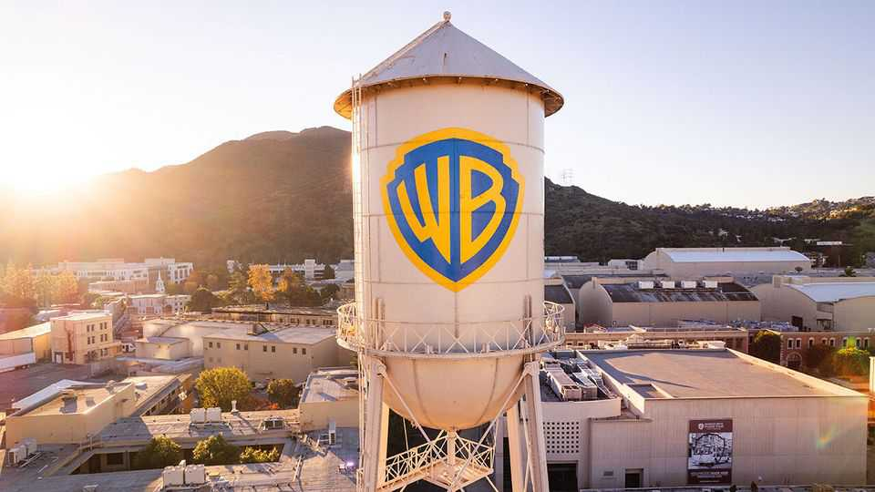
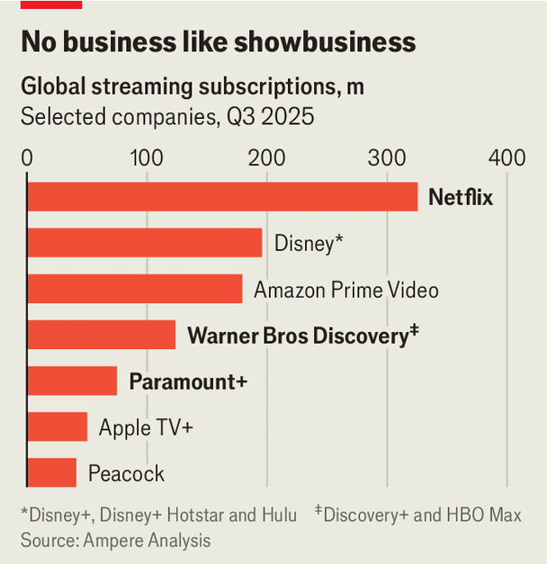

Business | That’s not all, folks!
Netflix and Paramount are battling for more than Warner Bros
They present rival visions for the future of entertainment
December 11th 2025

THE CREDITS were ready to roll. Netflix, the world’s biggest streaming company, had announced on December 5th that it was to acquire most of Warner Bros Discovery, one of the biggest names in old-fashioned moviemaking, in a deal valued at $83bn. But on December 8th Paramount, a much smaller rival, pressed pause on the transaction. It appealed directly to Warner’s shareholders to accept an alternative offer of $108bn for the whole company, promising a deal that is “superior to Netflix in every dimension”.

The Looney-Tunes sums could yet grow even higher: Paramount’s owners, the Ellison family, have made clear they are willing to shell out more; Netflix, valued at over $400bn, can also afford to up its bid if it wants to. But the main difference between the bidders is not the offer price. Netflix and Paramount see different things in their target. The result of the bidding war will shape the future of Hollywood, and of entertainment more widely.

For months Paramount was the favourite to buy the century-old studio. David Ellison, a 42-year-old Hollywood producer, acquired Paramount in August for $8bn, backed by his father Larry Ellison, whose stake in Oracle, a software company, has made him the world’s second-richest man. Scarcely had they got the keys to Paramount’s Melrose Avenue lot when they announced that they would go after Warner, to build a media colossus. The Ellisons had the money, the motive and a friendly relationship with President Donald Trump. What could stand in their way?

Netflix. On December 4th, as David Ellison sent increasingly frantic texts to Warner’s management, it transpired that Netflix was the preferred bidder; the next day the deal was announced. Filings released by Paramount this week show that the company was blindsided. Paramount now says its most recent, improved offer was not fairly considered by Warner’s management. It has gone hostile, arguing that shareholders deserve a chance to accept their offer, whatever executives have agreed with Netflix.

The two bids value Warner at a similar level. Paramount is offering $108bn in cash for the whole company. Netflix is offering $83bn, in a mixture of cash and stock, for the company’s studio and streaming service. Under the Netflix deal, Warner shareholders would keep the declining TV and cable networks in a stub company that Hollywood has called “ShitCo”. In most scenarios ShitCo’s market value would be enough for the Netflix deal to add up to roughly the same total as Paramount’s, albeit with more uncertainty.

Yet the two deals also represent different possible futures for the entertainment business. Paramount’s motive is clear. At the moment it lacks the scale to compete with the biggest names in streaming; combined with Warner, it would be big enough to be a serious rival to the likes of Netflix and Disney (see chart). The streaming wars, which Netflix has all but won, would be rekindled. By contrast, if Paramount fails to win this deal, it “sits much closer to an existential crossroads”, notes MoffettNathanson, a research firm.

Paramount also promises that it would rejuvenate the cinema industry. David Ellison, a devotee of the silver screen who has produced films such as “Top

Gun: Maverick”, said this week that a combined Warner-Paramount would release more than 30 movies a year in cinemas. Netflix has promised that it will keep giving Warner movies theatrical releases. But no one in Hollywood thinks that the streaming giant will be the saviour of the big screen. Only earlier this year Netflix’s co-chief executive, Ted Sarandos, said that cinemagoing was “an outmoded idea, for most people”.

Instead Netflix sees something else in Warner: its ideas. Netflix hardly needs scale. With around 325m subscribers it is already nearly twice as big as its nearest rivals. But what it has in quantity, it lacks in quality. UBS, a bank, points out that Netflix has about twice as many titles as Warner on its streaming service in America, but that when it comes to titles rated at least nine out of ten on IMDB, a review website, Warner’s HBO Max has 141 against Netflix’s 120. Netflix sees potential to squeeze more engagement out of those first-class titles. It has already shown how it can make hits out of tired old series like “Suits”, a forgotten legal drama which it licensed from NBCUniversal a few years ago and turned into a smash. What could it do with gold-plated intellectual property (IP) like Warner’s “Game of Thrones”? As Mr Sarandos has put it, “Their assets work better in our business model, and our business model works better with these assets.”

Netflix views those assets as weapons in a bigger fight, with competitors outside Hollywood. Despite the town’s obsession with the streaming wars between competing studios, Netflix has come to see its biggest rival as YouTube. The Google-owned social-media platform accounted for 28% of streaming on TVs in America in the latest quarter, against Netflix’s 19%, according to Nielsen, which measures such things (HBO Max made up less than 3%). Netflix may now be the king of Hollywood. But it is increasingly pitting its professionally made shows against the home-made, algorithmically sorted content on YouTube and other platforms. The Warner acquisition would give it an arsenal of premium-grade weapons for that war.

That will be the argument that Netflix pitches to competition regulators if its bid progresses. Allowing Hollywood’s biggest streaming service to absorb the fourth-largest may seem unlikely, especially when Paramount’s alternative deal promises to create a viable new competitor by combining the fourth-and fifth-largest. Netflix would hope that regulators take seriously the idea that the real threat to Hollywood is the social-media platforms in Silicon Valley, which for now are winning the war for attention among young audiences.

Both the Netflix and Paramount bids are complicated by politics. Paramount contends that it would get its deal through quicker than Netflix—partly because competition concerns would be less serious, and partly because the Ellisons are chums with the president. Mr Trump has said that Netflix’s deal “could be a problem” because of its “big market share”. Mr Sarandos is a Democratic donor whose wife served as an ambassador during Barack Obama’s presidency.

Yet Paramount’s offer is not without controversy, either. Affinity Partners, an investment firm run by Mr Trump’s son-in-law, Jared Kushner, is part of its consortium. Paramount says its bid is “back-stopped” by the Ellison family and RedBird Capital Partners, another American investment firm. But in a filing to regulators on December 8th it revealed that the biggest financial backers of its bid are in fact a group of sovereign-wealth funds from the Gulf. In an offer put to Warner earlier this month, the Ellisons were to stump up $12bn while Abu Dhabi, Qatar and Saudi Arabia would together contribute $24bn (with the remainder made up by debt). An earlier offer included backing from Tencent, a Chinese tech giant.

Paramount says Tencent is no longer on board and that the Gulf investors would have no voting rights or board representation at the new company. It argues that this should preclude the need for meddling by America’s inbound- investment watchdog, the Committee on Foreign Investment in the United States. Yet it would be controversial to say the least for one of America’s biggest media companies, which would control both CNN and CBS News, to be part-owned by Gulf monarchies and the president’s son-in-law.

The show is not over. Netflix may up its price; Paramount has made clear that its own 12-figure bid is not its best and final. But whatever amount is reached, two paths for the future of American entertainment have been laid out. On the one hand, Paramount would use Warner to keep something like the old Hollywood alive, fighting the streaming wars and pumping out theatrical releases, being propped up in this mission with billions of dollars from Gulf investors. On the other hand, Netflix promises in effect to accelerate the trends of the past few years, reducing the number of independent Hollywood studios in order to build an IP powerhouse capable of winning the wider contest for attention with Silicon Valley. Warner’s shareholders must choose between a nostalgic sequel and a radical reboot. ■

To track the trends shaping commerce, industry and technology, sign up to “The Bottom Line”, our weekly subscriber-only newsletter on global business.

This article was downloaded by zlibrary from https://www.economist.com//business/2025/12/09/netflix-and-paramount-are-battling-for- more-than-warner-bros