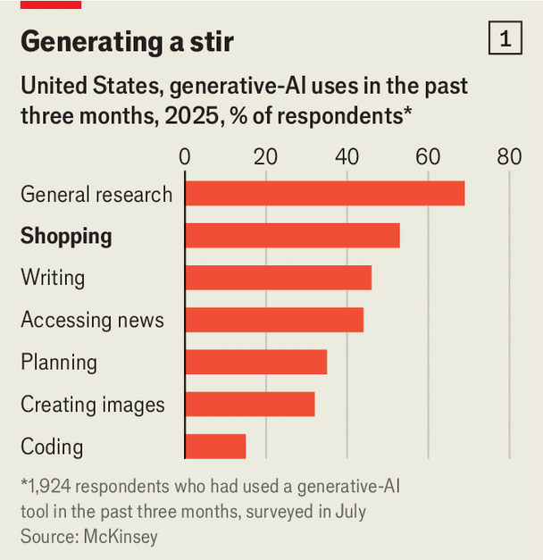
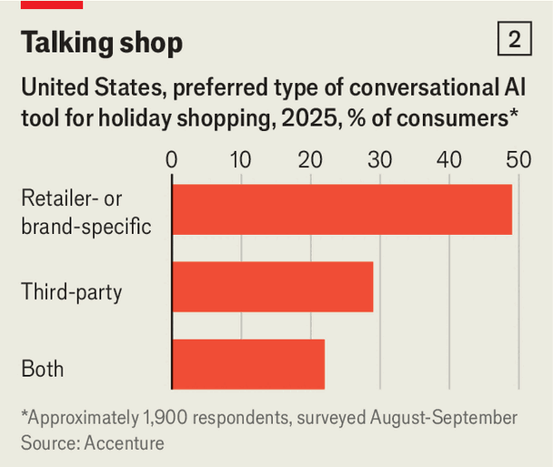

Business | Bot and sold
How AI is disrupting shopping
Looking for Christmas gifts? Just ask a chatbot
December 11th 2025

The time of year has come again when gift-givers trudge around shops and scroll endlessly through e-commerce websites to find suitable Christmas presents for their loved ones. Some will enjoy browsing. But many will not. A growing number will happily outsource much of the process to artificial intelligence (AI).

Chatbots offer a personal shopper for all. They can listen to what a user wants, produce a shortlist of products and help with comparisons. This holiday season around two-thirds of consumers in rich countries, and five-sixths of those aged 18-24, plan to use AI to help them shop, according to a survey by Shopify, a provider of e-commerce tools. A study from McKinsey, a consultancy, found that the second-most-common use for ChatGPT-like “generative” AI in America is for shopping advice, behind general research but ahead of writing assistance (see chart 1). Increasingly, consumers can even make purchases directly through a chatbot. By 2030 McKinsey reckons that

$3trn-5trn of shopping worldwide will be conducted through such “agents”. Retail is on the cusp of its next big upheaval.

AI firms are betting that their technology will disrupt shopping just as e- commerce did in the internet age. Although OpenAI has deprioritised efforts to integrate ads into ChatGPT, it has struck deals with Shopify and Etsy, an online marketplace for artisanal wares, to allow merchants to sell their products through its chatbot in return for a fee. Google, whose search engine has long been the starting point for many shoppers, is also eyeing the market for so-called agentic commerce. Users in America can have its AI tools call shops to check stock, track the prices of products and make some purchases on their behalf when deals come up.

Retailers, however, are not standing idly by. Many e-commerce websites have bristled at the idea of an AI agent getting between them and their customers. Amazon, the world’s biggest online mall, which makes roughly a tenth of its revenue from ads, is eager to keep shoppers coming to its website. It has blocked OpenAI’s crawlers from collecting information, and is suing Perplexity, another AI firm, claiming that its Comet browser has been prancing around Amazon’s website masquerading as a human (which Perplexity denies).

Others have been more open-minded. In October Walmart, Amazon’s long- time rival, announced that its products would soon be available to purchase directly through ChatGPT. Such deals may help retailers reach customers they otherwise would not have. Analysts at Mizuho, a bank, reckon that 4% of visits to Walmart’s website come from referrals, of which ChatGPT provides a third.

Doug McMillon, Walmart’s outgoing chief executive, has acknowledged that online shopping needs to move beyond “a search bar” and “a long list”. Some retailers, including Walmart, have developed shopping assistants of their own. Research by Accenture, another consultancy, suggests that Americans prefer such bots over third-party ones like ChatGPT when shopping (see chart 2).

That may reflect the challenge of integrating external AI tools with retailers’ data. On a recent earnings call Andy Jassy, Amazon’s boss, pilloried third- party shopping agents: “There’s no personalisation. There’s no shopping history. The delivery estimates are frequently wrong. The prices are often wrong.” (Amazon offers its own assistant, Rufus, which it says has been used by 250m customers this year.)

Julie Bornstein, founder of Daydream, an AI fashion-shopping tool, notes that chatbots are more helpful when searching for some goods than others. They

excel when products have clear, comparable specifications—like vacuum cleaners, for which retailers list weight and power. They perform tolerably with products involving a combination of specifications and personal preferences, like cosmetics. But in deeply personal realms, such as fashion, most flounder. “Taste-based categories are just completely different,” Ms Bornstein says. “It’s not about the specifications of the product. It’s about the feel of the product, the vibe of the product.”

How enthusiastically consumers turn to AI for shopping may also depend on how much chatbot-makers embrace ads to make money. Walmart is already experimenting with them in its shopping assistant, Sparky, and Google has reportedly told marketers that it will integrate ads into its Gemini chatbot next year. That could undermine the perceived objectivity of these tools, and thus turn off shoppers.

In the meantime, brands are busily looking for other ways to influence chatbots to recommend their products. “Search-engine optimisation” is giving way to “generative-engine optimisation”. Lily AI, a software firm, has amassed data on the language users plug into chatbots and embeds that into its clients’ websites. Whereas a company might list a “French terry” top in “midnight blue” in its “athleisure” section, customers simply ask chatbots for “navy hoodies”, explains Purva Gupta, Lily AI’s founder.

Mandeep Bhatia of Tapestry, which owns fashion labels including Coach and Kate Spade, adds that brands need to appear in the material that AI agents trawl through. Muck Rack, a public-relations-software firm, examined more than 1m links cited by popular chatbots in July and found that company websites or press releases appeared only 18% of the time, compared with 25% for news websites, the most frequently cited source. Chatbots also seem to favour fresh content. For Tapestry, fashion blogs and glossy magazines are crucial, notes Mr Bhatia.

A surprising consequence of all this may be that, as AI upends online shopping, physical stores gain renewed importance. With browsing shifting away from retailers’ and brands’ own websites, shops with striking displays and charming assistants will offer another way for companies to shape how they are perceived. Three-quarters of the respondents in Shopify’s survey this year said that they value human interactions when shopping, up from just over half in 2024. Plenty of shoppers still want to touch and feel certain types of

products, such as clothes. And at this time of year, heading to the high street offers a chance to soak up some festive cheer. ■

To stay on top of the biggest stories in business and technology, sign up to the Bottom Line, our weekly subscriber-only newsletter.

This article was downloaded by zlibrary from [https://www.economist.com//business/2025/12/08/how-ai-is-disrupting-shopping](https://www.economist.com//business/2025/12/08/how-ai-is-disrupting-shopping)