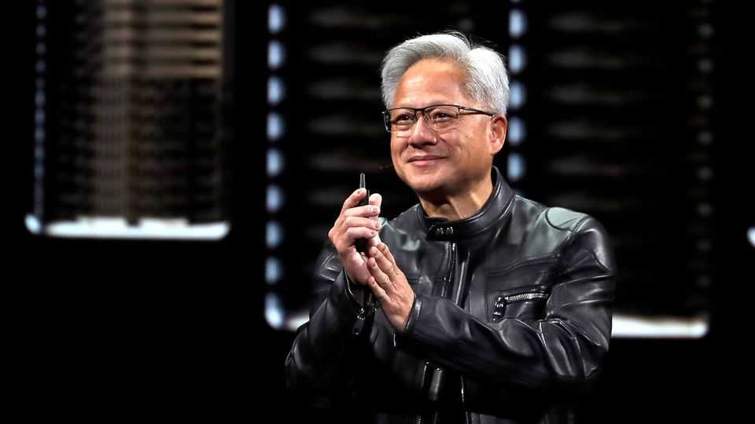
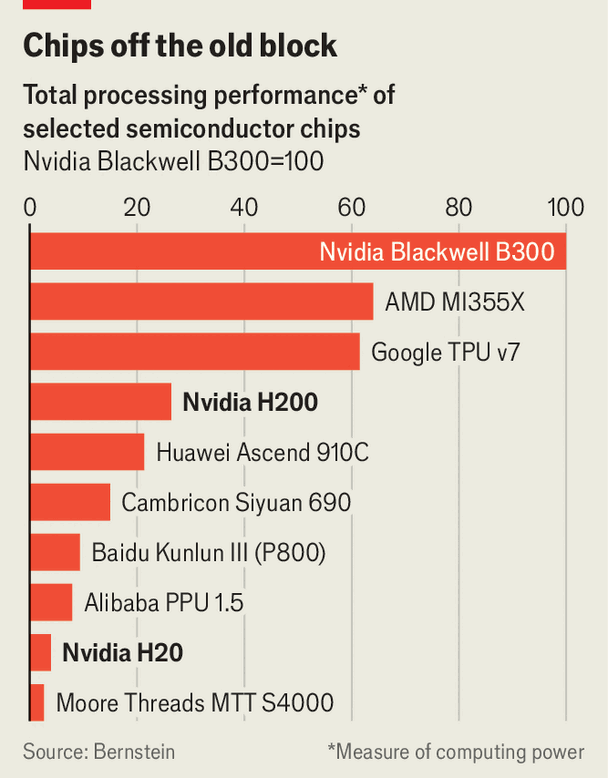

Business | The Nvidia way
Donald Trump’s flawed plan to get China hooked on Nvidia chips
The president is tearing up America’s export-control policy
December 11th 2025

In the race to dominate artificial intelligence (AI), China is neck and neck with America in software. Chinese models now routinely outperform many American ones on popular benchmarks. But on hardware, a wide gap remains. America’s chipmakers, led by Nvidia, are far ahead. American policymakers are divided on how to make best use of that advantage. Some argue for hobbling China’s AI developers by blocking their access to advanced chips. Others think it best to keep China hooked on

Nvidia’s technology. Donald Trump appears to have decided on the latter course. On December 8th the president authorised the sale of Nvidia’s H200 chips to “approved customers” in China, in exchange for a 25% cut for Uncle Sam.

Although the H200 lags behind Nvidia’s latest chip, the Blackwell, and will soon be eclipsed by its next, the Rubin, it is more than six times as powerful as the H20, the best Nvidia had been permitted to sell to China (see chart).

The company could gain $10bn-15bn in revenue a year from the approval, reckons Bloomberg Intelligence, a research group. China’s government, however, has plans of its own.

Over the past few years America’s chip-control policy has lurched in various directions. In 2022 the Biden administration imposed sweeping restrictions on sales of advanced chips to China. Nvidia responded with the H800, designed to adhere to those limits. A year later, as the rules were tightened, Nvidia brought out the H20. The Trump administration briefly banned these in April, then reversed course.

That has led Chinese regulators to urge local companies to avoid Nvidia altogether, citing security concerns and promoting domestic alternatives, which have gained ground. Bernstein, a broker, estimates that local chip suppliers including Huawei, Cambricon and Moore Threads will capture 60% of China’s $26bn-worth of spending on AI chips this year. That is a sharp reversal from just a few years ago, when American firms, chiefly Nvidia, accounted for over 80% of sales. Cambricon’s share price has jumped by more than 120% this year; that of Moore Threads surged by over 400% on its trading debut in Shanghai on December 5th.

Still, China’s chipmakers face steep barriers. Owing to American restrictions, they lack access to high-bandwidth memory, essential for running large AI models, and are cut off from the most advanced fabrication processes at TSMC, the world’s leading manufacturer of chips. They also cannot import cutting-edge chipmaking tools. Huawei is furthest ahead among Chinese suppliers with its Ascend 910C chip. But it is still a long way behind Nvidia, and is not expected to offer a chip to match the H200 until late 2027, according to the Institute for Progress, an American think-tank. Nvidia will have advanced several generations by then.

Jensen Huang, Nvidia’s boss, has long argued that blocking sales of high-end chips to China would spur local rivals to close the gap more quickly. Already Chinese chipmakers have proved their ability to innovate. Some have prioritised processing power at the expense of energy efficiency, while others have tightly integrated hardware with software to squeeze out better results. In the absence of Nvidia’s chips, Chinese AI developers will start to optimise their models around domestic offerings, Mr Huang has warned.

David Sacks, Mr Trump’s AI adviser, has taken up the cause. He has argued that there is a case for withholding America’s best chips from China, but not for cutting it off entirely, which would only deepen the Communist Party’s resolve to develop domestic alternatives. His view appears to have prevailed over that of the China hawks in Mr Trump’s circle, who argue that selling powerful chips, even slightly older ones, is risky, especially given their potential military applications.

Yet Mr Trump’s chosen strategy may not work as planned. Mr Huang has admitted that he has “no clue” whether Chinese authorities will permit the purchase of H200s. The government is said to be considering allowing only limited access. America may hope to keep China tethered to its technology. But China appears just as determined to cut the cord. ■

To track the trends shaping commerce, industry and technology, sign up to “The Bottom Line”, our weekly subscriber-only newsletter on global business.

This article was downloaded by zlibrary from https://www.economist.com//business/2025/12/09/donald-trumps-flawed-plan-to-get-china- hooked-on-nvidia-chips