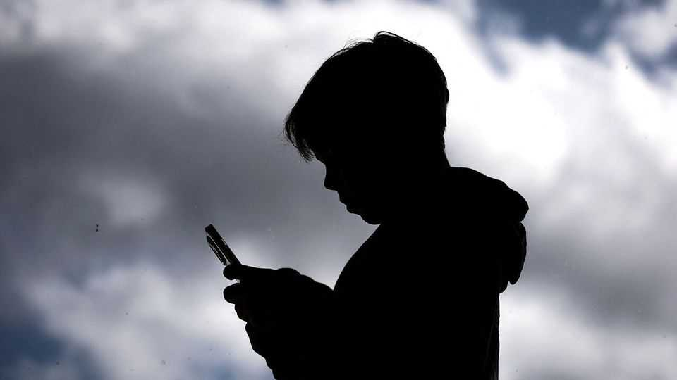
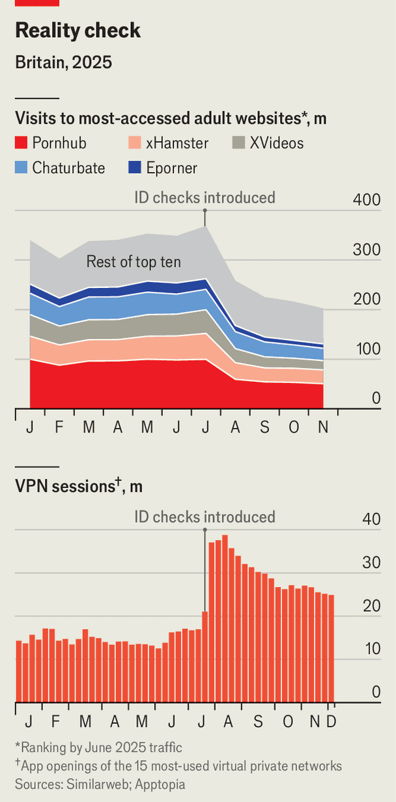

Business | Nannying the internet
From social media to porn, age checks are spreading across the web
Australia is not the only country introducing stricter controls
December 11th 2025

“This reform will change lives,” proclaimed Anthony Albanese, the prime minister of Australia, as the country banned under-16s from having social- media accounts starting December 10th. Many teenagers agreed—though perhaps not in the way the government meant. “I will be completely alone for the next 3 years until I am 16,” posted a user on Reddit, one of the proscribed social networks, noting that their music playlists on YouTube would also be lost.

To cheers in some quarters and wails in others, various countries are making parts of the web off limits to minors. Australia’s crackdown has been inspired by worries ranging from mental health and cyberbullying to disturbing content. It is not alone: Denmark and Norway are set to raise the minimum age of social-media account-holders to 15, and Spain and Malaysia have said they will raise it to 16. Several American states have tightened their laws, for instance by obliging networks to get parents’ permission for children’s accounts.

At the same time, some countries are demanding stricter age checks by adult websites. In July Britain introduced rules compelling porn websites to check that their users are over 18. France, Italy and Spain have brought in or proposed similar requirements. So have various American states. But policymakers seeking to shape how minors use the web should not expect it to be straightforward.

Start with social-media bans. These raise tricky questions about which platforms to include. Alongside conventional social networks such as Facebook, children chat during online games, exchange messages under videos and interact on the web in many other ways. Australia has decided that “social media” should include video-sharing platforms like YouTube (which has a separate version aimed at under-13s) and TikTok, but not messaging ones such as WhatsApp. Online games like Roblox are spared for now, though some parents are lobbying to include them.

Drawing those boundaries has left some apps feeling hard done by. Snapchat, a youth-oriented app on which 400,000 Australians aged 13-15 had accounts, argued that it should be excluded given that three-quarters of the time Australians spend on it is for messaging or making calls. But other features, such as a scrollable video feed, condemned it. Snapchat says it explored setting up a separate app for young people without these features, but lacked the time and resources. As more countries follow suit, such calculations may change.

Apps that are tailored to young users would be welcome. But some worry that the opposite will happen. Australia’s law bans children from having social- media accounts, but they remain free to use apps without logging in. On some platforms, such as Instagram, they cannot get far without signing up. But others, like YouTube and TikTok, let users scroll away anonymously.

Australian children using those apps may now be more likely to see content unsuitable for their age.

Another concern is that children who have been kicked off mainstream social- media apps may sign up for others that are less well known—and less well regulated. On the day its age restrictions came into effect, the top downloads in Australia on Apple’s app store included Lemon8, a social network from ByteDance, TikTok’s parent company, and Yope, a “friends-only private photo messaging app”. Neither is currently covered by the ban.

Something similar appears to be going on in the world of online porn. In Britain, total traffic to porn websites has fallen by a third since its age- checking rules landed in July, according to Ofcom, the regulator enforcing the law. Big websites such as Pornhub have seen their traffic fall by nearly half, according to Similarweb, a data provider (see chart, top). Ofcom says that of the top 100 porn websites in Britain, more than half are complying. It recently fined one big operator, AVS, £1m ($1.3m) for not obeying the new rules, and has launched more than 80 investigations into others. But among the (very) long tail of small porn websites, some domains that have ignored the law have rocketed in popularity. And new websites can spring up even more quickly than social-media apps, which require a critical mass of users.

Age-gating laws can also be bypassed with virtual private networks (VPNs), which disguise a user’s location. VPN use has soared in Britain. In the weeks after its age-checking rules were introduced, the number of weekly sessions on the 15 largest VPN mobile apps rose from a previous average of around 15m to nearly 40m, according to data from Apptopia, which measures such things (see chart, bottom). Usage has since dropped, but seems now to be stabilising at nearly double its previous level.

As age rules spread, tech companies are arguing over who should take responsibility for enforcing them. Australia’s new law places the burden on social-media companies themselves, which face steep fines if their checks are not judged to be effective enough. Britain has similarly placed the burden on porn websites. The argument runs that the companies responsible for creating the alleged harms should foot the bill for mitigating them.

Social-media companies have argued that it would make more sense for those developing the operating systems on which their apps run—principally Apple and Google—to take the responsibility. Users could register their date of birth once, after which their device could anonymously vouch for them being old enough to access whatever content they wished. Brazil has placed an obligation on app stores to assess users’ ages, as have a handful of American states. Apple has recently launched a feature that allows parents to set age ranges on their children’s phones; Google is developing something similar.

The rest of the world will be watching the various experiments under way. “The global community…are looking at Australia and saying: ‘Well, if

Australia can do it, why can’t we?’,” said Mr Albanese. They may soon have some answers. ■

To track the trends shaping commerce, industry and technology, sign up to “The Bottom Line”, our weekly subscriber-only newsletter on global business.

This article was downloaded by zlibrary from https://www.economist.com//business/2025/12/10/from-social-media-to-porn-age-checks- are-spreading-across-the-web