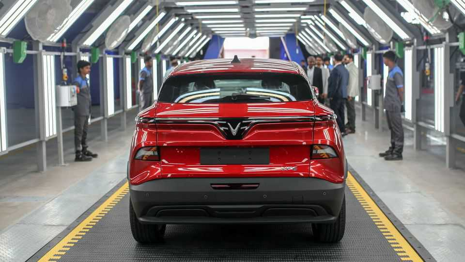

Business | Speeding downhill
Vietnam’s EV champion is bleeding cash
VinFast is seeking salvation in foreign markets
December 11th 2025

You might think that being a national champion in a country with a history of state largesse would be a lucrative business. For VinFast and its billionaire founder, Pham Nhat Vuong, it has been anything but. Despite dominating its home market, the Vietnamese maker of electric vehicles (EVs) has lost some $11bn since it launched its first electric car in late 2021. Although it receives some subsidies from the government, it is bankrolled primarily by Vingroup, Mr Vuong’s conglomerate, whose businesses range from malls to solar farms, and by Mr Vuong himself. As of June, Vietnam’s richest man had pitched in

$2bn of his personal wealth to cover VinFast’s losses, and pledged billions more.

VinFast is not getting any more profitable. The firm boasts that it “continues to break records” in car deliveries. Yet it loses money on each vehicle it sells. So far this year it has delivered over 120,000 electric cars and 230,000 electric two-wheelers, from which it generated about $2bn in revenue. The cost of producing these came to nearly $3bn—resulting in hefty losses even before research-and-development expenses and overheads.

The company sells some 90% of its vehicles at home, and is increasing its production there. A new factory in central Vietnam, capable of making 200,000 vehicles, was opened in June. But with profits still elusive, VinFast hopes to find salvation in international expansion. It has failed once before, selling just a few thousand cars in the American market after it tried to expand there in 2022. (The push is still officially on, but delayed until 2028.) The company is now targeting markets closer to home, including India, Indonesia and the Philippines, and soon expects to have a sixth of its production capacity outside Vietnam.

Furthest along is its effort in India, where the company has set up a distribution network of some two dozen dealerships. These are backed by a factory in Tamil Nadu capable of churning out 50,000 cars a year. This month the company announced that it would expand the site to also produce electric scooters and buses. It will be hoping that India’s price-conscious consumers will warm to its vehicles more than Americans did. Although the market for electric cars in India is small, with just over 70,000 cars sold in the first half of the year, that figure was up by 65% from the same period in 2024, according to HSBC, a bank.

Yet India is no sure bet. Three local carmakers—Tata Motors, Mahindra and MG Motor (a joint venture between JSW, an Indian conglomerate, and SAIC, a Chinese carmaker)—along with Hyundai of South Korea together account for over 90% of sales of electric cars in India. The rest is contested by big foreign carmakers including Tesla, BMW and BYD. In November VinFast sold 291 electric cars in India, more than Tesla but less than half of BYD. Electric two-wheelers, a more fragmented market, may hold greater promise for VinFast, though sales are growing less quickly than for electric cars. In

both segments VinFast will have to compete fiercely on price, which will not help its profitability.

VinFast’s one advantage is Mr Vuong’s deep pockets. Shares in Vingroup have rocketed by 600% this year, propelling his wealth to over $25bn, up from $4bn in 2024. One reason has been excitement among Vietnamese retail investors over Vingroup’s new ventures, says Dominic Scriven of Dragon Capital, an investment firm in Ho Chi Minh City. The conglomerate’s transport arm, launched this year, will break ground this month on a $4bn metro line connecting Ho Chi Minh City to a nearby coastal area. Vingroup has also recently expanded into making films (V-Film) and steel (VinMetal). And VinFast has unveiled plans to start building robotaxis. Mr Vuong has a busy year ahead. ■

To track the trends shaping commerce, industry and technology, sign up to “The Bottom Line”, our weekly subscriber-only newsletter on global business.

This article was downloaded by zlibrary from [https://www.economist.com//business/2025/12/11/vietnams-ev-champion-is-bleeding-cash](https://www.economist.com//business/2025/12/11/vietnams-ev-champion-is-bleeding-cash)