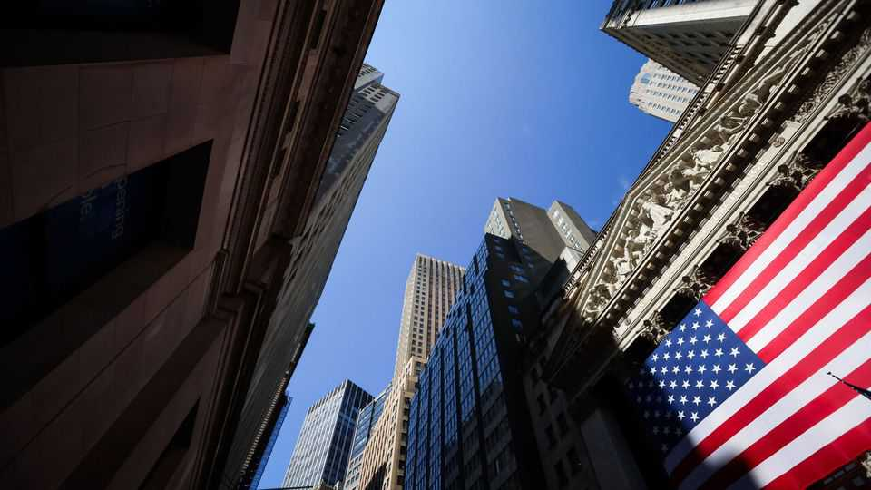
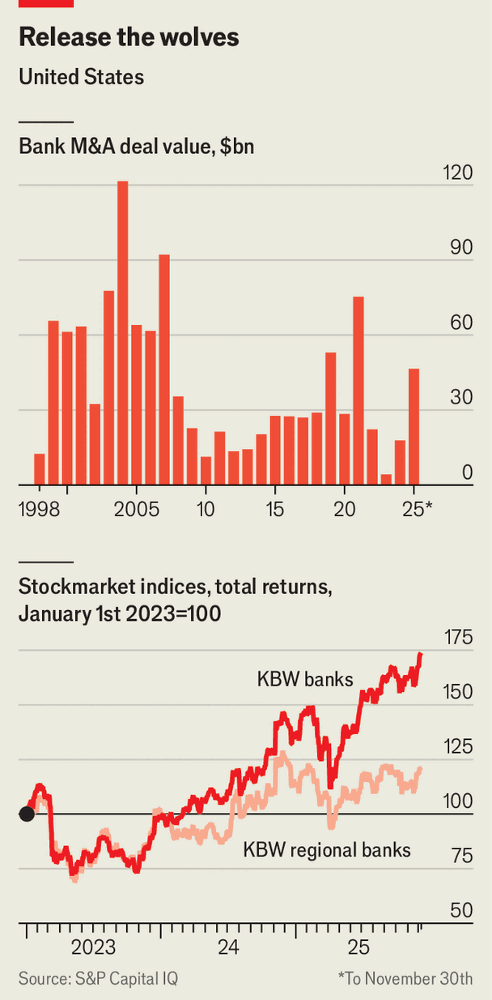

Finance & economics | Deal season
Wall Street is drooling over bank mergers
The world’s most fragmented financial industry faces dramatic change
December 11th 2025

FOR MOST of the past two decades, bankers have been waiting for a merger- and-acquisition recovery in their own industry. Their hopes have been dashed by, among other things, regulation, interest rates and economic shocks. Now, however, they may be about to get their wish. America has around 3,800 commercial banks—a figure that has declined steadily from 12,300 in 1990, but remains far higher than in other rich countries. This year pressure to merge and unlock the benefits of scale has

grown, while the regulatory and financial hurdles have shrunk. Banking deals worth around $47bn have been announced so far in 2025, more than twice the amount in 2023 and 2024 combined. And the pace is accelerating: October was the strongest month for deals since 2019.

Why the enthusiasm? According to Gartner, a research group, banks and investment firms are expected to raise their spending on technology from $760bn this year to $1.1trn in 2029 as they modernise systems and experiment with artificial intelligence. JPMorgan Chase, America’s biggest bank, alone spent around $18bn this year on various forms of tech. “Retail banking is going the way of every commodified product. It’s about tech, breadth and brand,” says Richard Ramsden of Goldman Sachs, a bank. “Being bigger gives you that competitive advantage.”

At the same time, mergers are becoming simpler. A surge in interest rates, starting in 2022, left banks nursing vast paper losses on long-term assets, making such institutions less appetising to prospective buyers. Yet in the past three years, under more favourable conditions, unrealised losses on holdings of securities have fallen by half, to $337bn. In November the Financial Accounting Standards Board made an important tweak to rules that govern the purchase of loans. Banks will no longer have to double-count the risk of credit losses when they buy another lender.

This is just one part of a broader regulatory revolution. Travis Hill, acting head of the Federal Deposit Insurance Corporation, is now close to confirmation as permanent chair. If he makes it over the line, the Trump administration will have appointed a full cast of bank-friendly regulators. Capital requirements for the largest lenders are already being eased. Analysts at Jefferies, an investment bank, expect looser rules across the board, which they estimate will free up $2.6trn in lending capacity, equivalent to 16% of total American bank assets, and thus enable acquisitions.

A pair of deals in October shows why Wall Street is so excited. Fifth Third Bank and Huntington Bancshares, two Ohio-based lenders, spent $10.9bn and $7.4bn, respectively, on smaller banks. Those are healthy sums, but most interesting was that each deal pushed the institution above $250bn in assets— where regulatory scrutiny becomes more fastidious. In recent years, banks have lingered below the mark, avoiding the hassle even if that meant avoiding scale, too. Now they are increasingly confident that they will not be dragged over the coals by regulators.

The speed of deals completions is another reason for excitement. Nicholas Holowko, a banking analyst at UBS, points to a $9bn merger announced in

July between Pinnacle Financial Partners and Synovus, two banks in the South, which was signed off by regulators in less than five and a half months —the fastest approval of its size since the global financial crisis of 2007-09. According to Mike Mayo, a bank analyst at Wells Fargo, such a pace is fairly typical for the recent burst of deals.

Bank executives are focused on the gains to be had from scale, rather than nervous about the potential for problems. Could anything dampen their mood? There have been spells of concern about the health of American corporate lending this year. Perhaps more worrying, however, would be a shift in the political temperature. Midterm elections in November 2026 will not lead to a change of regulators. But they may shift the make-up of legislators scrutinising the industry, including in the House of Representatives’ powerful financial-services committee, and indicate tighter regulation is likely in the future.

Chief executives are inevitably coy when asked about potential mergers. Would-be buyers moan about smaller banks being too richly valued, attempting to talk down prices. Would-be sellers are even more reluctant to make themselves known, seeking to avoid the perception that they are in any way distressed. For now, each side is playing its role to perfection. But even if there is a Democratic landslide in 2026, bankers will have a year before new legislators take their seats, and three years until a new president might toughen the industry’s scrutiny. The regulatory, financial and technological fates are aligned. Investment bankers would be well advised to catch up on their sleep over the holidays—next year could be busy. ■

For more expert analysis of the biggest stories in economics, finance and markets, sign up to Money Talks, our weekly subscriber-only newsletter.

This article was downloaded by zlibrary from https://www.economist.com//finance-and- economics/2025/12/11/wall-street-is-drooling-over-bank-mergers