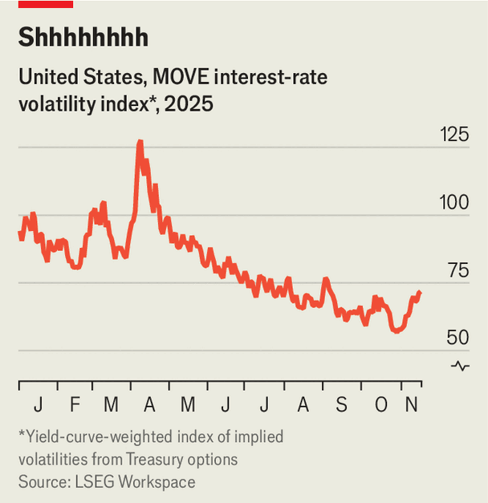

Finance & economics | Interest rates
America’s bond market is quiet— almost too quiet
Scott Bessent has a cunning plan
December 11th 2025

What is happening in the bond market? Not much, it seems. After explosive volatility earlier this year, which peaked around “Liberation Day”, when President Donald Trump announced a slew of tariffs, movements in yields have become remarkably orderly. Indeed, the MOVE index, which aggregates the implied volatility bond investors expect based on trading in derivatives markets, has declined steadily since April, and remains at depths not plumbed since 2021.

Viewed from one angle, such stability makes sense. Volatility tends to be high in times of crisis, when bond yields are spiking and stocks are lurching. Since his trade salvo in April, Mr Trump has calmed down, America’s economy has held up and stockmarkets have risen to all-time highs. All the same, it is odd just how orderly interest rates on long-duration bonds have been.

After all, there is plenty going on. The Federal Reserve is cutting interest rates, and there has been lots of volatility elsewhere in rate markets. In recent months, at the short end, funding markets have been jittery. In October the secured overnight financing rate (SOFR), the interbank-lending benchmark, climbed to its highest over the rate paid by the Fed in six years. Banks have also begun borrowing, on occasion, from the Fed’s standing repo facility, which they do only at times of stress.

This has raised suspicions. Mike Howell of CrossBorder Capital, an investment firm, says the term premium—the difference between short-term and long-term rates—is “the little dog that didn’t bark”. Along with other investors, he points to an unusual explanation for why things have been quite so tranquil: the Treasury has become a big buyer of its own bonds.

America’s finance ministry has, of course, always been in the business of selling Treasuries. If the government wants to spend more than it collects in taxes—as it often does—the Treasury must finance that deficit. To do so, it

issues bills via auctions. Yet it is much more unusual for it to be a serious purchaser of its own debt.

The change was prompted by a series of market ructions, including a blow-up in the repo market in 2019 and the malfunctioning of bond markets in 2020. Under Janet Yellen, the Treasury began to consider a “buy-back” programme, whereby it would regularly offer to acquire older, illiquid issues of its debt, the kind that can be difficult to offload at reasonable prices in a panic. It would replace these bonds with freshly issued (and therefore much more liquid) debt in its usual auctions.

The Treasury launched such a scheme last year. Scott Bessent, the current treasury secretary, has since drastically expanded it. On his watch the Treasury has bought almost $180bn-worth of bonds so far this year, up from $84bn last year. In general, it has been retiring long-dated debt—20-year or 30-year issuance—and replacing it with shorter-dated bills. Although this move towards shorter maturities will not have a huge impact on the overall maturity of government debt, the Treasury is now one of the largest buyers of long-term government bonds, meaning it has the heft to move markets. Last month Mr Bessent announced plans to make the programme even bigger.

In one way, the scheme has been a tremendous success: its goal was to keep volatility in the bond market in check and the market has indeed been remarkably stable. Yet perhaps things are a little too quiet. The aim, when buying back bonds in order to provide “liquidity support”, is to prevent things from malfunctioning by ensuring that prices can clear the market easily, and can do so even in busy times. That is not the same as keeping volatility low in general: sometimes prices need to move a lot in order to clear the market.

Moreover, Mr Bessent, a former hedge-fund manager who calls himself “America’s top bond salesman”, has another reason to like placidity. He counts low and stable interest rates as a political victory. “We are making substantial progress in keeping rates down following the spending blow-out from the Biden years,” he said in November, highlighting the fact that the term premium was either unchanged or had fallen this year, depending on the duration.

The mantra adopted by large swathes of the market after the global financial crisis of 2007-09 was “Don’t fight the Fed”, as its bond-buying programme

tended to drive changes in asset prices. Perhaps they are about to learn a new lesson: “Don’t fight the Treasury, either.” ■

For more expert analysis of the biggest stories in economics, finance and markets, sign up to Money Talks, our weekly subscriber-only newsletter.

This article was downloaded by zlibrary from https://www.economist.com//finance-and- economics/2025/12/11/americas-bond-market-is-quiet-almost-too-quiet