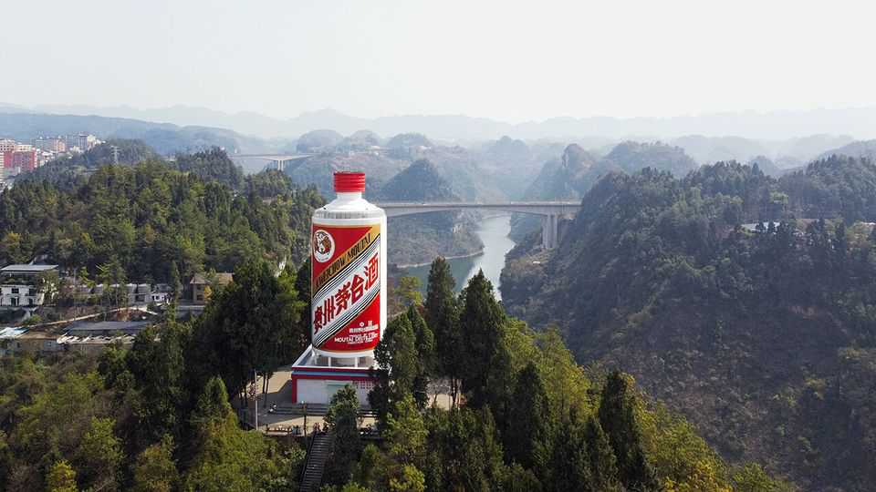

Finance & economics | Cheap shots
What a stiff drink says about China’s economy
The baijiu business is the latest to be struck by “involution”
December 11th 2025

Baijiu, China’s favourite firewater, is losing its bite. This year retail prices have been hovering around the benchmark of 1,499 yuan ($212) a bottle, as set by Kweichow Moutai, a state-owned giant. Or they were, until rogue vendors recently began to ignore the company’s pricing strategy, selling the booze at a 100-yuan discount in the hope of attracting more customers. The reduction might seem like an afterthought in a market with over $100bn in annual sales. But for decades Moutai and other Chinese spirit-makers have

tightly controlled supply and prices via a complex distribution network. Demand has almost always outstripped supply. Bottles often sold for 3,000 yuan apiece; older vintages have been known to fetch more than 500,000 yuan at auctions. The value does not just come from the spirit itself: bribes are passed in baijiu instead of cash, making the drink a currency for corruption.

Moutai’s benchmark-price and distribution system has mainly served as a means of stopping rampant speculation. The firm has ruled over the industry like a quasi-regulator. It conducts spot investigations at vendors to ensure they are complying with price recommendations. To combat hoarding, customers are allowed to buy only one or two bottles a day.

The fact that prices are dropping below the benchmark suggests that supply is now outstripping demand—and that something has gone very wrong in the baijiu market. China binged on the drink during the covid-19 pandemic. Prices surged and Moutai briefly became the country’s most valuable listed firm. Since then, however, the hangover has been harsh. Moutai is now worth about half what it was in 2021. An economic slowdown has forced smaller companies to reduce expense budgets and cut back on wining and dining clients. In May a central-government edict banned smoking and boozing at state banquets. Young people have been swapping out baijiu and other strong spirits for lighter, fruitier concoctions, says Rachel Lee of Worldpanel China, a consultancy. The shift in the market has left thousands of distributors across the country with mounting stocks that they are eager to sell.

The troubles of China’s economy mean worse may be to come for baijiu. One particularly ugly aspect of the malaise has been gluts in goods leading to vicious price-cutting—a phenomenon that is often referred to as “involution”. Many carmakers have been slashing prices even though they are loss-making. In a fight for customers, the country’s largest internet platforms have been heavily discounting food deliveries, often at the expense of restaurants. Lower prices might sound like good news for consumers. But across an economy, involution can lead to deflation, which causes people and firms to delay much- needed investment.

Now involution is coming to baijiu. The decision of several vendors on Douyin, a social-media and e-commerce platform, to sell Moutai’s flagship bottle at a discount was a shock to the industry. Douyin cracked down on the discounted sales, but similarly priced bottles have appeared on other websites.

Pinduoduo, for instance, has started selling bottles at the same discounted price as a way to attract new customers to its e-commerce platform. With distributors sitting on excess stock, it is not difficult to see how baijiu could pour onto the platforms at ever lower prices.

The makers are fighting back. Moutai and Wuliangye, another leading brand, have together launched an “anti-involution campaign”. This is mainly a call to fellow producers to avoid excessive competition with each other (and, implicitly, to keep prices high). But involution may force them into more significant changes. The companies have long talked about shrinking their enormous distribution networks, focusing instead on direct sales to customers. In the past few weeks, Moutai has established a sales channel on Douyin, the first of its kind, in an effort to keep some control over prices. Both Communist Party officials and baijiu makers have found common cause in fighting involution. The next step? Perhaps it is time to relax controls on boozing at state banquets. ■

For more expert analysis of the biggest stories in economics, finance and markets, sign up to Money Talks, our weekly subscriber-only newsletter.

This article was downloaded by zlibrary from https://www.economist.com//finance-and- economics/2025/12/11/what-a-stiff-drink-says-about-chinas-economy