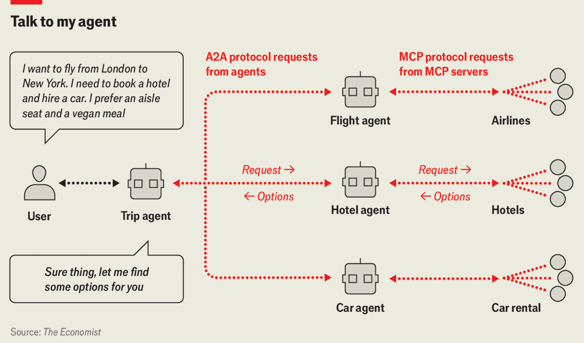

Science & technology | Intelligent agents
The next version of the web will be built for machines, not humans
AI will surf, shop and act on your behalf
December 11th 2025

In 1999, a decade after inventing the world wide web, Sir Tim Berners-Lee, a British computer scientist, imagined an intelligent version of his creation. In that vision, much of daily life—finding information, making plans, handling mundane tasks—would be done not by people, but by “intelligent agents”: machines able to read, interpret and act. The web has evolved dramatically since its invention but the experience has remained manual—users still type, click and browse before they buy, read or watch.

Artificial intelligence (AI) may now bring Sir Tim’s dream within reach. Today’s large language models (LLMs) can summarise documents, answer questions and reason. What they cannot do for the moment is act. That, however, is changing with “agents”: software that gives LLMs tools which let them perform tasks, not just generate text.

The shift started in 2022 with the launch of ChatGPT. Many users began asking questions of chatbots, rather than putting keywords into search engines, to assimilate information that might be spread around the web. Such “answer engines” barely scratch the surface of the potential, however. Kevin Scott, chief technology officer of Microsoft, a software giant, reckons agents able to handle more complex tasks “are not that far away”. But for them to take over more of the work, the web’s plumbing must change.

A central obstacle is language: giving agents a way to talk to online services and each other. A website or online service normally talks to the outside world through an application programming interface (API), which tells visitors what it can do, such as booking a doctor’s appointment or supplying a map location. APIs, however, are written for humans, and each has its own quirks and documentation. This is a tough environment for AI agents, because they reason in natural language. Dealing with each new API requires learning its dialect. To act independently on the web, therefore, agents will need a standardised way to communicate.

This is the aim of the Model Context Protocol (MCP), developed by Anthropic, an AI lab. Mike Krieger, its chief product officer, says the idea came while linking Claude, its chatbot, to services like Gmail, an email platform, and GitHub, a repository of code. Instead of integrating each application with Claude on a case-by-case basis, the firm wanted a shared set of rules to help agents directly access a user’s emails or files. Rather than study technical guides, an agent can ask an MCP server what a system does— book a flight, cancel a subscription, issue a refund and so on—and then take an action on behalf of the user, without bespoke code.

Say you want to book a trip from London to New York. You start by giving your travel plans to a trip agent, which then subdivides the task between specialised agents that can look for flights, hotels and cars (see chart). These agents contact the MCP servers of airlines, hotels and car-hire firms, gather information, compare possibilities and create a list of potential itineraries. Once you pick an option, the trip agent would book the whole lot.

This type of co-ordination requires rules for how individual agents identify, talk to and trust each other. Google’s proposed solution is the A2A (agent-to- agent) protocol for this purpose. Agents can advertise their abilities to each other through this and negotiate which agent does what. Laurie Voss of Arize

AI, a startup, says companies are in a “landrush” to define the dominant standards for the agentic web. The most widely adopted protocol will let its backers’ tools do more, sooner and better. On December 9th Anthropic, OpenAI, Google, Microsoft and others announced the Agentic AI Foundation, which will develop open-source standards for AI agents. Anthropic’s MCP will be part of this, signalling its wider adoption as an industry standard for agentic communication.

Still, most of the web that these agents will surf is made for human eyes. Finding a product still means clicking through menus. To let language models access sites more easily, Microsoft has built Natural Language Web (NLWeb), which lets users “chat” to any web page in natural language. Users could ask the NLWeb interface of a travel website, for example, for tips on where to go on holiday with three children; or what the best wine shops are in a particular place. Whereas traditional search might require clicking through filters for location, occasion and cuisine across several menus, NLWeb is able to capture the full intent of a question in a single natural sentence, and respond accordingly. Each NLWeb site can also act as an MCP server, exposing its content to agents. Thus NLWeb bridges the modern visual internet and one that agents can use.

As agents grow more capable, a new platform contest is taking shape, this time over the agents themselves. It echoes the browser wars of the 1990s, when firms fought to control access to the web. Now, browsers are being reimagined with agents at their core. OpenAI and Perplexity, a generative-AI startup, have launched agent-powered browsers that can track flights, fetch documents and manage email. Their ambitions go further. In September OpenAI enabled direct purchases from select websites inside ChatGPT. It has also integrated with services like Spotify and Figma, letting users play music or edit designs without switching apps.

Such moves worry incumbents. In November Amazon, a shopping site, sued Perplexity, alleging the startup was violating its terms of service by failing to disclose that its browser was shopping instead of a real person. Airbnb, a short-term-rentals app, chose not to integrate with ChatGPT, saying the feature was not “quite ready”.

Advertising, too, will have to adapt. Today’s web runs on monetising human attention, through search ads and social feeds. Alphabet and Meta, among the

biggest tech firms, expected to earn nearly half a trillion dollars a year this way, accounting for more than 80% of their revenues. Dawn Song, a computer scientist at the University of California, Berkeley, says marketers may need to pitch not to people, but to “agent attention”. Travel sites, for instance, will not persuade the traveller, but their digital proxy. The tactics may stay the same, optimising rankings, targeting preferences, paying for placement, but the audience will be algorithms.

Agent-led browsing could also greatly expand activity online. Parag Agrawal, founder of Parallel Web Systems, an AI startup, notes that the web was built for humans reading at human speed. Agents face no such limits. They can scan thousands of pages in seconds, follow links people overlook and juggle tasks in parallel, much of it never shown on a screen. He predicts agents could use the web “hundreds or thousands” of times more than people do.

Where agents act, they can also err. An AI agent may behave in ways its user does not fully grasp. It can make mistakes, then fabricate explanations. More worrying is outside manipulation. Prompt injection—hiding malicious commands in web pages or files—can trick agents into leaking data, bypassing safety checks or taking unauthorised actions.

Safeguards can reduce the risks. One is to restrict agents to trusted services. Another is to give them narrow powers. Some might be “read-only”, allowed to fetch data but not send or change it. Others might act only with human confirmation. For the most sensitive jobs, a person may need to remain in the loop.

Despite the risks, software developers are optimistic. Mr Agrawal imagines a shift from a “pull” internet, where people initiate actions, to a “push” model, where agents act unprompted—setting up meetings, flagging research or handling small tasks. It could be the foundation of a new and very different version of the web. ■

Curious about the world? To enjoy our mind-expanding science coverage, sign up to Simply Science, our weekly subscriber-only newsletter.

This article was downloaded by zlibrary from https://www.economist.com//interactive/science-and-technology/2025/12/10/the-next- version-of-the-web-will-be-built-for-machines-not-humans