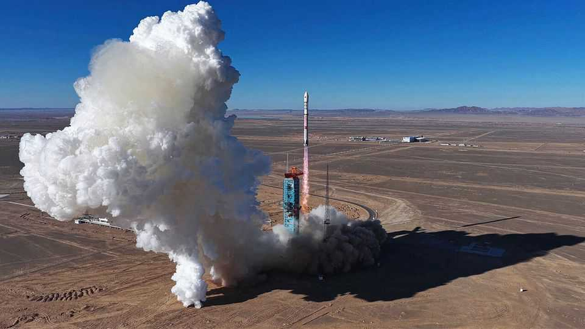

Science & technology | Head to head
The Chinese rocket industry takes off
A reusable booster failed last week, but showed the Americans they may soon have competition
December 11th 2025

ZHANG CHANGWU and Kang Yonglai are names less familiar in the West than Elon Musk and Jeff Bezos. But that may soon change. They are the bosses, respectively, of LandSpace and Space Pioneer, two of China’s leading private space-launch companies. These firms are still a long way behind Mr Musk’s SpaceX and Mr Bezos’s Blue Origin. But when it comes to technological developments in a wide variety of fields, China’s recent history

has often felt, to paraphrase Lenin, like one of decades when nothing happens followed by weeks when decades happen.

December 2025 may go down as the start of one of those calendar- compressing times, for it was when LandSpace became the first non-American firm to attempt to return a rocket stage to Earth for reuse, and thereby break America’s grip on the market for cheap satellite launches. Space Pioneer is also preparing such a launch.

The test firing of LandSpace’s vehicle, Zhuque-3 (ZQ-3), from the Jiuquan Satellite Launch Centre on the border between Inner Mongolia and Gansu (pictured), ended with the returning first stage, which was supposed to touch down 390km from the launch site, undergoing what Mr Musk refers to jokingly as a rapid, unscheduled disassembly—a spectacular explosion. That might sound like a failure, even though the non-reusable second stage reached orbit. But Mr Musk would certainly have proclaimed a similar result for SpaceX as a success. LandSpace seems to agree, saying it had acquired “critical engineering data under the rocket’s real flight conditions”.

It is only 11 years since would-be Chinese rocket entrepreneurs were let off the leash, after China’s State Council admitted private enterprise to the rocket and satellite industries hitherto reserved to the government. The result has been a period of creative destruction in which new firms, frequently led by ambitious middle-rankers from the state-controlled sector, have tinkered with various ideas, gone up various blind alleys and struggled to steal a march, as it were, on the “Long March” launchers produced by the state-owned China Aerospace Science and Technology Corporation (CASC). These have hitherto been the workhorses of Chinese rocketry.

At the moment, they still are. In 2024, 49 Long March rockets were launched —the biggest capable of carrying 25 tonnes of payload to low-Earth orbit (LEO). And a Long March with a reusable booster is poised to take off from Jiuquan, too. But the ZQ-3 and Space Pioneer’s Tianlong-3 (TL-3) are hoping to join them. According to LandSpace, ZQ-3 is capable of lifting up to 21 tonnes to LEO (though less if the first stage is to be re-used). TL-3’s capacity is similar. Falcon 9, the reusable foundation of SpaceX’s fortunes, has a maximum LEO capacity of 22.8 tonnes.

LandSpace was founded in 2015. Mr Zhang’s background is in finance (he took an MBA at Tsinghua University). Among his recruits when he moved into rocketry was Mr Kang, who was the firm’s chief technology officer before leaving in 2019 to launch Space Pioneer. Mr Kang, by contrast, is an engineer. He worked previously at the China Academy of Launch Vehicle Technology, the part of CASC which manufactures the Long March rockets.

Both firms already have notable feathers in their caps. LandSpace’s was the launch, in 2023, of ZQ-2, the first rocket to reach orbit powered by methane and liquid oxygen (LOX). The standard mixture for rockets of this size is kerosene and LOX, but methane and LOX burns cleaner, which is useful if stages recovered for reuse are to be spruced up and turned round quickly. Both Blue Origin and SpaceX use methane and LOX for their latest projects—New Glenn (45 tonnes to LEO) and Starship (100 tonnes) respectively.

Pioneer’s cap-feather was operational rather than technological: it got into orbit with its maiden launch, also in 2023. That was the first time a private firm had achieved immediate success with a liquid-fuelled rocket (though Tianlong uses kerosene, not methane). SpaceX, for contrast, took four attempts to get its first squib, Falcon 1, to circle Earth. Space Pioneer did, however, blot its copybook in 2024, when a TL-3 first stage broke free of its moorings during what was meant to be a ground test and flew hundreds of metres into the air before crashing in a nearby forest.

SpaceX’s fortune derives principally from launching the numerous satellites making up the constellations that act as relays for broadband telecommunications, not least the firm’s own Starlink service. If LandSpace’s and Space Pioneer’s launchers prove themselves, both firms will be well placed to do likewise, for two Starlink-like Chinese constellations are now beginning to take shape.

One, Guowang, is run by China’s government. The other, Qianfan, is sponsored by the government of Shanghai. Together, these systems will require the launching of more than 28,000 satellites, an improbable proposition without the employment of reusable rockets—an employment most unlikely to involve any foreigners.

Success here would then give both firms the money and confidence to proceed to the next stage: launchers that could rival New Glenn or even Starship. At

the moment, only CASC has announced plans for such a behemoth, which it dubs Long March 9. Expect, therefore, to hear more from Mr Zhang and Mr Kang. The final frontier, it seems, has some new settlers sniffing around. ■

Curious about the world? To enjoy our mind-expanding science coverage, sign up to Simply Science, our weekly subscriber-only newsletter.

This article was downloaded by zlibrary from https://www.economist.com//science-and- technology/2025/12/03/the-chinese-rocket-industry-takes-off