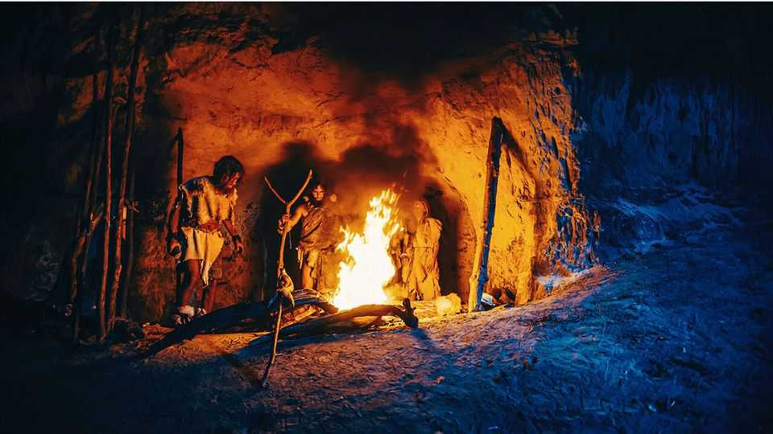

Science & technology | Sparks will fly
Humans were lighting fires from scratch a lot earlier than previously thought
A 400,000-year-old tinderbox is found in eastern England
December 11th 2025

The invention of the wheel aside, the lighting of the first fire is probably the best-known cartoonists’ trope about early humans. With good reason. Controlling fire is one of humanity’s most important technologies. Some, indeed, think that it was fire—or, rather, the subsidiary technology of cooking —which permitted the evolution of big-brained hominids. The extra nutrients thus liberated, along with the smaller gut required to digest cooked food

would, the argument goes, have allowed more resources to be used to enlarge the central nervous system.

Understanding how fire was brought under control is thus of great interest to palaeoanthropologists. And a new piece of the jigsaw has been unearthed from an old clay pit at East Farm, Barnham, in eastern England. It is the oldest evidence to date of the creation artificially of new fires, rather than the careful nurturing of existing ones derived from natural causes, such as lightning strikes. As they write in Nature, Nick Ashton of the British Museum and his colleagues have found evidence of what are, in effect, Palaeolithic tinderboxes.

The strata these tools come from are 400,000 years old, a time (though no actual fossil remains have been found there) when the resident hominids were Neanderthals rather than modern Homo sapiens. The site seems, from the flint tools discovered, to have been occupied on two separate occasions. It is from the second occupation that the signs of fire-setting come.

That fires burned here in the Palaeolithic is not in doubt. Part of the clay at what would then have been ground level is baked in a way that shows it had been subjected to intense heat, and many of the flint tools found nearby also exhibit signs of being heated. Dr Ashton and his colleagues have shown that this heating was not a consequence of a passing wildfire, but rather the result of human action, using a series of tests that compared the magnetic and chemical properties of the heated clay with those of neighbouring, unheated samples.

To achieve a magnetic profile similar to that of the heated clay’s, the unheated clay was exposed, in experiments by Dr Ashton’s team, for four hours on 12 separate occasions, to temperatures between 400°C and 600°C. The abundance of certain hydrocarbons within it is also characteristic of clay heated by human fires rather than natural wildfires.

The most intriguing finds of all, though, are two pieces of pyrite, an iron- sulphide mineral that, if struck with a flint, produces sparks (and, indeed, is so-called because of this property, the Greek for “fire” being “pyr”). Given the absence of natural pyrite in the area’s rocks, Dr Ashton and his colleagues feel confident that the two samples they discovered were imported deliberately, presumably for the purpose of lighting fires.

The human use of fire, attested by evidence from Africa, goes back around 1.6m years. But, hitherto, the oldest signs of deliberate fire-setting by striking pyrite with flints, unearthed in France, are from 50,000 years ago. The East Farm pyrite does thus seem the oldest evidence to date of the creation of fire from scratch. ■

Curious about the world? To enjoy our mind-expanding science coverage, sign up to Simply Science, our weekly subscriber-only newsletter.

This article was downloaded by zlibrary from https://www.economist.com//science-and- technology/2025/12/10/humans-were-lighting-fires-from-scratch-a-lot-earlier-than- previously-thought