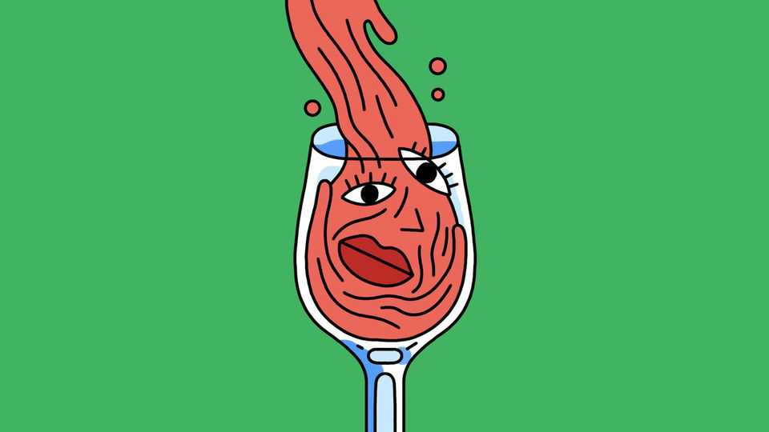

Science & technology | Well informed
Why hangovers get worse as you get older
But there are things you can do to help
December 11th 2025

Readers of a certain age may have begun to suspect that downing a few drinks for Christmas cheer no longer gives the same experience it once did. The studies show your feelings are right: those glasses of wine do seem to leave their mark for longer (and a bit more heavily) as you age. Ageing bodies tend to gain fat at the expense of muscle mass, for a start. Lean muscles hold lots of water, and alcohol is water soluble. As a result, the less muscle a body has, the fewer drinks it can agreeably absorb. Uncomfortably

quick jumps in levels of blood alcohol are one result. Harsher after-effects are another.

In a study of 48 social drinkers published in Alcohol in 2022, participants spent nearly three hours on an alcohol drip that maintained a blood level of 0.05%. Using body scans, the researchers had previously measured the lean body mass of each participant. The older participants (aged 55 to 65) had less muscle, and therefore body water, than the younger ones (aged 21 to 25), and that mattered. Though the older group felt just as intoxicated, it also reported, crucially, feeling less pleasure.

Getting older also tends to reduce the size of the liver and its ability to process alcohol, for example by slowing the transit of blood. That increases the body’s exposure to toxic metabolites as alcohol is broken down. One nasty by- product is acetaldehyde. A carcinogenic compound, it can cause pounding headaches, terrible nausea and heart palpitations, as well as the hallmark of a truly miserable hangover—the sensation of having been poisoned.

It doesn’t help that ageing already tends to erode sleep quality. Reasons include a weakening of the brain’s circadian clock, chronic pain and, for men, night-time urination triggered by prostate enlargement. The loss of muscle tone plays a role here, too. Flabbiness in the throat worsens snoring, further degrading sleep by reducing oxygen intake and increasing night awakenings. Alcohol exacerbates snoring by relaxing throat muscles, leading the airway to partially close during sleep. And poor sleep compounds a hangover.

Regular drinking even impairs sleep on dry days. Sleep is regulated by signalling molecules in the brain, such as GABA and melatonin, that alcohol, over time, disrupts. This makes chronic insomnia more likely to eventually emerge, according to a long-term study of 13,851 older Finnish twins published in SLEEP Advances in 2022. After controlling for potential explanations such as genetics and levels of “life satisfaction”, the researchers concluded that even moderate habitual drinking “predicts poor sleep quality later in life”.

The list goes on. Drinking can aggravate other tolls of ageing such as inflammation, reduced dexterity and memory loss. Alcohol also interacts adversely with many medications, reducing efficacy or worsening side-effects.

Grim as all this may sound, alcohol’s unpleasant effects can be tempered. Sipped drinks are more easily absorbed, so don’t gulp. Hydrate by alternating booze with water or, even better, a sports drink or coconut water. The latter are packed with electrolytes, electrically charged minerals that improve nerve signalling and the body’s fluid and pH balances. Snack throughout the evening. And, to sleep better, don’t delay your nightcap until bedtime. ■

After a free, evidence-based guide to health and wellness? Sign up to our weekly Well Informed newsletter.

This article was downloaded by zlibrary from https://www.economist.com//science-and- technology/2025/12/05/why-hangovers-get-worse-as-you-get-older

Culture

The apple-pie-scented world of conservative women’s media The race to translate the Bible into every language by 2033 India’s best-known artist gets his own museum—in Qatar The best albums of 2025 Proposing this Christmas? Go for a yellow-gold ring Every sheet of wrapping paper tells a story