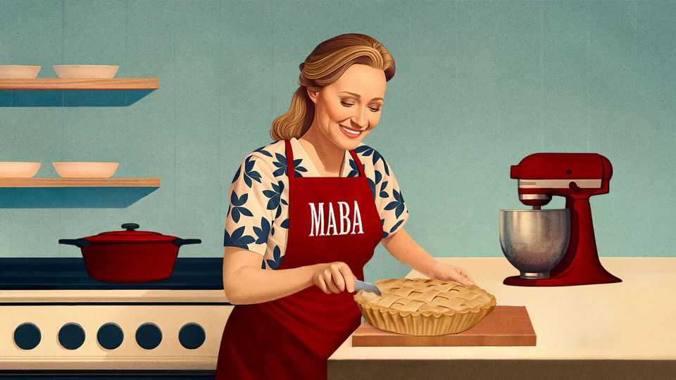

Culture | Make America Bake Again
The apple-pie-scented world of conservative women’s media
Put on your milkmaid dress: it is time to enter the womanosphere
December 11th 2025

Feminism has always raised difficult questions, such as: Can you solve the gender pay gap? How can women combine motherhood and work? What might prevent sexual violence? Now Evie, an American magazine, has raised another thorny issue: “Do You Smell Like A Feminist?” Evie tackles other issues, too, from socialising (“How To Elevate Your Conversation Skills So Everyone Will Love Talking To You”) to love (“Dating Is A Disaster, But Are Men Really To Blame?”) and wellbeing (“Why Wearing

Dresses Might Actually Be Better For Your Health”). This has led to fears that reading Evie Might Actually Not Be Better For Young Women’s Feminism.

Welcome to the womanosphere, the world of conservative women’s media. It is a category that might, to many, feel unnecessary: conservative women have always taken part in the media. Emmeline Pankhurst wrote dense articles on women’s suffrage with titles like “What Women Demand”. Margaret Thatcher wrote denser ones on free enterprise with titles like “Consensus—or Choice”.

This is different. Conservative women are a political force: Donald Trump won a majority of white female voters in 2016, 2020 and 2024. Yet these new conservative media—which range from magazines like Evie (whose main audience is women aged 25-34), to podcasters such as Erika Kirk and commentators including Candace Owens—have very little to say about how to achieve constitutional change or a low-tax economy. They have rather more to say about things like the benefits of prayer, the evils of birth control and the “45 Milkmaid Dresses That Will Make Any Man Weak In The Knees”. The milkmaid magazines are also accused of myriad other weaknesses: the genre has been called “sinister” and “pernicious” by progressive folk.

The fury can seem odd, as the genre is, at first sight, almost industrially anodyne. Its apotheosis is Hannah Neeleman, a former ballerina-cum-beauty- queen who married the son of a multi-millionaire entrepreneur. Ms Neeleman now lives on a farm in Utah where she farms dairy cows (of which she has about 120), produces children (she has eight) and breeds Instagram followers (10m). As a recent interview in Evie put it, Ms Neeleman “reminds us of the joy and fulfilment” that comes from “embracing your unique calling”—like marrying a multi-millionaire.

Read on through the genre, though, and the cause of the unease becomes clearer. The womanosphere may champion motherhood and desserts, but each slice comes with a slightly bitter aftertaste. A recipe which claims to help every reader achieve “star apple-pie-baker” status appears under the headline “11 Recipes Every Wife Should Know How To Make” if she is “to please any husband”.

Whereas the conservatism of Pankhurst and Thatcher was inherently feminist, much of the womanosphere is explicitly not. Brittany Martinez, who co- founded Evie with her husband and is its editor, says that she would not call

herself a feminist: the label is “kind of cringe”. Ms Owens calls feminism a “failed revolution against biology”. Ms Kirk has called for a revival of “biblical womanhood” (although presumably not Jezebel).

The womanosphere’s charge-sheet against feminism is lengthy: it has led to rising teen pregnancies (through failed sex-ed); rising abortion (through evidently more successful sex-ed); to the pill; to miserable, sappy men; and miserable, manly women. Feminism, Ms Martinez adds, is a form of “self- hatred” that “seeks to turn first-rate women into second-rate men”.

This is ironic, as the womanosphere evolved to emulate the manosphere. (Podcasts are a big deal in both.) Just as the manosphere gave men muscle- building garnished with MAGA, so the womanosphere offers sourdough seasoned with anti-abortion rhetoric. Sometimes it is overpowering: Ms Owens has called abortion “child sacrifice” performed as part of a “satanic system”. That Is Not The Sort of Topic To Elevate Your Conversation Skills So Everyone Will Love Talking To You.

The womanosphere is accused of peddling a “1950s housewife life”— sometimes referred to online as “tradwife” content. Ms Martinez demurs: she is not sure why journalists are “obsessed” with “one decade that I even didn’t live through”. It is a fair point. Journalists are forever banging on about decades such as the 1920s (in which American women got the right to vote); the 1930s (birth control) and the 1960s (equal pay); yet Ms Martinez was not around for any of it.

She prefers to concentrate on modern women who, she thinks, want “romance, love, beauty, families, faith”, and so with articles like “I’m a Hot Mom, And I’m Tired of Being Mom-Shamed About It”, she offers them this. She does not offer them many quotes from Mary Wollstonecraft, the pioneering feminist who argued that beauty was not women’s power but their “gilt cage”—and that women who focused on looks thus wasted their lives seeking “to adorn [their] prison”. But then Wollstonecraft died 200 years before Ms Martinez was born, so who cares about her?

Others have wider interests. Ms Owens’s previous book, about racial politics in America, was a New York Times bestseller. The subject of her latest, “Make Him A Sandwich: Why Real Women Don’t Need Fake Feminism”, is self- evident. She says she is searching for the “truth”, which she feels the

mainstream media ignore. She does celebrate female beauty, but has also found time to attack vaccines (“poison”) and Brigitte Macron (“in fact a man”). One of the mainstream media publications she shuns is the dictionary, for she regularly misuses simple English words like “magnanimous” (which she seems to think means “big”) and “promiscuous” (which she uses as a synonym for “sexy”).

It is easy to smirk at the womanosphere. But it is worse than comedy: it is a tragedy. For, like the manosphere, it touches on many genuine problems. Feminism has rested on some convenient white lies. Working motherhood is hard: women brought up believing that they could “have it all” often feel that they are just failing at it all. There are discussions that can, and should, be had by young women. Then again, those discussions are tricky and might involve quoting cringe feminists who died ages ago. So let’s not bother with that: let’s open up Evie instead and think of “15 Ways To Make Your Christmas Outfits More Feminine”. ■

This article was downloaded by zlibrary from https://www.economist.com//culture/2025/12/11/the-apple-pie-scented-world-of- conservative-womens-media