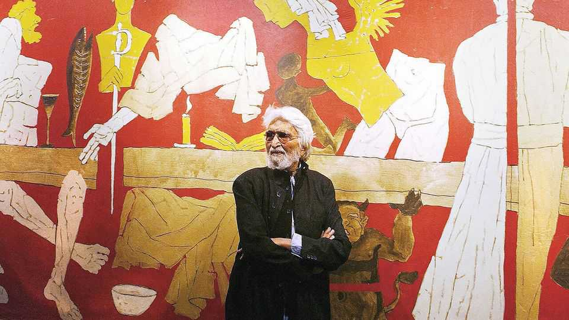
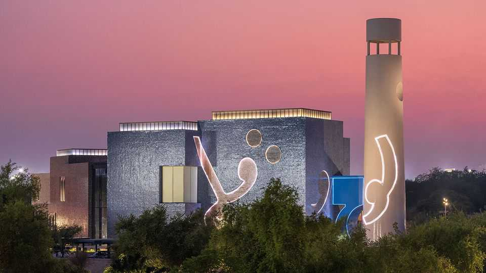
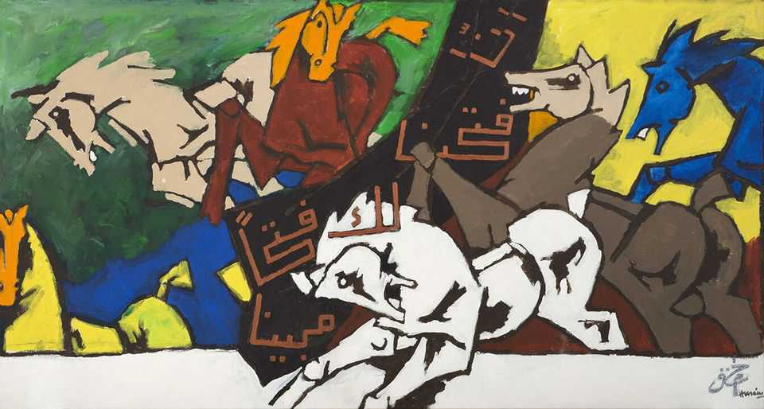

Culture | Art and exile
India’s best-known artist gets his own museum—in Qatar
M.F. Husain was driven out of his home country by Hindu nationalists
December 11th 2025

Although he died 14 years ago, aged 95, M.F. Husain is India’s best-known modern artist. He recently became its most expensive, too: earlier this year one of his works sold at auction for $13.8m, a new record for an Indian painter. The opening of Lawh wa Qalam (The Canvas and the Pen) in Qatar adds one more item to Husain’s list of achievements, for it is the first museum outside India dedicated to a single Indian artist.

Why is the museum in Doha and not, say, Pandharpur, the town of Husain’s birth? The artist, who was Muslim, fell foul of Hindu nationalists, who claimed to be offended by his frequent depiction of Hindu goddesses in the nude. By the mid-2000s the harassment had become intolerable: death threats, vandalism of his artwork, an attack on his home by Hindu militants and an estimated 900 legal cases registered against him. He left India in 2006 and never returned, living between Dubai, Doha and London. “It is a sad day for India,” the editor of the Hindu, a newspaper, wrote at the time.

In 2010 Husain was offered Qatari citizenship, which he accepted. Because India does not allow dual citizenship, he renounced the nationality of his birth with “deep pain”. He is sometimes described as “an Indian-origin Qatari painter”.

Husain was one of India’s first “celebrity artists”, says Sonal Singh of Christie’s, an auction house. He developed an outsize persona, with a rags-to- riches story that involved sleeping on Mumbai’s pavements and painting movie posters. “He made that effort to make himself visible while most other artists waited for someone else to take the initiative,” says Dadiba Pundole, his gallerist; that helped make him the “brand ambassador for Indian art”.

His output was prodigious. Husain produced some 40,000 works over the course of his life, from quick, small sketches to enormous, multi-panel works such as the one auctioned earlier this year. In the popular Indian imagination, he is associated with depictions of horses, daily life and those Hindu goddesses.

His range was far greater, however. Lawh wa Qalam contains just 140-odd paintings, but even with its small sample, the breadth of his oeuvre is on display. Beyond the obligatory horses, it includes abstracts, portraits of Indian luminaries and panels from a 100-foot painting celebrating India’s struggle against British rule. Though chiefly a painter, he also made sculptures and films, including a short that won the top prize at Berlin Film Festival. These, too, find space at the museum.

So do works painted in Qatar, where he traded horses for camels. On display are the products of his last commission, 99 paintings on the theme of Arab civilisation. These were sponsored by his patron, Sheikha Moza bint Nasser, the mother of the reigning emir. He completed around 35 before he died. It is Sheikha Moza, in her role as chair of the Qatar Foundation, who commissioned Lawh wa Qalam. At a function on November 27th to mark the opening of the museum, she characterised Husain as both Indian and Arab: “two identities that enriched his understanding of the human condition”. Not

only did he become a Qatari citizen, she pointed out, but he also had Yemeni ancestry.

Conspicuous by their absence are the paintings that upset Husain’s persecutors, whose Hindu-nationalist movement is now the most powerful force in Indian politics. This is a shame. Husain is not merely a victim of the Hindutva brigade, yet what drove him out of India is also what cemented his place in history. Lawh wa Qalam would not exist had he stayed.

Perhaps it is fitting that Husain’s museum is in the Gulf, and not just because of his ties to Yemen. South and west Asia share centuries of connections through trade, migration and empire. Language, food and art have all flowed back and forth across the Arabian Sea. The Husain museum, says Noof Mohammed, its curator, can serve as a “bridge between Qataris or Qatar and South Asians”. Husain once said that he “never really belonged anywhere or to anyone”. The opposite is also true: he belongs to everyone. ■

For more on the latest books, films, TV shows, albums and controversies, sign up to Plot Twist, our weekly subscriber-only newsletter

This article was downloaded by zlibrary from https://www.economist.com//culture/2025/12/08/indias-best-known-artist-gets-his-own- museum-in-qatar