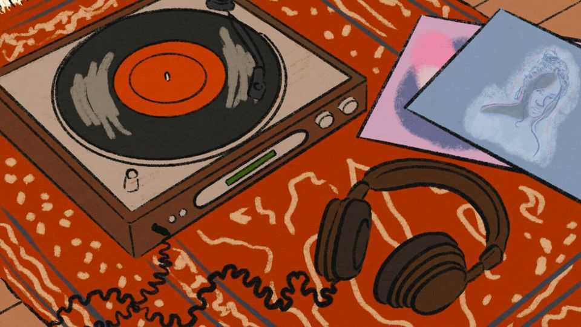

Culture | Strike a chord
The best albums of 2025
Emerging stars and established acts alike released remarkable records this year
December 11th 2025

“Addison”. By Addison RaeThe breakout pop album of 2025. Addison Rae, a former TikTok star, pays tribute to musical forebears including Britney Spears and Lana Del Rey, but has a dreamy style all her own. “Always Been”. By Craig FinnThis record, by the frontman of The Hold Steady, tells a series of interlocking tales about failure. It is an overlooked gem of sophisticated songwriting. “black British music”. By Jim LegxacyThe most intriguing British hip-hop release of the year. It comes from an artist uninterested in rehashing rap

clichés: James Olaloye takes alt-rock instrumentation and acoustic ballads and works them into his sound.

“Blizzard”. By Dove EllisThis Irish singer-songwriter provoked a bidding war between record labels this year and his debut album is a fabulous summation of his promise. His soaring voice will probably be filling very big venues very soon.

“Can’t Lose My (Soul)”. By Annie and the CaldwellsThis American gospel group released their debut album after 40 years. The Lord’s message is carried on sinuous blues and hard funk, as well as in the sublime voices of Ms Caldwell and her daughters.

“A Complicated Woman”. By Self EsteemOn her follow-up to “Prioritise Pleasure”, Rebecca Taylor produces thrilling, propulsive dance-pop. “If I’m so empowered,” she wonders, “why am I such a coward?”

“Double Infinity”. By Big ThiefBig Thief are one of the best indie groups of the age. This record, their sixth, has great spikiness and variety, thanks to Adrianne Lenker’s songwriting.

“EURO-COUNTRY”. By cmatAn Irish singer with a superb voice toys with the conventions of country music for a modern world. There is much to love here—a particular highlight is a song in which she goes into a reverie while browsing deli goods at a petrol station.

“New Threats From the Soul”. By Ryan Davis & the Roadhouse BandThis album travels the highways and byways of American music to tell picaresque stories about lives drifting out of focus. The lyrics are extraordinary.

“West End Girl”. By Lily AllenA divorce album that does not hide behind metaphor or euphemism. Instead, Lily Allen outlines various betrayals and deceptions in detail (inspired by her ex-husband, David Harbour). This is the rawest record of the year by some distance—and a truly compelling listen.■

For more on the latest books, films, TV shows, albums and controversies, sign up to Plot Twist, our weekly subscriber-only newsletter

This article was downloaded by zlibrary from [https://www.economist.com//culture/2025/12/11/the-best-albums-of-2025](https://www.economist.com//culture/2025/12/11/the-best-albums-of-2025)