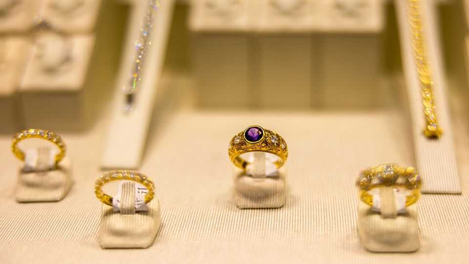
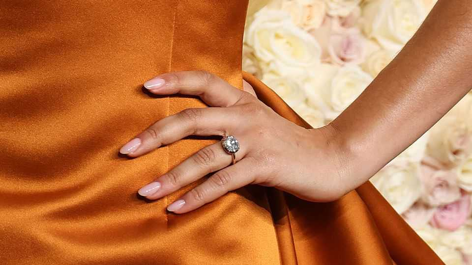

Culture | A decent proposal
Proposing this Christmas? Go for a yellow-gold ring
Celebrities and economic uncertainty have put the “precious” back in “precious metal”
December 11th 2025

IF YOU HAVE ever used social media, chances are you will have seen someone post an ecstatic announcement of their engagement. Under a snap of the happy couple smiling at the camera, the caption reads: “I said ‘Yes’!” or “Forever starts now!” or “Officially off the market!” You are more likely to see such posts in December than at any other time: it consistently ranks as the most popular month for proposals. According to one survey in Britain, almost a third of men think Christmas Eve is the best time to pop the question.

This year, posts enthusing “He put a ring on it!” may show a picture of a sparkler with a yellow-gold setting. The precious metal is firmly back in fashion. Brands, magazines and influencers alike declare that one thing that is glittering is gold.

“We find ourselves in the midst of a yellow-gold renaissance,” Tobias Kormind, the co-founder of 77 Diamonds, a British jeweller, has said. In 2018 only 13.4% of the engagement rings the firm sold were yellow gold; much more popular were white gold (42.2%) and platinum (37.3%). This year, however, 42.5% of sales were of yellow-gold rings, while white gold accounted for 22.5% and platinum 31.7%.

What explains this new golden age? Celebrities are one factor. Just as Princess Diana set off a trend for sapphires, and Grace Kelly made emerald-cut diamonds look anything but square, the rich and famous have burnished yellow gold’s reputation. Taylor Swift and Dua Lipa, two of the world’s biggest pop stars, and Zendaya, a popular actress, have all shown off yellow- gold engagement rings this year. Searches for their styles have soared.

The gold rush also reflects growing demand for items with a vintage look. For centuries yellow gold was de rigueur, symbolising wealth, royalty and romance. It began to be displaced by white metals in the 1990s, partly because they are tougher and partly because they evoked the sleek, minimalist style of the era. (They were favoured by Tiffany, America’s leading luxury jeweller.) But now antique-style rings have a certain lustre to them, as they evoke enduring love stories. Such pieces may also include a coloured stone—a ruby, for example—which look brighter and better when set in yellow gold.

Finally, gold is proving its mettle as an investment, hitting a record $4,380 an ounce on October 20th. (It is now around $4,200.) “When I started in jewellery manufacturing, platinum was double the price of gold,” says Sally Ryder, the founder of Ryder Diamonds, a jeweller based in Hong Kong. Now platinum is nearly a third of the price. Even the lovestruck want to buy rings that will hold their value. Many consider gold to be a solid choice; speculators and investors have long thought of it as a safe asset. So when it comes to choosing a ring, many believe that nothing is as good as yellow gold. ■

This article was downloaded by zlibrary from https://www.economist.com//culture/2025/12/11/proposing-this-christmas-go-for-a-yellow- gold-ring