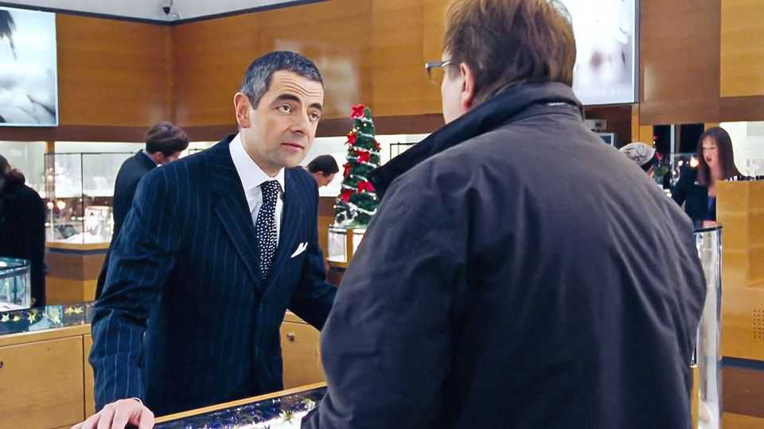
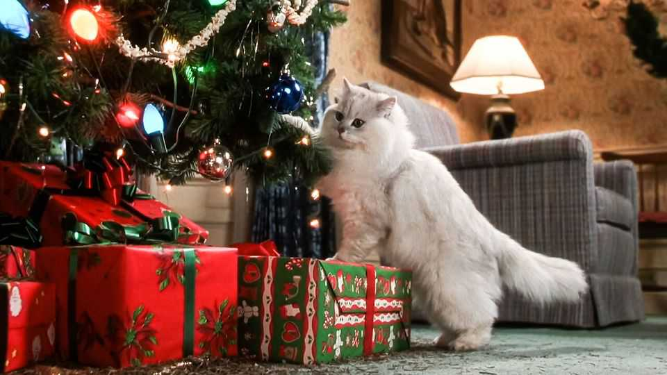

Culture | Back Story
Every sheet of wrapping paper tells a story
The hidden drama of one of the most enervating rituals of Christmas
December 11th 2025

It takes aeons to claw up the edge of the sticky tape. How much of your life have you spent doing this? When at last you manage it, the snippet of tape coils up annoyingly before you can smooth it onto the wrapping paper. You cut off far too much paper for the job, but it seems profligate to throw the leftovers away. They are stuffed into a drawer full of strips discarded at past Christmases.

The Hall brothers of Kansas City have a lot to answer for at this time of year. Short of tissue paper in 1917, they sold fancier envelope linings instead. Thus modern, decorative wrapping paper was born (so, later, was Hallmark). It was handy during the Depression as a way to ornament often ordinary presents. Today the gift-packaging industry consumes billions of dollars and umpteen trees, chiefly at Christmas. But, in life and art, each sheet of wrapping paper also tells a story, turning a simple exchange into a five-act drama.

The first act is the wrapping itself. This is unglamorous and often tetchy, leading to in-house rows over the use of tape and scissors. “Can’t I just staple it?” you wonder—though that might lead to a child pricking a finger, and spraying blood around as in a gory “Saturday Night Live” sketch set at a wrapping counter. The actual act of wrapping rarely features in films, an exception being “Love Actually”. A salesman (played by Rowan Atkinson, pictured) is so excruciatingly slow about it that a wife catches her husband buying a necklace. She assumes it’s for her. It isn’t.

The drudgery, though, is part of the narrative. You may only have clicked the link your nephew sent to buy his present, but your creases and corners, and the tedium they involved, insist that you do really care about him. In her new Christmas show on Netflix, Meghan Markle suggests, as a bonus gesture, adding handcrafted miniature wreaths (because everyone has time to make those).

After the matching swag is heaped beneath the tree, the spoils of another outlasted year, comes the drama’s next act: the handover. Wrapping drapes gifts in mystery, especially those of indecipherable shapes, like the gun rack Wayne is given in “Wayne’s World” despite not owning a gun, or the wrapped-up cat in “National Lampoon’s Christmas Vacation”. Even obvious objects are shrouded in uncertainty. Yes, it’s a book, but which? Sure, those are socks, but how tasteless?

Next, the opening. If wrapping is psychologically revealing, whether of nonchalance or perfectionism, unwrapping is more so. Like other hotly anticipated treats (fireworks, cakes), it is always brief, but in degrees. Some people unwrap languidly, kidding themselves they will reuse the paper. Others shred it in a frenzy.

The moment of recognition is the climactic fourth act. For a second only the recipient sees inside the wrapping paper; everyone else sees their reaction. The scene is like an awards ceremony at which the nominees open the envelopes. Some are thrilled; some are not. Receiving the husband’s gift in “Love Actually”, his wife expects to find that necklace. Inside is a CD. Inferring that he is having an affair, she nips away for a private cry.

Children are much worse than adults at dissembling. If they already own your offering, or don’t like the look of it, you will know immediately. A classic case is the pink bunny suit given to a miffed boy in “A Christmas Story”, by an aunt who seems to think he is “not only perpetually four years old, but also a girl”. (Very small children are different: for them, manically ripping up the paper is the main event, so wrapping up their old toys is a sound economy.)

“My God, would you look at that mess?” gripes the patriarch in “A Christmas Story”, speaking for every father who surveys the post-presents carnage

before trudging around with a bin bag. In the final act of the wrapping-paper drama, the reindeer-patterned scraps are gathered up like limbs after a battle. This is the shard of mortality in the joy, the point when environmentalists fret about landfill, and those stooping dads worry about slipping a disc.

Is wrapping paper worth the waste and bother? Consider one of literature’s loveliest unwrappings. In “The Gift of the Magi” by O. Henry, Della and Jim have only two assets besides each other: her luscious hair and his pocket watch. Della sells all her hair to get Jim a watch-chain for Christmas. He sells the watch to reciprocate. Tearing at the paper, she finds a set of beautiful, useless combs. She shrieks for joy, then wails, then smiles. The surprise still counts, as do the feelings it came wrapped in. ■

For more on the latest books, films, TV shows, albums and controversies, sign up to Plot Twist, our weekly subscriber-only newsletter

This article was downloaded by zlibrary from https://www.economist.com//culture/2025/12/05/every-sheet-of-wrapping-paper-tells-a- story

Economic & financial indicators Economic data, commodities and markets