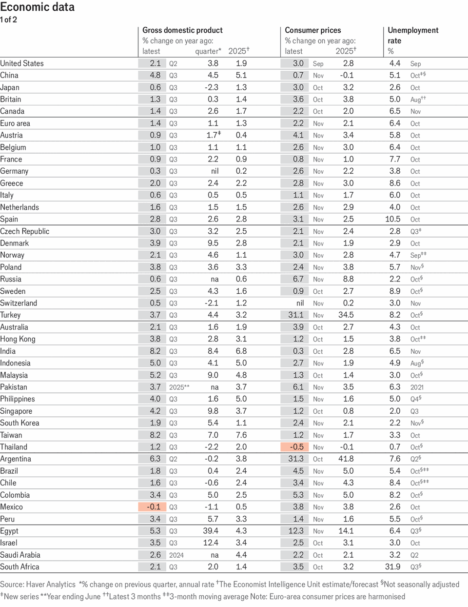
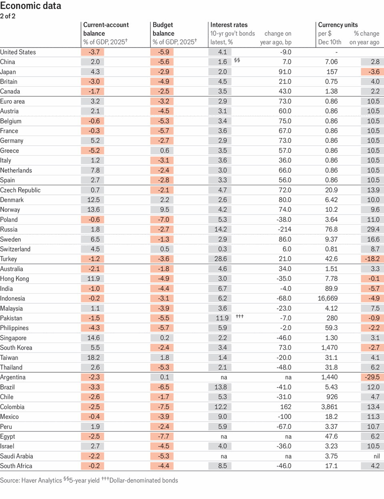
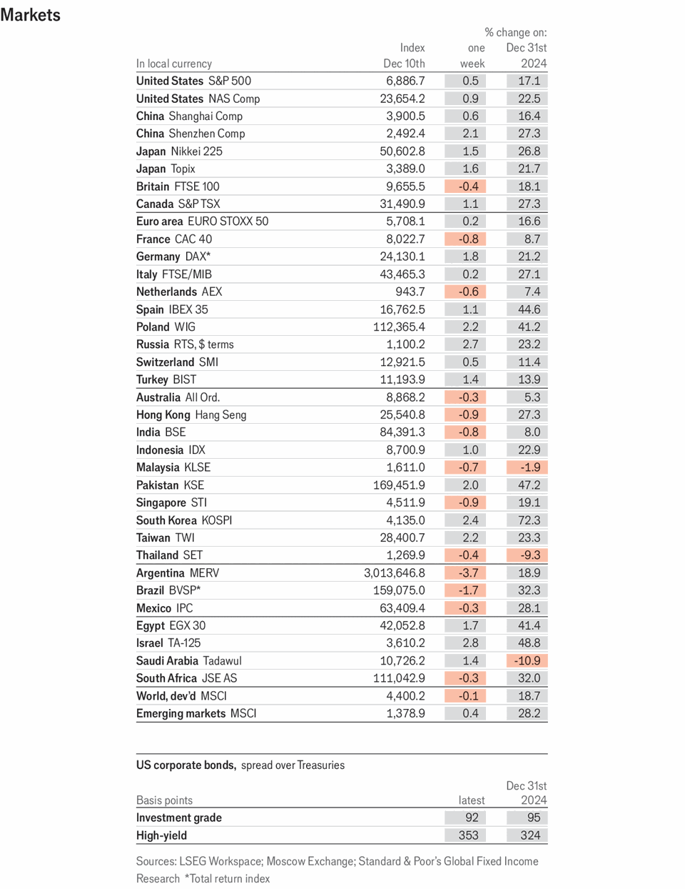
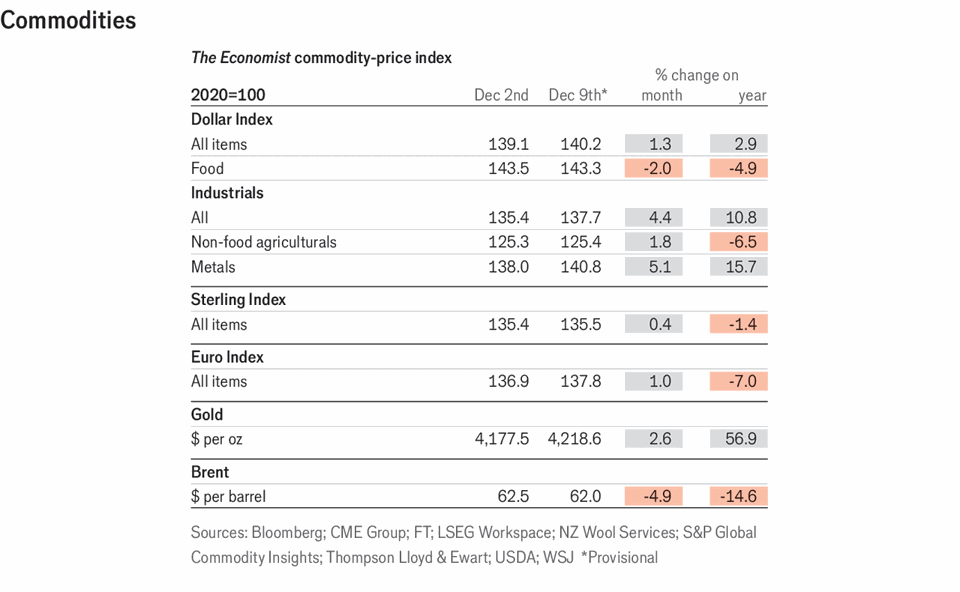

Economic & financial indicators | Indicators
Economic data, commodities and markets
December 11th 2025

This article was downloaded by zlibrary from https://www.economist.com//economic-and- financial-indicators/2025/12/11/economic-data-commodities-and-markets

Obituary Frank Gehry shook up buildings as never before