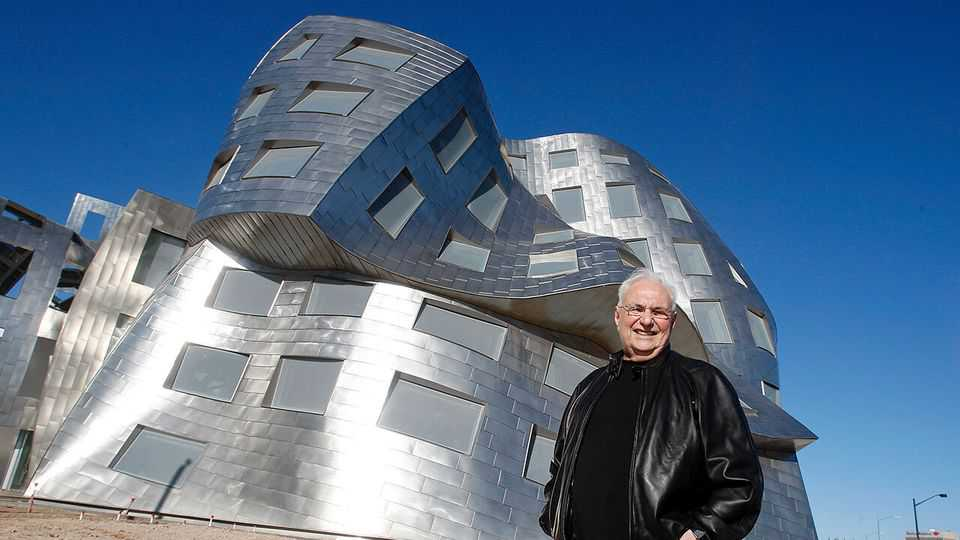

Obituary | Plywood, titanium and light
Frank Gehry shook up buildings as never before
The world’s most innovative architect died on December 5th, aged 96
December 11th 2025

There was no mistaking a building by Frank Gehry. Suddenly, from above the roofs, would surge a blaze of light. As you turned a corner, a group of gleaming walls would be tumbling on each other. College halls would turn into punched paper bags, their windows protruding as if about to fall. Beside a lake a building would glitter with thousands of glass-shards, a lizard twisting. These creations had come not from some showy whiz-kid but from a bespectacled, baggy-trousered man in late middle age, who simply could not

stop having ideas. As he talked (not a lot, as he was shy, and preferred laughing) he was constantly sketching, on yellow legal pads, any object under discussion. These pages littered his office, pleasing him with their crumpledness. He loved clutter, and the way random things—a bottle, a pencil, a stone—sat together on his desk. Out of this ferment had come what many thought the best building of the 20th century, the Guggenheim Museum in Bilbao, high waves of titanium bursting alongside the Nervion river; the Walt Disney Concert Hall in Los Angeles, his adopted home, a stainless-steel city in itself, cascading on Bunker Hill; the Mopop building in Seattle, with 21,000 metal shingles to catch every light, and the Fondation Louis Vuitton in Paris, emerging in veils of glass from the Bois de Boulogne.

Their forms often surprised even him. When he first saw the completed Guggenheim in 1997, he thought it was a disaster. It was only later, when he realised that it did a nice thing with the river, that he started to feel proud of it. Just a bit. But he had a long list of precursors and influences to name. Le Corbusier, whose work he had encountered in Paris in 1961, who had painted as well as designed his ideas, treating architecture as art. The chaotic, restless artists and sculptors, Richard Serra, Lou Danziger, Claes Oldenburg and others, he had befriended when in 1947 he moved to southern California. Southern California itself, with its brightness, its risk-taking attitude and the free, open desert, though modernist steel and glass boxes were springing up every instant. Yet he treasured most a tiny 17th-century church in Rome, San Carlino by the long-neglected Francesco Borromini, who had already done all the moves that he, much-applauded Frank Gehry, might like to presume he had done first.

He was a paper and pencil man, but from 1991 his work had been transformed by technology. An impressive app called Catia allowed his growing band of assistants to digitise his models onscreen, make new 3D models from them and send those directly to be scaled up huge. How it worked he hadn’t a clue. It told him whether each project was possible or not, but he didn’t want to hear about limits. In his childhood in a run-down section of Toronto, his wood- block cities were fantastical. In his grandfather’s hardware store he sorted nails and screws, cut glass, cut pipe and took clocks apart, fascinated by everything.

Every week, too, his grandmother bought a live carp to make gefilte fish, installing it in the bath. He spent hours watching it move, gleam and turn. As a

result, several huge commissions were covered with myriad metal scales. A giant fish, fat as a carp and made of strips of gilded steel, was the centrepiece for the Barcelona Olympics in 1992. Sinuous fish shapes, covered with hundreds of tiny shards of shiny Formica, made the “Gehry Lamps” that softly lit his interiors. Swimming fish led on to rippling robes and billowing sails, which were almost his trademark. (He sailed himself, in a yacht called Foggy, sparkling with hundreds of glass inserts.) Unlike the products of dead, stark modernism, he wanted his to live. His “Fred and Ginger” House in Prague persuaded two towers to embrace and dance together.

The human element was always important. He intended his buildings to be as comfortable as a baby in a mother’s arms, and also democratic. His big prestige commissions looked elitist, but he liked to imagine them full of messy, noisy people. Workaday materials were great: plywood, tar-paper shingles, bricks (which could crumple, too). He even tried to find beauty in chain-link fencing for a time. Most of these featured in the “Gehry Residence” he designed for himself and his family in Santa Monica in 1978, an apparent mish-mash of corrugated aluminum, Finnish plywood and, yes, chain-link fencing around an inoffensive 1920s house. His message: this building was busy evolving.

He also built it that way to fit in. The area was not classy, and nor was he (as many neighbours angrily agreed). Trying to integrate was another theme in his life. He had been born Ephraim Goldberg to Jewish immigrants, which won him little luck either in Toronto, where he was beaten up at school, or in LA, where for years he was passed over for commissions. As Frank Gehry he did much better, and could still make nice flowing loops when he signed his name: the main thing.

His designs, too, needed to acknowledge where they were, despite their brash eruption. The Guggenheim in Bilbao was the shining resurrection of a rusting riverfront; his elegant Spruce Street residential tower in New York paid homage to its neighbours, the Chrysler Building and the Empire State; a wine- grower’s hotel in Spain exploded with the colours of a bottle of Rioja. His Guggenheim in Abu Dhabi, still in progress, was designed as a cluster of assorted buildings, an organic Arab village.

As his fame spread, detractors said he was becoming a brand and spreading himself too thin. Naturally he disagreed. He was never too busy to do private

commissions for friends. And he kept on working because the ideas kept coming. Shapes appeared to him in dreams, or when he was driving; he easily lost himself in his own world. Sketches would catch those forms first; then hopeful cardboard models. The sober, naysaying computer would too often turn his imaginations into dried-out things. But he had put his finger playfully in the living flame far too many times to stop. ■

This article was downloaded by zlibrary from https://www.economist.com//obituary/2025/12/11/frank-gehry-shook-up-buildings-as-never- before

