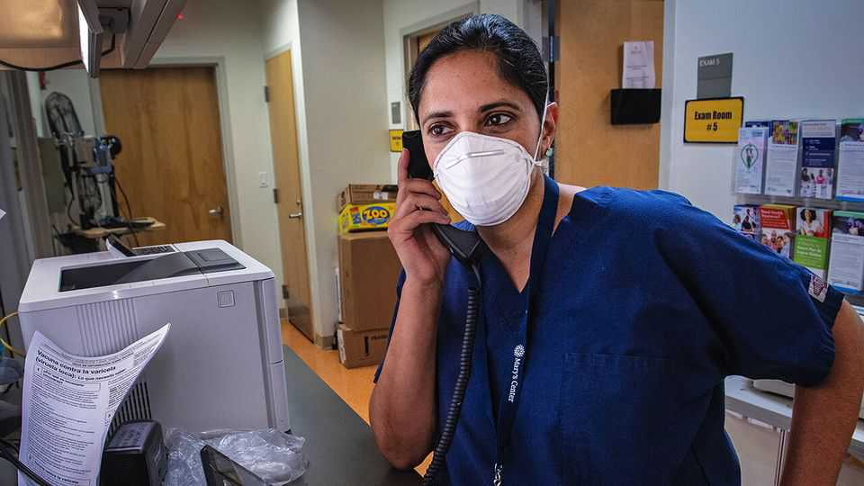
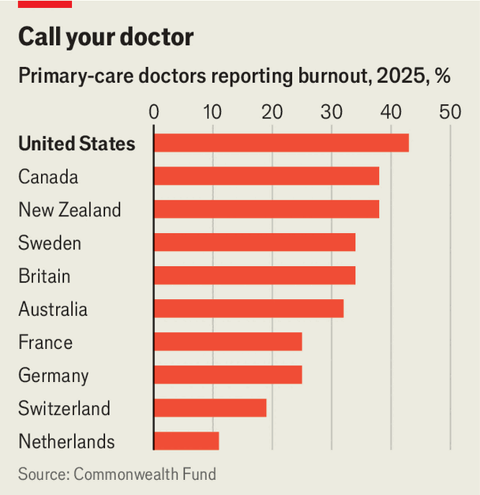

United States | Dr Feelbad 
American doctors are rich and miserable 
A recent study shows they are world leaders in burnout 
December 11th 2025 
 

Look around a physicians' car park in Dallas, Texas, and the rewards from years slogging away in training are evident. "It looks like a German-car dealership," says Scott Yates, a doctor, from behind the wheel of his BMW. He reels off all the luxury-car brands he can see. Yet he worries that his peers are still unhappy. "We all went to medical school to practice medicine," he says, "not to deal with insurance companies, not to fill out paperwork." This burden lies at the heart of a confounding statistic: American family doctors are among the best paid in the world and also some of the most miserable. 

备注

- <strong><em>physicians</em></strong>：/[fɪˈzɪʃənz]/ "医生"；文中用来表达医生，强调他们的职业身份；physician是医生的正式说法，比doctor更正式。 
- <strong><em>slogging</em></strong>：/[slɒɡɪŋ]/ "辛苦工作"；文中用来表达多年辛苦训练，强调医生培训的艰辛；动词原形是slog（辛苦工作）。 
- <strong><em>dealership</em></strong>：/[ˈdiːləʃɪp]/ "经销商"；文中用来表达汽车经销商，强调停车场里豪车很多；由dealer（经销商）加后缀-ship构成。 
- <strong><em>reels off</em></strong>：/[riːlz ɒf]/ "快速列举"；文中用来表达快速列举所有豪车品牌，强调Yates医生的观察；固定短语，指快速列举或背诵。 
- <strong><em>deal with</em></strong>：/[diːl wɪð]/ "处理、应对"；文中用来表达处理保险公司，强调医生需要应对保险事务；固定短语，deal指处理，with表示对象。 
- <strong><em>fill out</em></strong>：/[fɪl aʊt]/ "填写"；文中用来表达填写文书工作，强调医生需要完成大量表格；固定短语，fill指填充，out表示完成。 
- <strong><em>confounding</em></strong>：/[kənˈfaʊndɪŋ]/ "令人困惑的"；文中用来表达令人困惑的统计数据，强调高收入与高不满意度之间的矛盾；动词原形是confound（使困惑）。 
 
In a recent international survey by The Commonwealth Fund, a think-tank, of 11,000 doctors, 43% of American respondents reported feeling burnt out, more than in any of the other nine peer-countries polled (see chart). In Britain, just over a third of general practitioners in the bedraggled NHS reported being "physically or emotionally exhausted", despite earning about half of the $242,000 taken home by the average American primary-care doctor. "Burnout is sometimes like a dirty little secret," says Revathi Ravi, an internist and paediatrician in Boston. The American health-care system has all "the ingredients for it". Her own experiences of burnout were so intense she considered quitting. 

备注

- <strong><em>think-tank</em></strong>：/[θɪŋk tæŋk]/ "智库"；文中用来表达智库，强调Commonwealth Fund的性质；固定短语，指智库或智囊团。 
- <strong><em>respondents</em></strong>：/[rɪˈspɒndənts]/ "受访者"；文中用来表达受访医生，强调调查的对象；由respondent（受访者）加-s构成。 
- <strong><em>burnt out</em></strong>：/[bɜːnt aʊt]/ "精疲力竭的"；文中用来表达精疲力竭的感觉，强调医生的职业倦怠；固定短语，指因过度工作而精疲力竭。 
- <strong><em>peer-countries</em></strong>：/[pɪə ˈkʌntriz]/ "同等国家"；文中用来表达同等国家，强调对比的基准；peer指同等的，countries指国家。 
- <strong><em>bedraggled</em></strong>：/[bɪˈdræɡəld]/ "破败的、疲惫的"；文中用来表达破败的NHS，强调英国医疗系统的困境；由be-和draggled（拖拽的）构成。 
- <strong><em>practitioners</em></strong>：/[prækˈtɪʃənəz]/ "执业医生"；文中用来表达全科医生，强调英国医生的类型；由practitioner（执业者）加-s构成。 
- <strong><em>taken home</em></strong>：/[teɪkən həʊm]/ "税后的、实际到手的"；文中用来表达税后收入，强调美国医生实际到手的工资；固定短语，taken指拿到的，home指到家，合起来指扣除税费后实际到手的收入。 
- <strong><em>internist</em></strong>：/[ɪnˈtɜːnɪst]/ "内科医生"；文中用来表达内科医生，强调Ravi医生的专业；指专门治疗内科疾病的医生。 
- <strong><em>paediatrician</em></strong>：/[ˌpiːdiəˈtrɪʃən]/ "儿科医生"；文中用来表达儿科医生，强调Ravi医生的另一个专业；指专门治疗儿童疾病的医生。 
- <strong><em>ingredients</em></strong>：/[ɪnˈɡriːdiənts]/ "要素、成分"；文中用来表达要素，强调美国医疗系统具备导致职业倦怠的所有条件；由ingredient（成分）加-s构成。 
  
 

Paperwork is the driving force behind this misery, says Celli Horstman, one of the Commonwealth study's authors. "There are just so many administrative tasks—on top of spending time with patients—that US physicians are expected to do." Ms Hortsman cites elaborate charting, inboxes teeming with patient messages and fighting with insurance companies. 

备注

- <strong><em>driving force</em></strong>：/[ˈdraɪvɪŋ fɔːs]/ "驱动力"；文中用来表达驱动力，强调文书工作是导致医生痛苦的主要原因；driving指驱动的，force指力量。 
- <strong><em>administrative</em></strong>：/[ədˈmɪnɪstrətɪv]/ "行政的"；文中用来表达行政任务，强调医生需要处理大量非医疗工作；由administer（管理）加-ive构成。 
- <strong><em>on top of</em></strong>：/[ɒn tɒp ɒv]/ "除了...之外"；文中用来表达除了花时间与患者相处之外，强调行政任务是在患者护理之外额外的工作；固定短语，top指顶部，on top of指在...之上，引申为除了...之外。 
- <strong><em>elaborate</em></strong>：/[ɪˈlæbərət]/ "详细的、复杂的"；文中用来表达详细的记录，强调医生需要做复杂的图表记录；指详细的或复杂的。 
- <strong><em>charting</em></strong>：/[tʃɑːtɪŋ]/ "制图、记录"；文中用来表达制图记录，强调医生需要做详细的医疗记录；动词原形是chart（制图）。 
- <strong><em>teeming</em></strong>：/[tiːmɪŋ]/ "充满的"；文中用来表达收件箱充满患者消息，强调消息数量之多；动词原形是teem（充满）。 
 
Doctors are particularly aggrieved by the rise of electronic health records. Studies show that family doctors spend, on average, just under an hour every day answering patient messages alone. The use of remote-contact and communication apps spiked during the covid pandemic, reports Tait Shanafelt, a doctor at Stanford who studies burnout, "leading to a tsunami of inbox messages for physicians". Although he emphasises their potential for improved treatment, "it's all just extra work." 

备注

- <strong><em>aggrieved</em></strong>：/[əˈɡriːvd]/ "愤愤不平的"；文中用来表达医生对电子健康记录的愤愤不平，强调他们的不满；由ag-和grieved（悲伤的）构成。 
- <strong><em>electronic</em></strong>：/[ɪlekˈtrɒnɪk]/ "电子的"；文中用来表达电子健康记录，强调记录方式的现代化；由electron（电子）加-ic构成。 
- <strong><em>remote-contact</em></strong>：/[rɪˈməʊt ˈkɒntækt]/ "远程联系"；文中用来表达远程联系，强调疫情期间的联系方式；remote指远程的，contact指联系。 
- <strong><em>spiked</em></strong>：/[spaɪkt]/ "急剧上升"；文中用来表达远程联系应用的使用急剧上升，强调疫情期间的变化；动词原形是spike（急剧上升）。 
- <strong><em>tsunami</em></strong>：/[tsuːˈnɑːmi]/ "海啸"；文中用来表达收件箱消息如海啸般涌来，强调消息数量巨大；源自日语，现用来比喻大量涌来的事物。 
 
This angst is not just a problem for doctors. Burnt out physicians are twice as likely to make a mistake. They are also more likely to quit, which can produce staggering costs. One analysis from 2019 found that turnover and hours lost to burnout costs roughly $7,600 per employed doctor, or $4.6bn each year. 

备注

- <strong><em>angst</em></strong>：/[æŋst]/ "焦虑"；文中用来表达焦虑，强调这不仅是医生的问题；源自德语，指焦虑或不安。 
- <strong><em>staggering</em></strong>：/[ˈstæɡərɪŋ]/ "惊人的"；文中用来表达惊人的成本，强调职业倦怠造成的经济损失；动词原形是stagger（使震惊）。 
- <strong><em>turnover</em></strong>：/[ˈtɜːnəʊvə]/ "人员流动"；文中用来表达人员流动，强调医生离职造成的成本；由turn（转）和over（过）构成。 
 
Some solutions to burnout are straightforward. Researchers point to Australia, which created a centralised platform for health bureaucracy, cutting down endless form-filling. Jen Brull, the chair of the American Academy of Family Physicians, a trade association, hopes that artificial intelligence might help too, especially for "routine tasks like charting, coding and note-taking". "A decade ago, maybe people would have said, 'the clinician should do more mindfulness practices'," says Dr Ravi, the Boston physician. Now there is more recognition of the need to reduce workloads. In the meantime, she leads classes and coaches doctors to avoid and withstand burnout, just as she did. 

备注

- <strong><em>straightforward</em></strong>：/[ˌstreɪtˈfɔːwəd]/ "直接的、简单的"；文中用来表达解决方案是直接的，强调解决方法并不复杂；由straight（直的）和forward（向前的）构成。 
- <strong><em>centralised</em></strong>：/[ˈsentrəlaɪzd]/ "集中的"；文中用来表达集中化平台，强调澳大利亚的做法；动词原形是centralise（集中化）。 
- <strong><em>bureaucracy</em></strong>：/[bjʊəˈrɒkrəsi]/ "官僚机构、行政系统"；文中用来表达医疗行政系统，强调需要处理的行政工作；指官僚机构或行政系统。 
- <strong><em>routine</em></strong>：/[ruːˈtiːn]/ "常规的"；文中用来表达常规任务，强调AI可以帮助处理日常重复性工作；指常规的或例行的。 
- <strong><em>coding</em></strong>：/[ˈkəʊdɪŋ]/ "编码、分类"；文中用来表达编码分类，强调医生需要做的医疗编码工作；动词原形是code（编码）。 
- <strong><em>clinician</em></strong>：/[klɪˈnɪʃən]/ "临床医生"；文中用来表达临床医生，强调医生的职业身份；指从事临床工作的医生。 
- <strong><em>mindfulness</em></strong>：/[ˈmaɪndfʊlnəs]/ "正念"；文中用来表达正念练习，强调过去建议的解决方法；由mindful（留心的）加-ness构成。 
- <strong><em>recognition</em></strong>：/[ˌrekəɡˈnɪʃən]/ "认识、认可"；文中用来表达认识，强调现在更多人认识到需要减少工作量；由recognise（认识）加-tion构成。 
- <strong><em>cutting down</em></strong>：/[ˈkʌtɪŋ daʊn]/ "减少、削减"；文中用来表达减少无尽的表格填写，强调澳大利亚平台的作用；固定短语，cut指削减，down表示减少。 
- <strong><em>withstand</em></strong>：/[wɪðˈstænd]/ "承受、抵抗"；文中用来表达抵抗职业倦怠，强调医生需要学会应对；由with（与）和stand（站立）构成。 
