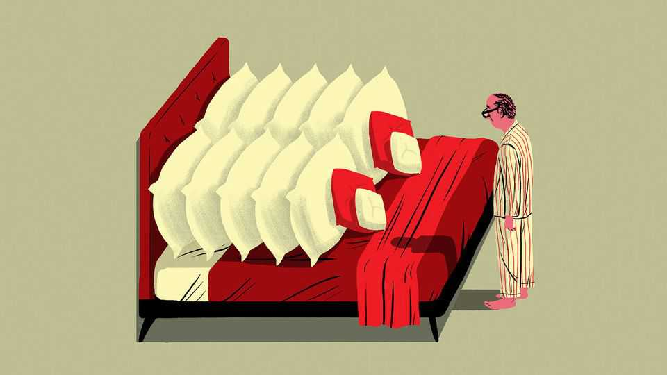

Business | Bartleby
A short guide to every business-hotel room
The world's most commoditised experience
December 11th 2025 
 

 
Welcome to the Marryattilton Hotel. We're delighted that you have chosen to spend time with us, and look forward to making your stay as enjoyable as possible. We offer an entirely commoditised experience which somehow manages to be part of the attraction. Please do take a few minutes to read the following notes. • Guests must check out at midday. If you wish to extend your stay, please just let us know and we will happily charge you a lot extra.• The WiFi password is your room number. You will see a warning that your messages may not be securely protected. Please wonder briefly if you should 

备注

- <strong><em>delighted</em></strong>：/[dɪˈlaɪtɪd]/ "高兴的"；文中用来表达酒店很高兴，强调欢迎的语气；动词原形是delight（使高兴）。 
- <strong><em>look forward to</em></strong>：/[lʊk ˈfɔːwəd tuː]/ "期待、盼望"；文中用来表达期待让您的住宿尽可能愉快，强调酒店的欢迎态度；固定短语，look指看，forward指向前，to表示对象。 
- <strong><em>commoditised</em></strong>：/[kəˈmɒdɪtaɪzd]/ "商品化的"；文中用来表达完全商品化的体验，强调商务酒店房间的标准化；动词原形是commoditise（商品化）。 
- <strong><em>attraction</em></strong>：/[əˈtrækʃən]/ "吸引力"；文中用来表达吸引力，强调商品化体验反而成为吸引力的一部分；由attract（吸引）加-tion构成。 
- <strong><em>check out</em></strong>：/[tʃek aʊt]/ "退房"；文中用来表达退房，强调酒店规定的退房时间；固定短语，check指检查，out表示离开，合起来指退房。 
- <strong><em>extend</em></strong>：/[ɪkˈstend]/ "延长"；文中用来表达延长住宿，强调退房时间的规定；指延长或扩展。 
- <strong><em>securely</em></strong>：/[sɪˈkjʊəli]/ "安全地"；文中用来表达安全保护，强调WiFi警告信息；由secure（安全的）加-ly构成。 
 
take this warning seriously and then ignore it.• We have given you two room cards even though you are clearly on your own. Make sure to carry them both around with you so that if you do lose one, you will be sure to lose both. • You have two complimentary bottles of water. Your name will be displayed on the TV screen when you turn it on. For some reason both of these things will make you feel well treated. • Some of our larger rooms come with a bowl of fruit. You would not be excited by the sight of a grape at home. Here you will see it as a mark of very high status.• You have two flannels, four handtowels and eight large towels. If you need more towels, you're almost certainly doing something wrong.• Our amenities include an origami masterclass in your bathroom. The loose end of your toilet roll will be laboriously folded into a swan each morning. The flannels will be shaped into bows. The large towels will be rolled so tightly that this creates a vacuum. • All our carpets have been specially designed to make you feel dizzy. • The windows may or may not be see-through. You'll be able to judge by the behaviour of the office workers across the street from you. • We have given you 20 times as many pillows as you need. Please do not attempt to use them all. It would be like sleeping standing up.• The sheets will be tucked so aggressively under the mattress that it will take you several minutes of intense effort to ram your legs down the length of the bed. Please do not try to create more room by kicking out furiously. You will only do yourself an injury.• All your drinking glasses will be wearing little paper hats.• We take extra care to make the corridors as featureless as possible, so that you have maximum difficulty finding your way back to the lifts.• You have the use of an extremely large, white dressing gown. Please wear it just because it is there.• For people under the age of 25, that thing on your bedside table is a landline phone. Simply dial "0" and no one will pick up. These phones are also placed on a table beside the lifts on each floor, where they must never be used. • We are committed to using entirely unnecessary packaging. Unwrapping the soap will require both time and incredible determination. • There is a safe in the wardrobe. Do not use it. It is not safe.• Sockets are available everywhere throughout the room except close to the desk where you want to work.• To add a bit of fun to your stay, we always have one light that refuses to turn off no matter which switches you press. • All our rooms come with two sets of curtains as standard. One for you, and one for your non-existent companion. • Breakfast is served from 6am. Our scrambled eggs are made of rubber. Our bacon is extremely brittle and will shatter if you apply any pressure. Cereals are available by slowly turning the handle on a dispenser for 20 minutes. If you are tempted to complain, 

备注

- <strong><em>complimentary</em></strong>：/[ˌkɒmplɪˈmentəri]/ "免费的"；文中用来表达免费的水，强调酒店提供的免费物品；由compliment（赞美）加-ary构成。 
- <strong><em>displayed</em></strong>：/[dɪˈspleɪd]/ "显示"；文中用来表达显示你的名字，强调电视屏幕的个性化；动词原形是display（显示）。 
- <strong><em>flannels</em></strong>：/[ˈflænəlz]/ "法兰绒毛巾"；文中用来表达法兰绒毛巾，强调浴室用品的数量；由flannel（法兰绒）加-s构成。 
- <strong><em>handtowels</em></strong>：/[ˈhændtəʊəlz]/ "手巾"；文中用来表达手巾，强调浴室用品的种类；由hand（手）和towel（毛巾）加-s构成。 
- <strong><em>amenities</em></strong>：/[əˈmenɪtiz]/ "设施"；文中用来表达设施，强调酒店提供的服务；由amenity（便利设施）加-s构成。 
- <strong><em>origami</em></strong>：/[ˌɒrɪˈɡɑːmi]/ "折纸"；文中用来表达折纸大师课，强调浴室用品的艺术性摆放；源自日语，指折纸艺术。 
- <strong><em>masterclass</em></strong>：/[ˈmɑːstəklɑːs]/ "大师课"；文中用来表达大师课，强调酒店用幽默的方式描述浴室用品的摆放；由master（大师）和class（课程）构成。 
- <strong><em>laboriously</em></strong>：/[ləˈbɔːriəsli]/ "费力地"；文中用来表达费力地折叠，强调酒店员工的工作；由laborious（费力的）加-ly构成。 
- <strong><em>swan</em></strong>：/[swɒn]/ "天鹅"；文中用来表达折叠成天鹅形状，强调卫生纸的艺术性摆放；指天鹅。 
- <strong><em>bows</em></strong>：/[bəʊz]/ "蝴蝶结"；文中用来表达折叠成蝴蝶结形状，强调毛巾的艺术性摆放；指蝴蝶结。 
- <strong><em>vacuum</em></strong>：/[ˈvækjʊəm]/ "真空"；文中用来表达产生真空，强调毛巾卷得极紧；指真空或空白。 
- <strong><em>dizzy</em></strong>：/[ˈdɪzi]/ "头晕的"；文中用来表达让你感到头晕，强调地毯设计的特殊效果；指头晕的或眩晕的。 
- <strong><em>see-through</em></strong>：/[siː θruː]/ "透明的"；文中用来表达窗户可能是透明的，强调窗户的隐私性不确定；固定短语，指透明的。 
- <strong><em>pillows</em></strong>：/[ˈpɪləʊz]/ "枕头"；文中用来表达枕头，强调房间枕头数量之多；由pillow（枕头）加-s构成。 
- <strong><em>tucked</em></strong>：/[tʌkt]/ "塞入"；文中用来表达床单被塞入床垫，强调床单的紧实；动词原形是tuck（塞入）。 
- <strong><em>aggressively</em></strong>：/[əˈɡresɪvli]/ "猛烈地"；文中用来表达猛烈地塞入，强调床单的紧实程度；由aggressive（猛烈的）加-ly构成。 
- <strong><em>mattress</em></strong>：/[ˈmætrəs]/ "床垫"；文中用来表达床垫，强调床单被塞在床垫下；指床垫。 
- <strong><em>ram</em></strong>：/[ræm]/ "用力推"；文中用来表达用力推腿，强调从紧实的床单中挣脱的困难；指用力推或塞。 
- <strong><em>furiously</em></strong>：/[ˈfjʊəriəsli]/ "猛烈地"；文中用来表达猛烈地踢，强调试图挣脱床单的动作；由furious（猛烈的）加-ly构成。 
- <strong><em>corridors</em></strong>：/[ˈkɒrɪdɔːz]/ "走廊"；文中用来表达走廊，强调走廊设计的无特色；由corridor（走廊）加-s构成。 
- <strong><em>featureless</em></strong>：/[ˈfiːtʃələs]/ "无特色的"；文中用来表达无特色的走廊，强调酒店设计的标准化；由feature（特色）加-less构成。 
- <strong><em>lifts</em></strong>：/[lɪfts]/ "电梯"；文中用来表达电梯，强调寻找电梯的困难；由lift（电梯）加-s构成。 
- <strong><em>dressing gown</em></strong>：/[ˈdresɪŋ ɡaʊn]/ "浴袍"；文中用来表达浴袍，强调酒店提供的超大浴袍；dressing指穿衣，gown指长袍。 
- <strong><em>landline</em></strong>：/[ˈlændlaɪn]/ "固定电话"；文中用来表达固定电话，强调年轻客人可能不认识的设备；由land（陆地）和line（线路）构成。 
- <strong><em>bedside</em></strong>：/[ˈbedsaɪd]/ "床边的"；文中用来表达床边桌，强调电话的位置；由bed（床）和side（边）构成。 
- <strong><em>packaging</em></strong>：/[ˈpækɪdʒɪŋ]/ "包装"；文中用来表达不必要的包装，强调肥皂包装的复杂；由package（包装）加-ing构成。 
- <strong><em>unwrapping</em></strong>：/[ʌnˈræpɪŋ]/ "拆开"；文中用来表达拆开肥皂，强调包装的复杂；由un-（不）和wrap（包装）加-ing构成。 
- <strong><em>determination</em></strong>：/[dɪˌtɜːmɪˈneɪʃən]/ "决心"；文中用来表达需要极大的决心，强调拆包装的困难；由determine（决定）加-tion构成。 
- <strong><em>wardrobe</em></strong>：/[ˈwɔːdrəʊb]/ "衣柜"；文中用来表达衣柜，强调保险箱的位置；指衣柜或衣橱。 
- <strong><em>sockets</em></strong>：/[ˈsɒkɪts]/ "插座"；文中用来表达插座，强调插座位置的不便；由socket（插座）加-s构成。 
- <strong><em>switches</em></strong>：/[swɪtʃɪz]/ "开关"；文中用来表达开关，强调无法关闭的灯；由switch（开关）加-s构成。 
- <strong><em>curtains</em></strong>：/[ˈkɜːtənz]/ "窗帘"；文中用来表达窗帘，强调房间有两套窗帘；由curtain（窗帘）加-s构成。 
- <strong><em>non-existent</em></strong>：/[nɒn ɪɡˈzɪstənt]/ "不存在的"；文中用来表达不存在的同伴，强调酒店幽默地假设客人有同伴；由non-（不）和existent（存在的）构成。 
- <strong><em>scrambled</em></strong>：/[ˈskræmbəld]/ "炒的"；文中用来表达炒鸡蛋，强调早餐的质量；动词原形是scramble（炒）。 
- <strong><em>brittle</em></strong>：/[ˈbrɪtəl]/ "易碎的"；文中用来表达培根易碎，强调早餐的质量；指易碎的或脆弱的。 
- <strong><em>shatter</em></strong>：/[ˈʃætə]/ "粉碎"；文中用来表达会粉碎，强调培根的脆弱；指粉碎或破碎。 
- <strong><em>cereals</em></strong>：/[ˈsɪəriəlz]/ "谷物"；文中用来表达谷物，强调早餐的获取方式；由cereal（谷物）加-s构成。 
- <strong><em>dispenser</em></strong>：/[dɪˈspensə]/ "分配器"；文中用来表达分配器，强调谷物获取的困难；由dispense（分配）加-er构成。 
- <strong><em>make sure</em></strong>：/[meɪk ʃʊə]/ "确保"；文中用来表达确保随身携带两张房卡，强调酒店的建议；固定短语，make指使，sure指确定。 
- <strong><em>carry them both around</em></strong>：/[ˈkæri ðem bəʊθ əˈraʊnd]/ "随身携带两者"；文中用来表达随身携带两张房卡，强调酒店的建议；carry指携带，around指周围，合起来指随身携带。 
- <strong><em>turn it on</em></strong>：/[tɜːn ɪt ɒn]/ "打开它"；文中用来表达打开电视，强调电视屏幕会显示客人名字；固定短语，turn指转动，on表示开启。 
- <strong><em>pick up</em></strong>：/[pɪk ʌp]/ "接听"；文中用来表达没有人会接听电话，强调固定电话的无效性；固定短语，pick指拿起，up表示向上，合起来指接听电话。 
- <strong><em>turn off</em></strong>：/[tɜːn ɒf]/ "关闭"；文中用来表达无法关闭的灯，强调酒店房间的幽默设计；固定短语，turn指转动，off表示关闭。 
 
remember that you can go back for more. • The air conditioning has two modes: silent and jet-engine take-off. • If you try to get up in the middle of the night and find that you cannot move, do not panic. You are not paralysed; it's just those sheets again. • If you ask someone at reception for restaurant recommendations they will ask if you would like a map. Despite the fact you have a device in your pocket that can guide you to a point anywhere on the planet, you should say "yes". • A coffee machine is located above the fridge. It takes roughly 30 minutes to make it work. The results are disgusting. 

备注

- <strong><em>modes</em></strong>：/[məʊdz]/ "模式"；文中用来表达两种模式，强调空调的极端设置；由mode（模式）加-s构成。 
- <strong><em>jet-engine</em></strong>：/[dʒet ˈendʒɪn]/ "喷气发动机"；文中用来表达喷气发动机起飞，强调空调的噪音模式；jet指喷气，engine指发动机。 
- <strong><em>take-off</em></strong>：/[teɪk ɒf]/ "起飞"；文中用来表达起飞，强调空调噪音之大；固定短语，指起飞。 
- <strong><em>panic</em></strong>：/[ˈpænɪk]/ "恐慌"；文中用来表达不要恐慌，强调客人可能因为床单太紧而无法移动；指恐慌或惊慌。 
- <strong><em>paralysed</em></strong>：/[ˈpærəlaɪzd]/ "瘫痪的"；文中用来表达你没有瘫痪，强调只是床单太紧；动词原形是paralyse（使瘫痪）。 
- <strong><em>reception</em></strong>：/[rɪˈsepʃən]/ "前台"；文中用来表达前台，强调酒店服务的位置；指前台或接待处。 
- <strong><em>recommendations</em></strong>：/[ˌrekəmenˈdeɪʃənz]/ "推荐"；文中用来表达餐厅推荐，强调前台的服务；由recommend（推荐）加-ation加-s构成。 
- <strong><em>device</em></strong>：/[dɪˈvaɪs]/ "设备"；文中用来表达你口袋里的设备，强调智能手机；指设备或装置。 
- <strong><em>planet</em></strong>：/[ˈplænɪt]/ "星球"；文中用来表达地球上的任何地方，强调智能手机的功能；指星球或行星。 
- <strong><em>located</em></strong>：/[ləʊˈkeɪtɪd]/ "位于"；文中用来表达咖啡机位于冰箱上方，强调设备的位置；动词原形是locate（位于）。 
- <strong><em>roughly</em></strong>：/[ˈrʌfli]/ "大约"；文中用来表达大约30分钟，强调使用咖啡机的时间；由rough（粗略的）加-ly构成。 
- <strong><em>disgusting</em></strong>：/[dɪsˈɡʌstɪŋ]/ "令人恶心的"；文中用来表达结果令人恶心，强调咖啡的质量；动词原形是disgust（使恶心）。 
- <strong><em>go back</em></strong>：/[ɡəʊ bæk]/ "回去"；文中用来表达可以回去再拿，强调早餐可以多次取用；固定短语，go指去，back指回来。 
- <strong><em>get up</em></strong>：/[ɡet ʌp]/ "起床"；文中用来表达在半夜起床，强调客人可能因为床单太紧而无法移动；固定短语，get指获得，up表示向上，合起来指起床。 
 
Once again, thank you for choosing the Marryattilton. If you have any other questions, please just dial "0". We hope you enjoy your stay.■ 
Subscribers to The Economist can sign up to our Opinion newsletter, which brings together the best of our leaders, columns, guest essays and reader correspondence. 
This article was downloaded by zlibrary from https://www.economist.com//business/2025/12/11/a-short-guide-to-every-business-hotel- room 
