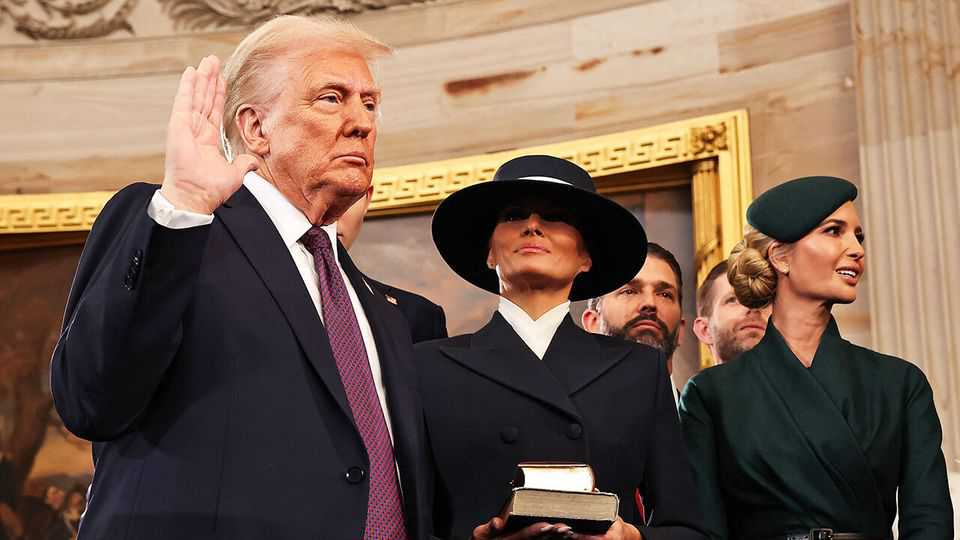
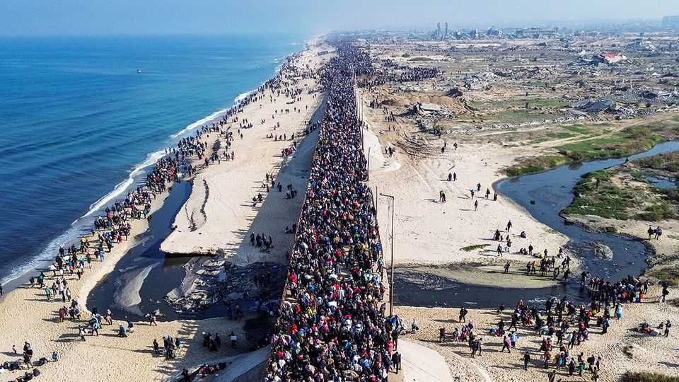
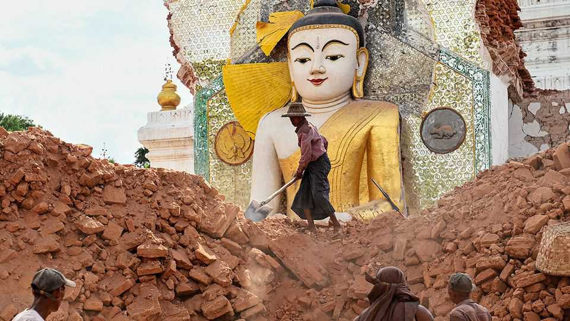
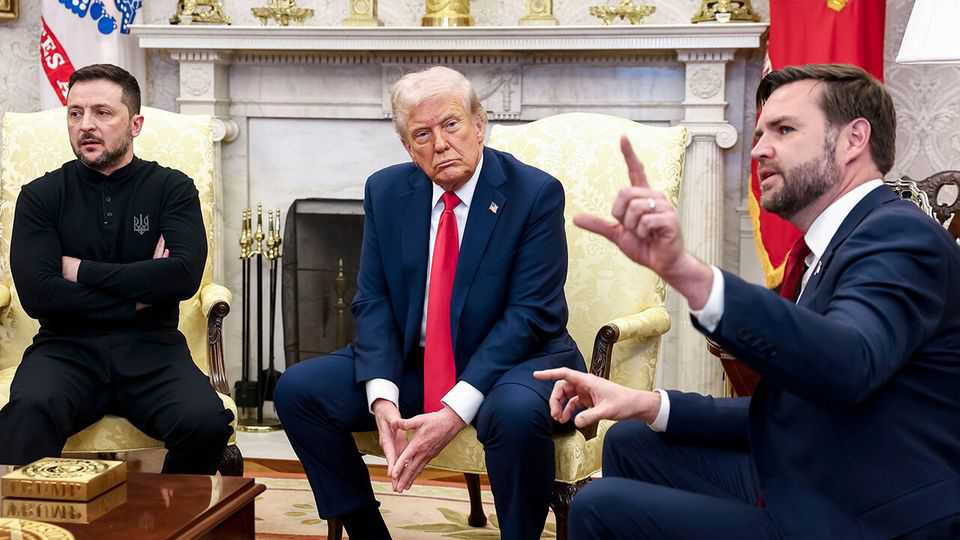
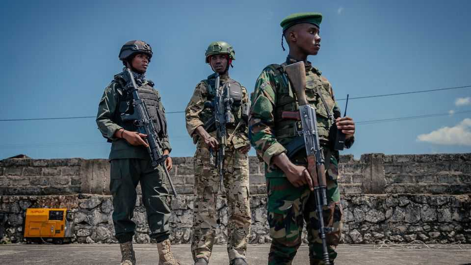
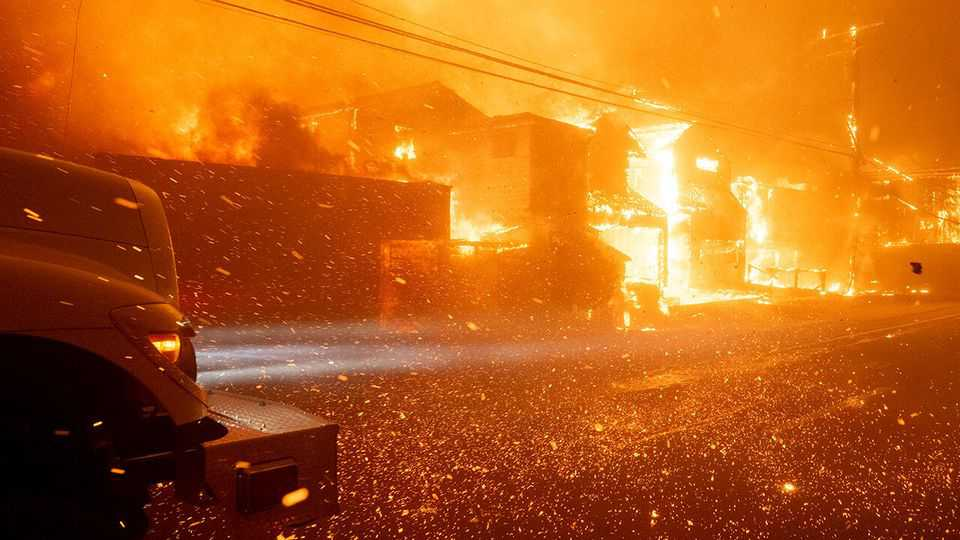

The world this week | The world this year 2025
The world this year 2025
December 18th 2025

The first year of Donald Trump’s second term turned domestic and international politics on its head. The president withdrew America from the Paris accord on climate change, deployed the armed forces to crack down on migration at the border, ordered the National Guard into cities to help arrest illegal migrants, scrapped all diversity programmes in government, cancelled policies supporting renewable energy, attacked judges he disagreed with and renamed the Defence Department the Department of War. The fractious mood in America worsened with the murder in public of Charlie Kirk at a college in Utah, where students had come to debate his conservative politics. Mr Trump also instigated tough trade policies, though the world economy remained remarkably resilient and is forecast to grow by around 3% in 2025. His big-bang “Liberation Day” tariffs in April led to the biggest fall in

stockmarkets for the year. The S&P 500 tumbled by 4.9% in a day (and a further 6% on the following day) and the NASDAQ by 6%. Many tariffs were eventually lowered or postponed, however, leading stockmarkets to bounce back. Overall, they had another good year.

The bosses of OpenAI, Oracle and SoftBank joined Mr Trump at the White House soon after his inauguration to announce the Stargate project, a $500bn investment in the infrastructure for artificial intelligence. A new AI industrial policy emerged in America, with the government taking a 10% stake in Intel. The pace and size of AI deals were mind-boggling, $50bn here, $300bn there, and stocks in AI-related companies soared. Nvidia became the world’s first $4trn company, and just a few months later the first $5trn one (albeit briefly). Investors have some doubts, however, about whether all that spending on AI will produce profits. Stocks swooned in January when DeepSeek, a Chinese firm, developed an AI model at a fraction of the cost of ChatGPT and the rest.

A ceasefire eventually came into force in Gaza, in large part because of the pressure Mr Trump put on Israel and Hamas and some energetic shuttle diplomacy by his envoys. America unveiled an ambitious peace plan for the region that was given a cautious welcome. The remaining Israeli hostages were freed by Hamas and Israel allowed in some aid for Gaza’s hungry and

shattered residents. Skirmishes continue and the peace remains fragile. Israel bombed Iran, wiping out a number of senior regime officials, including the chief of staff of the armed forces and the head of the Islamic revolutionary guard, as well as 11 nuclear scientists. During the 12-day campaign America dropped bunker-busting bombs on Iran’s uranium-enrichment facilities. Iran made a symbolic retaliation by firing missiles at America’s military base in Qatar.

In December two gunmen killed at least 15 people at a Jewish event at Sydney’s Bondi Beach. The gunmen were followers of Islamic State and had spent time in the southern Philippines, were IS is active. Earlier in the year a Syrian-born man attacked a synagogue in Manchester. He fatally stabbed one person and the police accidentally killed another. And a Palestinian sympathiser shot dead two Israeli embassy staff outside a Jewish museum in Washington.

America’s new national security strategy proclaimed its dominance in the Western Hemisphere. For the first time America’s armed forces attacked suspected drug-smuggling boats in the Caribbean and eastern Pacific. Mr Trump threatened to bomb or even invade Venezuela to oust Nicolás Maduro as president. Colombia was decertified as a partner in fighting drugs; Mr Trump called its leftist president an “illegal drug leader”. Violence rose in the country. Miguel Uribe Turbay, a conservative presidential candidate, was fatally shot at a rally. Mr Trump also floated using force to take control of the Panama Canal. Not all Latin American countries fell out with him. El Salvador struck a deal to house deported drug criminals from America in its prisons.

Jair Bolsonaro, a former president of Brazil, was found guilty by the country’s Supreme Court of conspiring to launch a coup after he lost an election in 2022 and sentenced to 27 years in prison. At the end of the year the Brazilian Congress passed a bill that could reduce that sentence to as little as two years, though this would have to be approved by the court.

Elon Musk was put in charge of the new Department of Government Efficiency, which recommended the mass firing of federal workers (317,000 left their jobs for one reason or another). But Mr Musk fell out with Mr Trump over the president’s “big beautiful” tax-cutting bill, which increased

the deficit. A row in Congress over health care meant that a bill to renew federal spending was delayed, leading to America’s longest-ever government shutdown.

Mr Musk was awarded a remuneration package by Tesla worth up to $1trn (depending on very ambitious performance targets). Tesla had a mixed year, recording steep declines in deliveries. The pace of growth in the demand for pure electric vehicles stalled in America and Europe, but sales of hybrids increased. Recognising the new reality, the EU eased a plan to ban sales of new petrol-engine cars by 2035; now emissions will have to be 90%. Norway was a notable exception to the EV reversal. Nearly 100% of new car sales in the country were electric.

The worst military conflict in decades broke out between India and Pakistan, sparked by a terrorist attack in Jammu and Kashmir that killed 26 people. India blamed Pakistan for giving succour to the attackers and fired missiles at what it said were terrorist bases in Pakistan. Pakistan responded with drone and missile strikes. Tensions remain high; incidents such as a deadly car bomb near the Red Fort in Delhi haven’t helped.

The year’s other big stories from Asia included the removal from office of Yoon Suk Yeol as South Korea’s president, following his imposition of martial law in late 2024. A subsequent election was won by Lee Jae Myung of the Democratic Party. Japan got its first female prime minister. Takaichi Sanae is described as the country’s Margaret Thatcher. She has the same proclivity for controversy, soon starting a full-on diplomatic row with China over Taiwan. In Thailand the Constitutional Court dismissed Paetongtarn Shinawatra as prime minister after an ill-advised phone call she placed with Hun Sen, an influential Cambodian politician, amid border clashes between the two countries.

A devastating earthquake and aftershocks struck Myanmar, killing at least 5,500 people. The epicentre was close to Mandalay but the quake also caused damage in Vietnam and Thailand. A skyscraper that was under construction in Bangkok collapsed, killing about 95 people. Afghanistan was also hit by a large earthquake in which some 2,200 people died.

The war in Ukraine raged on, with Russia making (extremely limited) territorial gains. The Trump administration waxed and waned in its support of Ukraine. Volodymyr Zelensky’s visit to the White House in February was a disaster. He was berated by the president and J.D. Vance, the vice- president, in a public confrontation that was unprecedented for any world leader. Later in the year Ukraine rattled Russia by launching drone attacks on air bases and refineries deep inside the country. A much ballyhooed summit in August between Mr Trump and Vladimir Putin in Alaska came to naught. The year ended with America pushing a peace plan.

The Christian Democrats came first in Germany’s snap election, at which the populist-right Alternative for Germany got its best-ever result. Friedrich Merz, the new chancellor, said that Europe could no longer rely on America for its defence and loosened Germany’s constitutional “debt brake” in order to ramp up spending on weapons and infrastructure. France saw François Bayrou resign as prime minister over a budget row in the National Assembly. Sébastien Lecornu also resigned, after less than a month in the job, only to be reappointed by Emmanuel Macron.

The civil war in Sudan took a turn for the worse when el-Fasher, the besieged capital of Darfur, fell to the rebel Rapid Support Forces. The RSF, which is descended from the mostly Arab Janjaweed militias, went on a killing spree in the city. America has accused it of genocide. The office of the prosecutor of the International Criminal Court expressed “profound alarm” over possible war crimes.

The conflict also intensified in eastern Democratic Republic of Congo, where Goma, the biggest city in the region, fell to M23 rebels backed by Rwanda. The Congolese and Rwandan presidents eventually signed a peace deal in Washington towards the end of the year, though the fighting continued to rage on the ground.

Mark Carney became Canada’s prime minister following the resignation of Justin Trudeau. An election in April returned the Liberals to office leading yet another minority government. Mr Carney promised to “stand up” to America. During a meeting at the White House with Mr Trump Mr Carney said Canada was not for sale.

Los Angeles had a tough year. Wildfires destroyed the wealthy Pacific Palisades neighbourhood in January, killing 12 people and razing 6,837 structures to the ground. A man was eventually charged with arson in October. The first house to be rebuilt was finished in November. During the summer riots broke out in the city in response to the crackdown on migrants. On the opposite coast, New York elected Zohran Mamdani, a democratic socialist, as mayor. Mr Mamdani has promised to put affordable housing at the heart of his agenda when he takes office on January 1st.

Following the death of Pope Francis the Vatican conclave elected Cardinal Robert Prevost as pope, the first pontiff to hail from the United States. Pope Leo’s first foreign tour took him to Turkey, and Lebanon, where about 40% of the population is Christian.

Bishop Sarah Mullally was appointed as the first female Archbishop of Canterbury, following the resignation of Justin Welby in 2024. She is due to start the job early in 2026, but like her predecessor she has already become mired in scandal relating to the handling of allegations of sexual abuse by Church of England clergy.

It was a year of political upheaval in Turkey. Protests erupted following the arrest of the mayor of Istanbul, the main opposition figure to President Recep Tayyip Erdogan, on what his supporters claim are politically motivated corruption charges. Turkey’s markets plunged in response. In a historic decision the Kurdish Worker’s Party (PKK), which Turkey, America and the EU describe as a terrorist group, laid down its arms and said it would dissolve itself after four decades of conflict.

The American economy remained strong. Throughout the year Mr Trump put pressure on the Federal Reserve to cut interest rates and sought to remove Lisa Cook from the Fed’s board of governors; the Supreme Court

will hold a hearing in January to determine if he has the power to do so. The Fed eventually started to reduce rates in September. Many other central banks, including the European Central Bank and Bank of England, also cut rates.

In Britain polling showed that Sir Keir Starmer is one of the most unpopular prime ministers ever, and Rachel Reeves, his tax-raising, welfare-spending chancellor, the most unpopular person in her job. Angela Rayner quit as deputy prime minister for not paying a property tax (she was also the housing minister). The populist-right Reform UK surged ahead in the polls. Even the Greens are polling as well as Labour. Sir Keir can take some Christmas comfort that the Tories are doing just as bad.

Warren Buffett decided to retire as chief executive of Berkshire Hathaway, a company he has led for six decades. At 95, the Oracle of Omaha will stay on as chairman when he passes the CEO job to Greg Abel in January. Berkshire’s stock has risen by 6,000,000% since 1965, outperforming the S&P 500, which is up by 46,000% over that period.

This article was downloaded by zlibrary from [https://www.economist.com//the-world-this-week/2025/12/18/the-world-this-year-2025](https://www.economist.com//the-world-this-week/2025/12/18/the-world-this-year-2025)