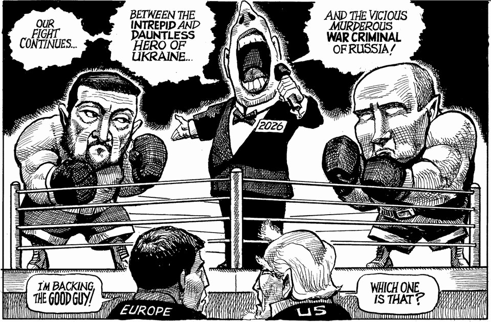

The world this week
The weekly cartoon
December 18th 2025

Dig deeper into the subject of this week’s cartoon: America gives Ukraine reason to hope, justEnough dithering. Europe must pay to save UkraineVladimir Putin has no plan for winning in Ukraine The editorial cartoon appears weekly in The Economist. You can see last week’s here. This article was downloaded by zlibrary from https://www.economist.com//the-world-this-week/2025/12/18/the-weekly-cartoon

Leaders

China proved its strengths in 2025—and Donald Trump helped Two months in, the Gaza ceasefire is floundering The Economist’s country of the year for 2025 What Novo Nordisk, OpenAI and Pop Mart have in common Your Well Informed guide to surviving Christmas