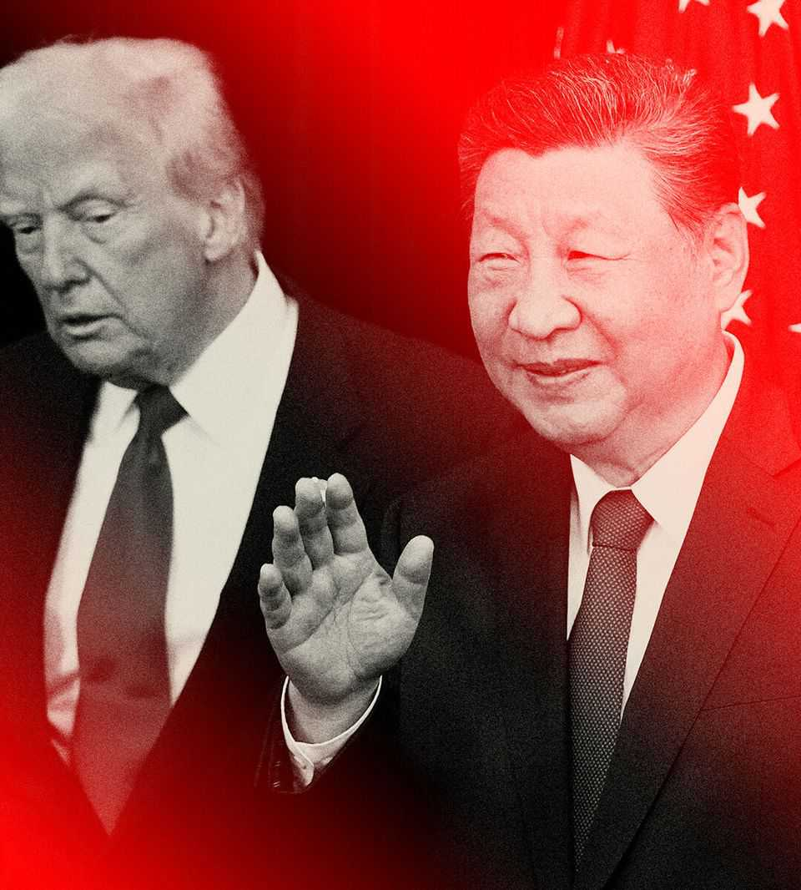

Leaders | Superpowers
China proved its strengths in 2025—and Donald Trump helped
It was a good year for Xi Jinping
December 18th 2025

THE BIG noise in 2025 has been President Donald Trump. Launching a barrage of executive orders, he directed his fire at target after target. With the aid of Elon Musk, he attempted to dismantle the federal bureaucracy. On “Liberation Day” he rewrote the rules of trade. Around the world he imposed peace and threatened war. However, the big beneficiary has been President Xi Jinping. This year China defied Mr Trump’s attempt to use tariffs to force a show of submission. By turning the tables, Mr Xi revealed just how much America actually depends on his policies. In this round of the superpowers’ fight for 21st-century supremacy, it was a victory for China.

This year showed the power of China’s industrial chokeholds. China’s share of the world’s manufacturing value added exceeds one-third, giving it the power to disrupt global supply chains overnight. In green technology, Chinese firms supply the materials, components and finished goods for 60- 80% of solar panels, wind turbines and electric vehicles. DeepSeek showed what China can do in artificial intelligence, despite America’s best efforts to hobble it. China’s drug firms now run nearly as many clinical trials as their American peers—and do them faster. Two decades ago Western firms invested in China to take advantage of its cheap producers and huge market. Today they build laboratories there.

In 2025 Mr Xi showed he is willing to use China’s dominance as not just a source of wealth, but of power. His restrictions on rare-earth exports are one example of how China can use other countries’ dependency as a weapon. Findings this month from the Australian Strategic Policy Institute show that China leads in research in 66 of 74 fields, measured by its share of key scientific papers. These include over two dozen areas, such as computer vision and grid integration, where it has a chokehold.

The extraordinary thing is that Mr Trump has played into Mr Xi’s hands, both with his tariffs abroad and his wrecking-ball at home. Choosing bilateral tariffs as a way to inflict pain on China was a mistake. Partly because Chinese firms are used to harsh conditions and partly because China is not a democracy, its economy is better at enduring pain than America’s. Mr Trump could instead have co-ordinated a commercial encirclement of China by integrating more deeply with America’s allies. Foolishly, he preferred to alienate them with tariffs.

Likewise, Mr Trump’s attack on science will impede American innovation. He has targeted researchers, cancelling grants and withholding billions of dollars in funding to institutions that he does not like. Framed as an effort to eliminate inefficiency and woke ideology, his efforts have curbed financing for vital research. His hostility to foreign scientists, especially ethnic Chinese ones, is part of a more general assault on immigration. Talented people will either leave America or choose not to move there. China has already benefited.

The question is where this leaves the superpowers. In the short run, the advantage is surely with China. America and its allies cannot soon deprive it of its chokeholds. Should Mr Xi choose to throttle Taiwan, America and its allies may find that sanctions intended to force China to back off will trigger reprisals that cause more harm than their industries and citizens are willing to bear. That would have grave implications for East Asian security, and for America’s role in the western Pacific.

In the longer run, China’s dynamism could be stifled by its rigid politics. To see why, consider its economy. Factory-gate prices were 2.2% lower in November than a year earlier, and have declined for 38 months in a row. Property prices in the secondary market are more than 20% below their peak and still falling. Although the party has pledged to stimulate domestic demand next year, it will also double down on strategic manufacturing—the very thinking that has mired it in overcapacity.

By the end of 2026 that may seem like hubris. As provinces and cities struggle to pay down debt, stagnation could become even more entrenched, a bit like Japan’s lost decades. Deflation could worsen if countries unwilling to lose their own industries block more of China’s cut-price exports. Yet as Mr Xi prepares to start a fourth term in charge in 2027, his underlings seemingly cannot or will not challenge him.

In China the bigger the mistake, the less willing the party is to change course. By contrast, America has change built in—indeed MAGA’s bent for deregulation and its impatience with the suffocating effects of elite political correctness were examples of that principle in action. Whereas China is an ethno-nationalist state in which people who are not Han Chinese struggle to be accepted, America is founded on universal values that speak to every race and creed. These values have long made America a magnet for talent and enhanced its global influence. In the past they have also bound together its alliances.

In theory, all that should be the basis for renewal. However, Mr Trump scorns universal values as gimmicks exploited by cynical foreigners. Oppression does not shock him: he admires iron-fisted rulers, especially when they are also rich. As his recent National Security Strategy showed, MAGA sees ethnic and religious diversity as a threat, not a source of

strength. If America is just one more ethno-nationalist project like Russia or China it will squander its greatest advantage.

Next summer America will mark the 250th anniversary of the Declaration of Independence. That should be the occasion for a debate about the republic’s founding principles. America’s economy remains the envy of the world. Nowhere else can mobilise ideas and capital on such a scale. Its people possess tremendous reserves of skill and enterprise.

Ideally, this would mean that the hopes of renewal will burn bright. The question is how much Mr Trump’s corruption of public life, his administration’s vindictiveness towards those in public service and his diminishment of Congress will dim America’s prospects. Mr Xi will be watching. ■

Subscribers to The Economist can sign up to our Opinion newsletter, which brings together the best of our leaders, columns, guest essays and reader correspondence.

This article was downloaded by zlibrary from https://www.economist.com//leaders/2025/12/18/china-proved-its-strengths-in-2025- and-donald-trump-helped