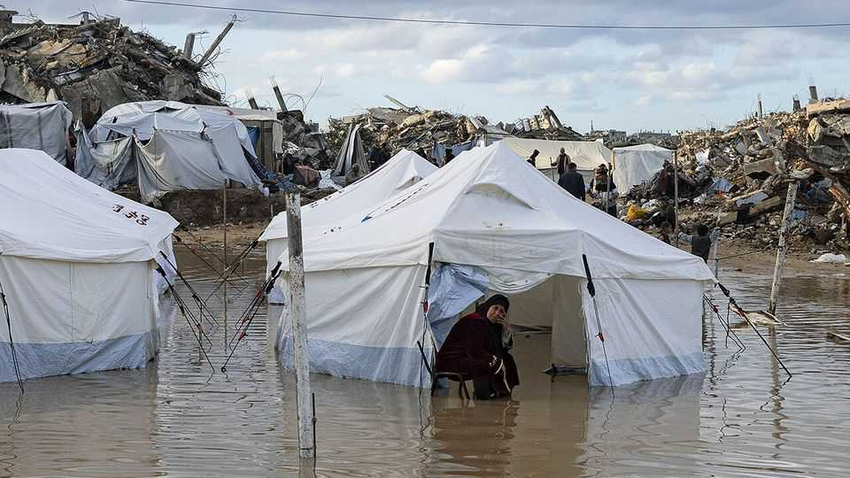

Leaders | Bored of peace
Two months in, the Gaza ceasefire is floundering
The consequences will ripple beyond the Middle East
December 18th 2025

EVEN with a ceasefire in place, Gazans still fear death from the skies—but more from the weather now than Israeli jets. The winter storm that lashed the Palestinian territory in early December flooded thousands of tents, leaving families to endure long nights standing in frigid waters. At least four babies died of hypothermia. Two months after it was signed, the deal is literally and figuratively sinking into the mud. Everyone knew it would be hard to move from the first phase to the second. The former stopped most of the fighting. The latter is more ambitious: Hamas will disarm, a new government will assume control and the enclave will be rebuilt.

It is unsurprising that these lofty goals have not been achieved. Hamas refuses to hand over its weapons, which precludes reconstruction and further Israeli withdrawal. What is more striking is that the world seems to have lost interest in spurring on peace.

Donald Trump has spent weeks hinting at big announcements about the “board of peace” that will oversee post-war Gaza. The announcements have not yet come, and may not until early 2026. No one has signed up for a planned peacekeeping mission, known as the international stabilisation force (ISF). Some officials in the region complain that they have not heard from the White House about Gaza since the October summit in Sharm el-Sheikh, where a peace plan was signed.

In recent weeks Mr Trump’s allies have instead focused on a scheme to build “planned communities” in the half of Gaza still under Israeli control. Each would house several thousand Palestinians and contain a clinic, a school and other services. The charitable view is that such hamlets would offer a model for how the rest of Gaza will be rebuilt.

A more realistic assessment is that they would become Potemkin villages. Each would shelter around 1% of Gaza’s population. Donor countries could slap their names on these communities and tout them as accomplishments. But they would offer no succour to the larger number of Gazans stuck on the other side of the ceasefire line. Rebuilding only the near-deserted, occupied half of Gaza would be a tacit admission that Mr Trump’s plan has stalled. That would be a tragedy.

Most obviously, a lack of progress towards phase two will prolong the misery of 2m Gazans. Hunger has abated, but there is more to life than food. Delay helps Hamas, which has reasserted control over the half of Gaza not in Israeli hands. With no alternative on offer, it is the only game in town. It will strain Israel’s relationship with Egypt as well. Diplomats in Cairo worry that the miserable conditions in Gaza will drive a growing number of refugees across the border.

America and its allies need to move faster. Mr Trump should appoint both a board and the Palestinian technocrats who will oversee Gaza on the ground.

Countries in the region should get off the fence and decide how they will support the ISF, reconstruction or both.

This newspaper has argued that the promise of rebuilding is a powerful tool to convince Hamas to disarm. That remains true. But Gaza deserves far more help than it is getting. Roads must be cleared of rubble to let aid get through. Gazans need caravans, sturdy tents and other shelters, as well as medical care. Mr Trump should insist that Israel allow foreign media into the enclave independently. If the plight of Gazans has slipped down the global agenda, first-hand accounts would push it back up.

Progress on the ceasefire plan will not only help Palestinians and Israelis. It is also a test of Mr Trump’s ability to honour ambitious but ill-defined agreements. If the Gaza deal turns out to be a worthless piece of paper, that will bode poorly for the peace deals he is trying to negotiate elsewhere—not least in Ukraine. America’s credibility is on the line. ■

Subscribers to The Economist can sign up to our Opinion newsletter, which brings together the best of our leaders, columns, guest essays and reader correspondence.

This article was downloaded by zlibrary from https://www.economist.com//leaders/2025/12/18/two-months-in-the-gaza-ceasefire-is- floundering