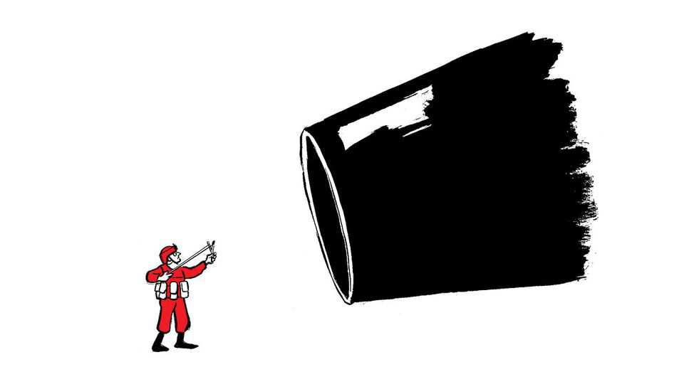

Letters | A selection of correspondence
Europeans should be worried by America’s new national security strategy
Also this week, Chinese trade, “stonking”, political parties, corrections, Santa and AI, “The Odyssey”, “The Wizard of Oz”
December 18th 2025

Letters are welcome via email to letters@economist.comFind out more about how we process your letter You are right to say that Europeans should be worried by America’s new national security strategy (“An unreliable ally”, December 13th). Donald Trump’s personal style may be brash and rude, but the message that America has had enough of European freeloading on defence and posturing on the world stage has been around for a long time.

Barack Obama was furious at Europe’s incapacity and lack of will to sort out Libya in 2011. In the same year he declared America’s strategic pivot to Asia. Vladimir Putin invaded Crimea in 2014, and the European reaction was to cut defence spending and double down on its energy dependence on Russia. Faced with this non-reaction to a drastically changed world, Trump 1.0 was sceptical of NATO and Europe; Trump 2.0 is evidently even more so.

Even now, after nearly four years of unprovoked Russian aggression in Ukraine and widespread grey-zone attacks across Europe, our politicians are still only just beginning to talk the talk, but walking the walk is still for the future. Britain may reach 3.5% of GDP spent on defence, but by 2035. Western fleets continue to carry a third of all Russian oil exports and European Union countries will continue to import Russian gas until late 2027. These are hardly signs of being deadly earnest in fighting a major threat.

Simon DigginsColonel (retired)US Combined Joint Task Force, Horn of Africa, 2011Rickmansworth, Hertfordshire

The national security strategy explicitly states an intent to “cultivate resistance” to European leadership from within our own borders, revealing an insidious and fundamental threat. Regardless of one’s view of the White House, the strategic reality is that Europe is now caught in a pincer movement: squeezed from above by political expediency, and from below by disruptive domestic movements increasingly energised by a superpower.

European decision-makers must stop eroding checks and balances, a tendency denounced by the European Ombudsman and illustrated by the growing appetite to bypass unanimity rules in the EU under the guise of “urgency.” Such expedience merely energises critics and creates tools that illiberal forces will happily inherit and use if, as Washington anticipates, they take power.

Institutions that provide critical services, from universities to banks, have a responsibility too. Many have drifted into becoming active participants in political battles. This must stop. They should return to institutional restraint and focus on their core missions. Inspired by the cybersecurity concept of

“attack surface reduction,” they must realise that restraint is the only way to ensure our institutions are not torn apart by the polarisation that Washington seeks to exploit.

Yohan Benizri451 InstituteBrussels

I was struck when reading your article on the fight for MAGA’s foreign policy by how aligned Mr Trump’s vision is with that of Xi Jinping and Vladimir Putin (“Deals and ideals”, December 13th). All three seem to be pushing hard to create the fictional nations of Oceania, Eurasia, and Eastasia from George Orwell’s “1984”. In Orwell’s novel the three powers were in constant conflict, but with no desire to ever actually prevail over the other. Rather, they relied on the threat implied by the other two to keep up a perpetual state of emergency that justified their dictatorial, totalitarian control over their own populations. How prescient Orwell seems now.

Doug ArcherdBrighton, Michigan

The Economist recommended that Europe should not raise trade barriers in response to China’s ballooning exports of cars, machine-tools and other manufactured goods (”From customer to killer”, November 22nd). The EU, including Germany, should instead pivot to services and become more like Britain, you say.

But this is not The Economist’s 19th-century crusade against the Corn Laws in favour of Manchester capitalism. And prescribing a 21st-century British remedy is hardly persuasive for the EU. The British economy has been in the doldrums for years, and the badly managed collapse of manufacturing helped propel Brexit.

China itself would certainly reject such a medicine wholeheartedly. The country continues to double down on costly but successful industrial policies. Combined with weak internal demand, these policies have pushed China’s export volumes up by roughly 40% over the past five years, while China’s imports of manufactured goods as a share of GDP have been falling for two decades. A China that exports nearly everything, imports far less and pours subsidies into advanced manufacturing does not just bend the rules-

based trading order, it distorts the manufacturing base of its trading partners and deepens strategic dependencies.

Why would Europe choose to double down on services and deepen its reliance on Chinese manufacturing at the very moment it is rearming to supply Ukraine and deter Russia, China’s ally? Europe will need drones and tanks, not just more consultants.

China’s policies should not be replicated by the EU, but neither should the China shock be allowed to play out without intervention to slow it down. The EU will have to use industrial policies to steer demand towards its own production and consider broader sectoral tariffs on China as the slow product-by-product trade defences are failing, as evidenced by the EU’s landmark duties on electric vehicles.

It is understandable that The Economist, given its free-trading genesis, is reluctant to say so. But clinging to one’s founding creed is risky when the beneficiary is not Manchester capitalism but a mercantilist China.

Sander TordoirChief economistCentre for European ReformBerlin

I always enjoy The Economist’s vocabulary. What were once “scrappy” startups are now “plucky”, and “lofty” firm valuations are “dizzying”. But the word I have enjoyed the most is “stonking”. I had not seen this prized jargon used in some time, so imagine my surprise when it made a recent appearance in Schumpeter (November 29th).

I have thought a lot about the term. Is someone who creates those outsize returns a “stonker”? Does the word work unconjugated, as in “to stonk”? Is “stank” the past tense?

Chris RyanCalgary, Canada

Your Blighty newsletter of November 18th asked for the best comparisons of political parties with well-known brands. My suggestions are John Lewis stores for the Conservatives; once reassuringly boring, now in an identity crisis and trying to sell you things no one asked for. ASOS for Labour; used to be cool, then chaotic, now desperately trying to look sensible again.

Promises better returns. IKEA for the Liberal Democrats; everyone likes the idea, but no one commits when it comes to the big purchase.

Sports Direct for Reform UK; shouts a lot, sells simple solutions and somehow always has a sale on. Patagonia for the Green Party; expensive, earnest and loved by people who cycle to meetings. BrewDog beer for the Scottish Nationalists; loud, proud, originally revolutionary, now dealing with some awkward headlines. And Le Creuset for Plaid Cymru; stylish, niche, and owned mostly by people who really care about provenance.

Nick HeathSan Miguel de Allende, Mexico

Both the Labour and Conservative parties feel like British Leyland in the 1970s. Endless infighting between management and workforce, as their market share declines along with the quality of their products. They have forgotten what their core purpose actually is.

Martin SmithAndover, Hampshire

A Free exchange column (December 6th) stated that in the media age before artificial intelligence, true and false information were easy to distinguish. They are not and never were. Even the most diligent newsroom team can publish information that is factually wrong or turns out that way later. Reputable newspapers, your esteemed organ included, publish corrections. An AI slop mill never will. Newspaper corrections are the anti- misinformation signal you are looking for.

Georg BlahaMunich

Ending letter deliveries in Denmark (”Final letter”, November 29th) is yet another casualty of the slow demise of all things paper. But there is hope for paper enthusiasts like me, who find a physical letter ever more comforting in the digital age. My husband and I, Gen Z and young millennial, designed and printed custom Christmas cards for the first time this year to post to friends and family. And it is younger commuters who are more likely to be holding a paperback on the subway, as older folk read on Kindles. If paper, against all odds, becomes cool again, it will be thanks to the smartphone generation.

James Hill-JiangNew York

Regarding concerns about AI (The World Ahead 2026), in Canada children who write a letter to Santa Claus at North Pole, H0H 0H0, and pop it in the mail without a stamp receive a personalised letter back from him. Last winter our postal service went on strike and our local flying club stepped up to organise sending the letters to Santa. We initiated a school-wide project and a special “flight to the North Pole”. Seven adults used AI to create, print, sign, stuff and repackage hundreds of personalised response letters within an afternoon, for delivery back to the children the next day.

When inputting the kids’ special requests into the AI prompt, we were either scolded for their selfishness in asking for an X-Box, or given enthusiastic guarantees that an X-Box would be waiting for them on Christmas morning.

As we consider building morality into AI, disciplined parenting and limits on gaslighting children should be on that list.

Meagan BalaneskiVermilion, Canada

I enjoyed your take on the relevance of Homer’s “The Odyssey” for today (The World Ahead 2026). You conclude that Odysseus, the hero, is imperfect but offers hope. Perhaps you could have reinforced this optimistic

message by referring to James Joyce’s “Ulysses”, which is based on Homer’s poem. It ends deliberately with the word “Yes”, as Molly remembers accepting her husband’s offer of marriage, aware though she is of his many shortcomings and even though she has had a sexual encounter with her lover during the day.

That “Yes” is a symbol of her husband’s peaceful triumph over his many adversaries and offers hope to all of us.

William MacilwraithWorcester

My one disappointment was that space did not permit a discussion of Penelope as a proto-feminist. She is almost as wily as Odysseus, her husband, contriving to maintain control over her body, at the same time as using her needlework skills to offer a role model for the numerous unsung female contributors to the arts and crafts movement.

Self-help guidance has a long pedigree.

Peter BloxhamLondon

Your review of Salman Rushdie’s new collection of short stories was right to point out how fun his writing can be (“Mightier than the knife”, November 8th). I once stumbled upon his essay about “The Wizard of Oz”. Among many witty observations, Mr Rushdie confessed that he hates Toto, “That little yapping hairpiece of a creature, the meddlesome rug!” The dog playing Toto apparently had a nervous breakdown during filming.

Mia McleanNew York

This article was downloaded by zlibrary from https://www.economist.com//letters/2025/12/18/europeans-should-be-worried-by- americas-new-national-security-strategy

United States

Will California try to block Hollywood’s next megadeal? Toll roads are spreading in America More schools in America are adopting a four-day week The race for an AI Jesus is on A vote against gerrymandering shows why political courage is rare