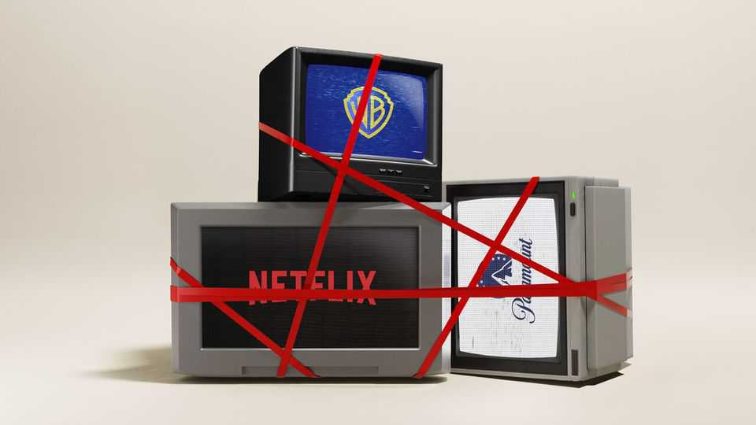

United States | Lights, camera, legal action!
Will California try to block Hollywood’s next megadeal?
States are beefing up their antitrust enforcement
December 18th 2025

CONSIDER IT a cautionary tale. In 2022 Kroger announced that it would buy Albertsons, a rival grocer, for nearly $25bn. Then things went off the rails. The attorneys-general (AGs) for Washington and Colorado challenged the merger in their respective state courts, on the grounds that the impact on prices and labour would harm their constituents. The Federal Trade Commission (FTC) brought its own suit in federal court soon after, and the avalanche of litigation torpedoed the deal. States may have been aligned with the FTC against the merger, but they didn’t wait for the feds to act before jumping into the fray. “It’s clear we are willing and able to litigate cases on our own,” says Phil Weiser, Colorado’s attorney-general.

Hollywood ought to pay attention. The industry’s latest merger risks becoming a sequel. Netflix and Paramount are in a heated competition to buy Warner Bros Discovery, one of Hollywood’s crown jewels. David Ellison, the nepo-baby boss of Paramount, wants to purchase the studio so badly he is mounting a $108bn hostile takeover bid. On December 17th the board of Warner Bros urged shareholders to reject Paramount’s offer, though Mr Ellison looks unlikely to back down so easily. Paramount hopes to convince Warner Bros shareholders that if Netflix prevails, the resulting mega-movie-and-streaming company would spook federal antitrust enforcers, whereas a Paramount-Warner combination could pass antitrust muster.

Both bidders are focused on getting Donald Trump, the Department of Justice (DoJ) and the FTC on side. It doesn’t hurt that the Ellison family is friendly with Mr Trump, a transactional president with a history of meddling in media mergers. The president has already mused about the deal, suggesting that he will ultimately decide who wins. But Mr Ellison and Ted Sarandos, Netflix’s co-chief executive, ignore state attorneys-general at their peril. Rob Bonta, California’s top prosecutor, is a particular wildcard who could kill any Warner Bros merger even if decision-makers in Washington see a deal they can accept. During the auction, a spokesperson for Mr Bonta’s office said that “further consolidation in markets that are central to American economic life…does not serve the American economy, consumers or competition well.” That does not sound as if he plans to defer to Washington, DC.

States have a long history of antitrust enforcement. Twelve states actually passed their own competition laws before Congress got around to drafting the Sherman Act, the foundation of America’s antitrust regime, in 1890. But consolidation across industries and the growth of anti-monopolist politics among leftists and MAGA economic populists have put the issue centre- stage. States are responding in two ways: by passing laws that beef up their antitrust powers and by bringing their own cases regardless of what the feds do. “There’s more of a concern of potential under-enforcement at the federal level” during Mr Trump’s presidency, explains Prasad Krishnamurthy, a legal scholar at the University of California, Berkeley.

In 2025 eight states introduced bills that would require big firms to notify their attorneys-general before a merger. Colorado and Washington passed their measures. Colorado is leading in other ways, too (perhaps because Mr Weiser is a former antitrust lawyer). In 2023 the state passed a law that increased fines and endowed the state’s attorney-general with more investigatory powers, among other things. Mr Weiser argues that prior to the reform his office had been handicapped in a way that had surrendered state sovereignty. No longer. “Just because the FTC or the DoJ goes one way”, he warns, “doesn’t mean I might not go another way”.

For three years the California Law Review Commission, which recommends bills to lawmakers, has been mulling whether the state should strengthen its antitrust laws. The legislature could take up the issue next year. Big firms, fearful of a balkanised antitrust landscape, will no doubt lobby hard against any reform.

There are other signs that Democratic attorneys-general, in particular, intend to prioritise antitrust enforcement. Rohit Chopra, a former head of the (in- effect defunct) Consumer Financial Protection Bureau, will lead a new consumer-protection working group for the Democratic Attorneys General Association. Taking on big firms also helps ambitious AGs to raise their profiles. Bob Ferguson, the attorney-general who sued Kroger and Albertsons in Washington, is now the state’s governor.  Mr Weiser is running for governor in Colorado. Part of his pitch to voters is that he went after “irresponsible companies that ripped off Coloradans”.

Mr Bonta may have something similar in mind. He is mulling a run for governor in 2026. California’s DoJ has already sued the second Trump administration at least 48 times, and he would not pass up an opportunity to suggest that California is standing up to big firms where the president is not. Suing to stop a Warner Bros merger would endear him to Hollywood’s powerful unions, which worry that fewer studios means fewer buyers for their members’ work. The LA chapter of the Writers Guild of America describes the studio’s potential sale as “a disaster”. Whichever firm prevails, the merger will take time to play out. This is just episode one. ■

Stay on top of American politics with The US in brief, our daily newsletter with fast analysis of the most important political news, and Checks and

Balance, a weekly note that examines the state of American democracy and the issues that matter to voters.

This article was downloaded by zlibrary from https://www.economist.com//united-states/2025/12/12/will-california-try-to-block- hollywoods-next-megadeal