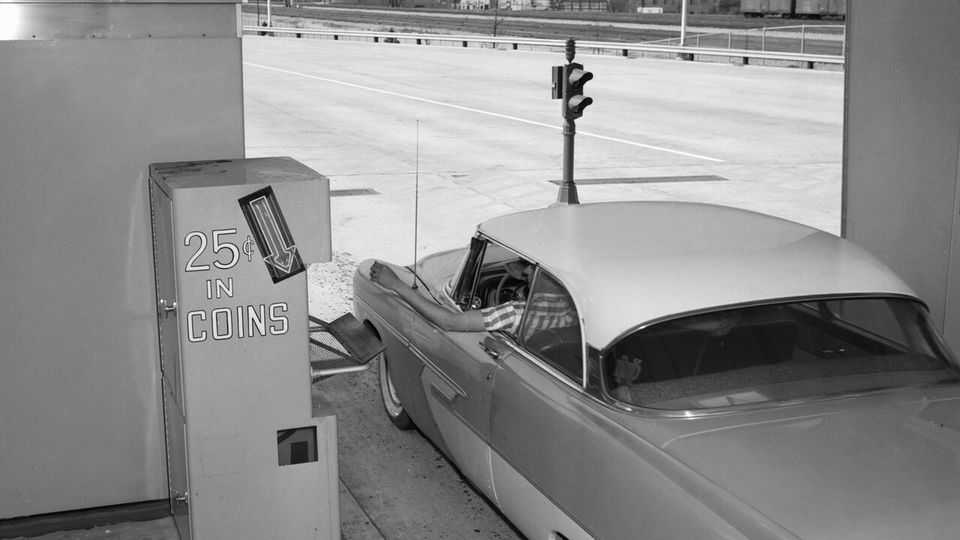

United States | Turnspike
Toll roads are spreading in America
The decline of petrol taxes is to blame
December 18th 2025

This article was downloaded by zlibrary from https://www.economist.com//united-states/2025/12/18/toll-roads-are-spreading-in- america