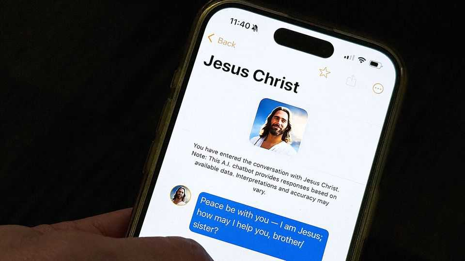

United States | God complex
The race for an AI Jesus is on
A chatbot offers personalised counsel on faith
December 18th 2025

A PASTOR’S job is to lead congregants towards a closer relationship with the divine. With Christmas approaching, many are writing sermons they hope will do just that. Yet surveys show that Americans’ trust in clergy has hit a record low. More people now pray in their cars than in churches. Perhaps inevitably, tech bros in Silicon Valley are taking the wheel. “Text with Jesus”, an app built with OpenAI’s ChatGPT, allows users to pose personal and theological questions. Represented by an avatar with a well- trimmed hipster beard, the virtual Jesus responds with friendly nudges and quotes from scripture. “I hear you sister, honest doubt matters and you’re not alone in it,” he responds to an admission of scepticism about the resurrection. The app suggests selecting a denomination and offers a range

of biblical figures and apostles to consult. For gentle advice consider Mary; for a scrappier conversation, perhaps Cain or Judas.

The app has about 150,000 users and is popular in big American cities like New York, but also in Mexico and across South America. It too has doubters. AI Jesus is too concerned “with providing answers palatable to the itching ears of 21st-century users”, wrote James Spencer of the Christian Post, a news website. He reckons the bot barely resembles biblical Jesus—to his horror, he writes, it wouldn’t unequivocally affirm that Jesus is God. Stéphane Peter, the app’s French-born founder, admits that his own mother thinks his innovation is blasphemous.

Pope Leo has cautioned Catholics against reading wisdom into aggregated data. Expect other faith leaders to follow. Elon Musk once warned that “with artificial intelligence we are summoning the demon”. At least for now the Satan feature on Text with Jesus isn’t on by default—it has to be enabled in the settings and is only available to subscribers. ■

Stay on top of American politics with The US in brief, our daily newsletter with fast analysis of the most important political news, and Checks and Balance, a weekly note that examines the state of American democracy and the issues that matter to voters.

This article was downloaded by zlibrary from [https://www.economist.com//united-states/2025/12/16/the-race-for-an-ai-jesus-is-on](https://www.economist.com//united-states/2025/12/16/the-race-for-an-ai-jesus-is-on)