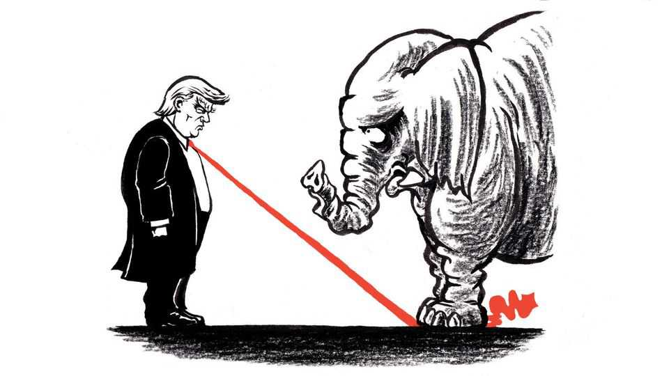

United States | Lexington
A vote against gerrymandering shows why political courage is rare
Yet it is particularly valuable now
December 18th 2025

Politicians generally have good reasons, even moral ones, to talk themselves out of acts that history might judge as brave. As a senator in his first term, John F. Kennedy wrestled with this complexity in “Profiles in Courage”, the study of character in the Senate that earned him a Pulitzer prize in 1957. The desire to get along with one’s peers, a willingness to compromise, even the ambition to win re-election—such reasons to soften principles in the moment may help advance them in the long haul, he observed. And while expediency may eventually serve principle, what is principled may be judged by the public to be sneakily expedient. Politicians who flout the will of their state or local constituents while claiming to act in the

national interest could be seen as angling for the presidency. Those who vote against their party while claiming devotion to higher principle lay themselves open to the charge “they accepted office under one banner and yet deserted it in a moment of crisis for another”, Kennedy wrote.

One could argue that Republican state senators in Indiana were just being smart politicians earlier this month when they rejected a bill to redraw their state’s congressional districts to benefit their party. Polls showed more of their constituents opposed the measure than supported it. Yet these state senators set a heartening example of courage in public life for a country in need of one. That they had the people and common sense on their side does not diminish their demonstration of character; instead, it supplies a gauge of just how debased American politics have otherwise become. “Friends, we’re better than this, are we not?” said Greg Goode, a senator who voted against the measure, posing a simple, clarifying question that other Americans might put to themselves as this challenging year draws to a close.

It would be tough to invent a surer means of intensifying polarisation and cynicism. In states dominated by Republicans, the legislatures have been holding special sessions not to confront high prices or any other matter on voters’ minds, but for a brazenly partisan purpose, to help their candidates choose their own voters rather than risk the reverse. In states Democrats dominate they have felt compelled to respond in kind. Thus is the race to the bottom being run under Donald Trump: few politicians but him seem to relish the degrading competition, but everyone winds up running as hard as they can.

In Indiana, the state house passed a redistricting bill. But despite intense lobbying from Mr Trump and others, despite threats that primary challengers would be lavishly funded and that federal money might be withheld, despite even death threats in some cases, 21 of 40 Republican senators joined with all ten Democrats to vote the measure down. “It was an act of principle and a courageous one,” says Mitch Daniels, a former Republican governor of Indiana who was consulted by some of the senators. “We’ve had too few examples of either in our politics in recent times.”

In trying to identify the source of courage in the politicians he admired, Kennedy approvingly cites the realism of one of them, John Adams, in

saying, “It is not true, in fact, that any people ever existed who love the public better than themselves.” Kennedy concludes of his heroes that “it was precisely because they did love themselves” and that each needed “to maintain his own respect for himself” that each could withstand public disapproval with the “faith that his course was the best one, and would ultimately be vindicated”. (Though, in some cases, it has not been.)

If self-love is the essential ingredient, that might explain why Mr Trump shows at least as much courage as anyone in public life these days, albeit without demonstrating character commensurate with it. He has shown fortitude in compelling his party to embrace not only his views on matters like redistricting, trade, political prosecution and militarised mass deportation, but even his standards for insult and self-enrichment in office. Republicans with other ideas have lacked the self-love, or self-respect, to dissent. For their part, Democrats have little cause to feel righteous. In recent years, to win primaries, many of the party’s candidates capitulated to its own extreme activists. Few Democratic politicians raised concerns about President Joe Biden’s policies or his age; those who did were vilified within the party.

In his time, Kennedy worried the “tremendous power of mass communications” and the “expensive” and “mechanised” reality of modern politics were making it even more perilous to venture unorthodox or unpopular positions. Yet America needed independent thinking more than ever to confront the Soviet Union: “Only the strength and progress and peaceful change that come from independent judgment and individual ideas —and even from the unorthodox and eccentric—can enable us to surpass that foreign ideology.” Today, the forces for conformity that Kennedy feared are stronger; though the Soviet Union is gone, the case for dissent and argument is at least as strong.

Americans have witnessed principled dissent this year, including by prosecutors who refused orders they considered partisan and university presidents who would not retreat from their vision of academic freedom. In the absence of a clear leader Democrats are starting to usefully bicker again. Some Republican congressmen, notably Thomas Massie of Kentucky, have even had the audacity to disagree with the president while still planning to run again. Mr Daniels notes that in Indiana, courage was contagious: “As a

few more people had the temerity to say, ‘I’m just not going to go along with this,’ the numbers grew,” he says. “The pressure never lessened, but the numbers grew.” Mr Trump is likely to face more principled dissent in his party next year—particularly as the deadlines pass for potential opponents to file for primaries. ■

Subscribers to The Economist can sign up to our Opinion newsletter, which brings together the best of our leaders, columns, guest essays and reader correspondence.

This article was downloaded by zlibrary from https://www.economist.com//united-states/2025/12/18/a-vote-against-gerrymandering- shows-why-political-courage-is-rare

The Americas

An oil boom where the Amazon meets the Atlantic Javier Milei loosens his grip on the peso