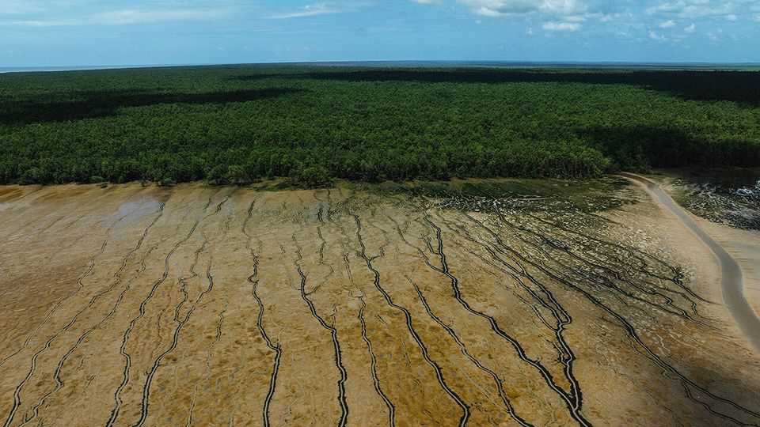
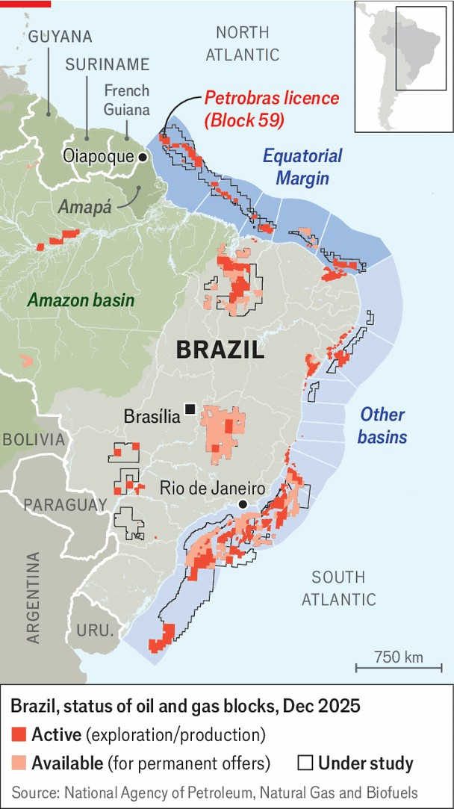
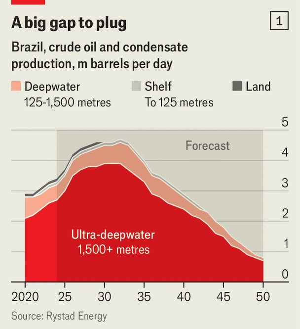
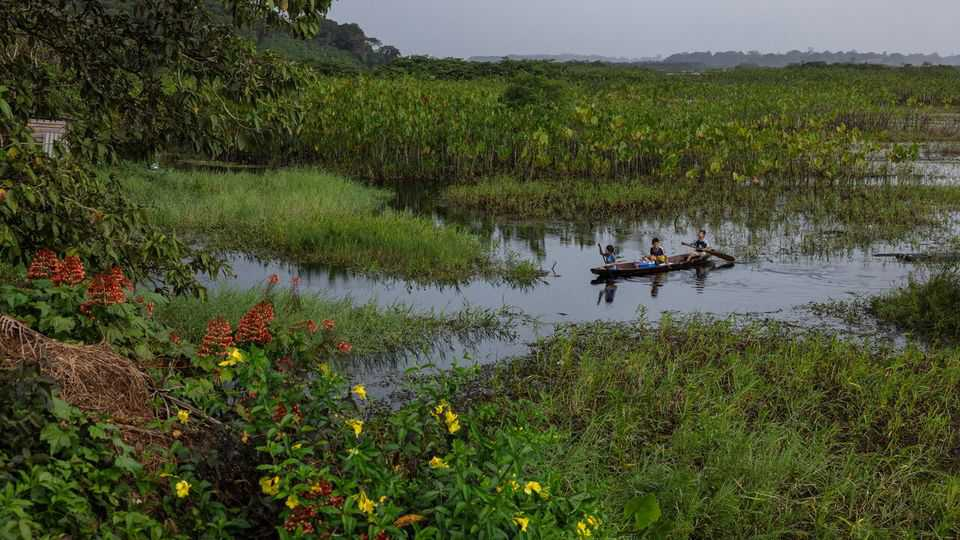
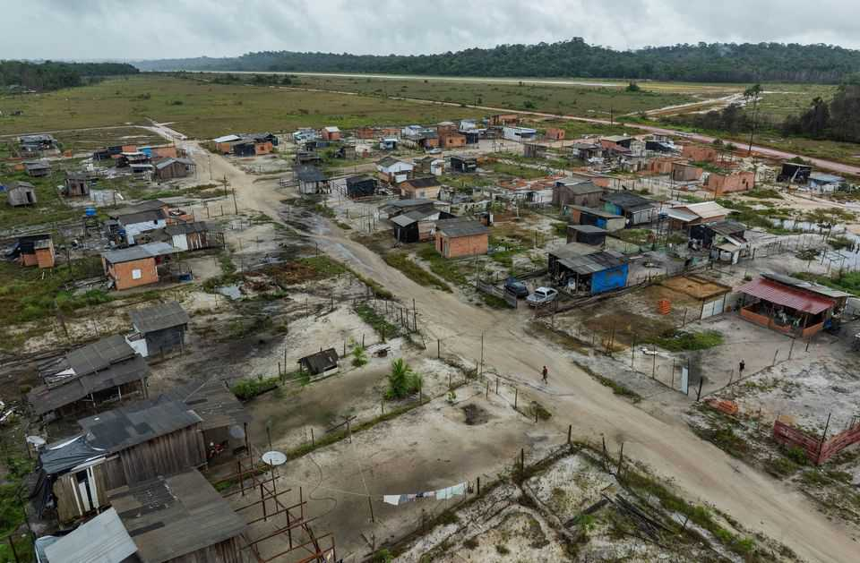
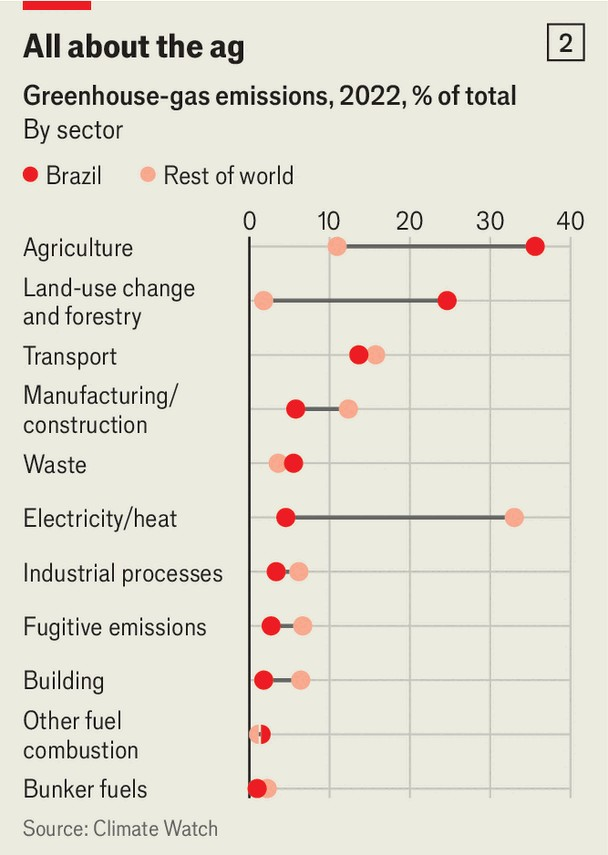
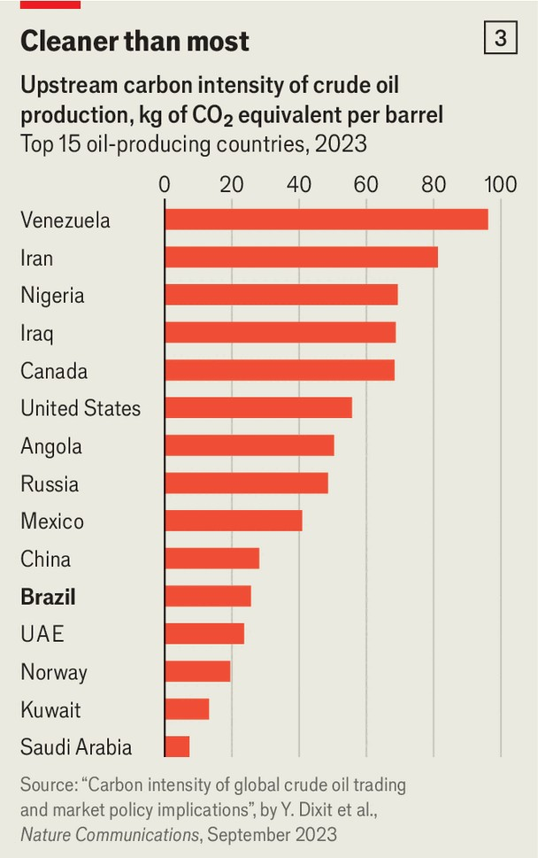

The Americas | Drill, baby, drill!
An oil boom where the Amazon meets the Atlantic
Despite is green bona fides, Brazil cannot resist a second run at oil riches
December 18th 2025

Oiapoque is a sleepy town on the edge of the Amazon basin in Brazil’s northernmost tip. On weekdays fishermen haul their catch to the local market and indigenous people stream in from the rainforest to sell ground manioc and buy fuel. At the weekend, tourists from neighbouring French Guiana cross the border to buy cheap food and flirt with locals. But it is not hard to see that a transformation is afoot. Hotels are popping up along the main drag. One that is set to open next year will boast seven floors, practically a skyscraper in the impoverished region. A tiny airport on the outskirts of town has been recently renovated. The whir of helicopter blades is becoming more common.

Long a backwater, Oiapoque is preparing to become a boomtown. On October 20th Ibama, Brazil’s environmental regulator, gave Petrobras, the state oil firm, a licence to explore for oil 160km (100 miles) off the town’s coast in a region known as the Equatorial Margin (see map). More than ten years in the making, the decision comes after a mounting campaign by Brazil’s president, Luiz Inácio Lula da Silva, known as Lula. While Ibama dithered, ExxonMobil found 11bn barrels of proven reserves off the coast of neighbouring Guyana, worth over half a trillion dollars. The tiny new petro- state quickly became the world’s fastest-growing economy. More blockbuster discoveries followed for neighbouring Suriname. Lula fumed. “Are we going to get stuck eating bread and water? No! We like bread with mortadella,” he told a crowd in February.

Brazil’s government is betting on oil from the Equatorial Margin to revive the country’s depleting reserves. In 2006, during Lula’s first term, vast reserves were found beneath a thick layer of salt under the seabed off Rio de Janeiro. Lula triumphantly declared that the discoveries were tantamount to Brazil’s second independence. The reserves, which are still being extracted, rocketed the country up the oil-producers’ league table. By 2030 Brazil’s “pre-salt” fields will make it the world’s fourth-largest oil producer. But soon after that the stuff will begin to run out (see chart 1). Without new discoveries to keep exports going, Brazil could once again become an oil

importer from 2040. Lula’s government reckons this oil-export decline would mean the state missing out on trillions of reais of revenue (hundreds of billions of dollars).

In order to put off this problem, Lula has been willing to disappoint those of his fans who voted him back into power in 2023 on a green platform. The potential gains are simply too juicy. Brazil’s national oil and gas agency reckons that the country’s chunk of the Equatorial Margin holds over 30bn barrels of oil, of which 10bn may be recoverable. Thanks in large measure to this region, South America has become the part of the world in which oil production is growing at the fastest rate. Its output is forecast to increase by a third by 2030, compared with around a quarter in the Middle East and a tenth in North America.

The catch is that South America’s newest oil frontier is near one of the world’s least-studied and most biodiverse regions—the Amazon river estuary. It accounts for a fifth of the fresh water flowing into the world’s oceans each day from rivers. An unknown but vast number of fish species nurse in the slimy soils of the region’s mangrove forests, which are among the world’s largest. Pink river-dolphins, whales and manatees splash about near the coast. In 2016 scientists stumbled upon a 1,000km-long deepwater

reef on the seafloor. Nobody knows the full scale of the other biological and geological riches that lie beneath the Amazon’s murky waters.

Most inhabitants of Amapá, the state in which Oiapoque is located, are gung-ho about oil. Along the highway connecting the state capital to the town, food shacks and rundown houses are plastered with stickers that read “Yes to development! Yes to petrol!” From her fruit and vegetable stall on the sweltering streets of Oiapoque, Edna da Silva Costa is giddy. “[Oil] is

going to generate money for everyone…everyone is in favour, it’s going to bring jobs.” Brazil’s energy ministry reckons that investments in the Equatorial Margin could reach 280bn reais ($52bn) and create 350,000 jobs. Such expectations probably explain why Brazilians increasingly support drilling. In October 26% said they were in favour of prospecting in the Equatorial Margin. Now 42% approve, against 49% who disapprove.

Yet drilling along Brazil’s northern coast is fiendishly difficult. The currents around the mouth of the Amazon are strong and unpredictable, generated by the colossal volume of water the river dumps into the sea. At the surface the currents run towards the Caribbean, but 200 metres down the flow reverses, pushing back towards the land. The main site that Petrobras is eyeing up, known as Block 59, is deep. At a depth of about 3km it is almost twice as far beneath the surface as the Deepwater Horizon well in the Gulf of Mexico; it took three months for BP to contain the flow of oil when that rig exploded in 2010. These complexities haven’t put off the oil majors. In June ExxonMobil, Chevron and the China National Petroleum Corporation won rights to prospect there. Petrobras is a world leader in deep-water drilling, since the pre-salt fields lie at a depth of about 2km.

Some locals are less sanguine. Under a mango tree that is hosting a conference of japim, small yellow-rumped birds, Gildo Leoncio, the vice-

chief of the Karipuna indigenous group, says Petrobras did consult him and other chiefs. “We told them we were worried, but they said nothing is going to happen, it’s all going to be safe,” he says. “But we’ve seen on television that there have been oil spills elsewhere. Why should we believe that can’t happen here?”

If Petrobras finds oil, it will take years to bring to market. But even the anticipation has a dark side. Much of the rainforest around Oiapoque has been cleared to make way for new development. Migration into the area “is out of control”, says Isaú Macena, a local-government official. Schools and hospitals are overflowing. Corruption is endemic across the Amazon.

Clécio Luis, the governor of Amapá, acknowledges the difficulties of managing an oil boom. “We can’t let this take us by surprise,” he says. He wants the state to follow Norway’s example and set up a sovereign-wealth fund to invest its new riches.

Lula’s government plans to use the oil money to try to escape the contradictions of promoting a green agenda while expanding oil drilling. On December 5th he ordered his ministers to produce a roadmap for how Brazil will lessen its dependency on fossil fuels. Oil revenues will apparently finance the transition. “Brazil’s strategy is pragmatic,” says Alexandre

Silveira, the country’s energy minister: to “ensure energy security and fiscal stability” in the short term, while financing “long-term competitiveness in renewables”. While the world continues to consume oil he thinks it may as well gobble up Brazil’s. The country’s carbon emissions per barrel of oil produced are significantly lower than the global average (see chart 3). Back in Oiapoque schools of catfish, hake and oscars play along the river in blissful ignorance. ■

Sign up to El Boletín, our subscriber-only newsletter on Latin America, to understand the forces shaping a fascinating and complex region.

This article was downloaded by zlibrary from https://www.economist.com//the-americas/2025/12/15/an-oil-boom-where-the-amazon- meets-the-atlantic