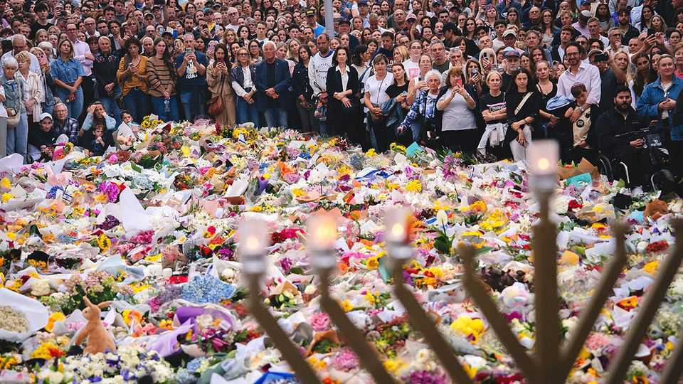
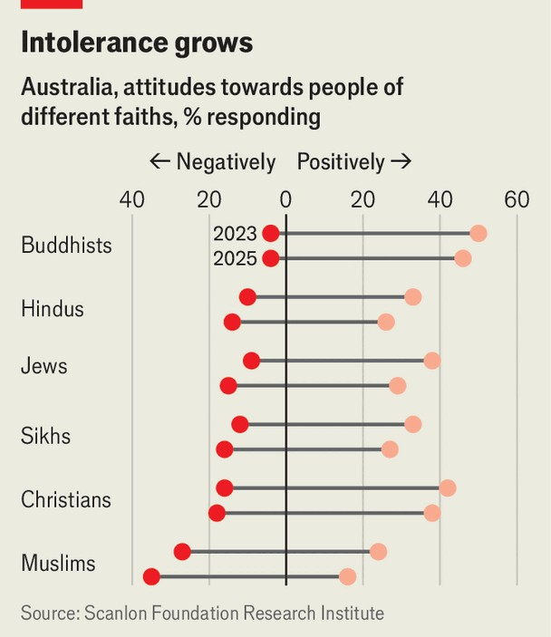

Asia | Terror on the beach
Can Australia defend itself against jihadist murderers?
The father and son who killed 15 in Sydney may have sought training in the Philippines
December 18th 2025

When gunmen opened fire on crowds attending a Hanukkah celebration at Bondi Beach in Sydney, Larisa Kleytman was among those who sought cover on the ground. Her husband of 57 years, Alex Kleytman, also dropped to the floor. Mr Kleytman, a retired civil engineer and a survivor of the Holocaust, died shielding his wife from the bullets. At 87, he is the oldest of 15 people who were murdered on December 14th in the deadliest terrorist attack in Australian history. Matilda, the youngest victim to have been named, was aged only ten.

Days after the attack mourners were still streaming to Bondi—a suburb with a large Jewish community—to lay flowers and light candles. They have sung Hanukkah songs; a few have wrapped themselves in Israeli flags. On December 16th Australia’s most famous beach still seemed frozen in time. Chairs and half-eaten picnics remained strewn across the lawn at an outdoor cinema that sits right next to the sands. Unfinished drinks stood abandoned on beachside tables.

Authorities say the attack was carried out by Sajid Akram, 50, and his son Naveed Akram, 24. The older Mr Akram was killed on the scene by police. His son was gravely wounded, arrested and taken to hospital; he has since been charged with 59 offences. Several explosive devices and two home- made flags bearing the insignia of Islamic State, a jihadist terrorist group, were found in the younger man’s car. Both men were motivated by “Islamic State ideology”, said Anthony Albanese, Australia’s prime minister. “The threat of antisemitism, as we have seen, is very real.”

Australians have responded anxiously to news that the younger Mr Akram was already known to Australia’s domestic intelligence service (ASIO). It admitted it had investigated him in 2019 (when the spies also interviewed his father). The Australian Broadcasting Corporation reports that, back then, the authorities had connected him to Isaac el-Matari—a self-proclaimed commander of Islamic State, based in Sydney, who was arrested that same year and later jailed for plotting a terrorist attack. But at the time ASIO found no evidence that Naveed Akram had himself been radicalised. After this there was clearly a big change in his “risk profile”, said Tony Burke, Australia’s home-affairs minister.

In November this year the father and son spent four weeks in the Philippines, returning about a fortnight before they launched their attack. During their trip they travelled to Davao City in Mindanao, an island in the south of the country. Mindanao has long suffered from Islamist militancy; one theory is that the men were seeking training. The Philippine Bureau of Immigration said that Sajid Akram entered the country on an Indian passport, and his son used an Australian one. Police in India confirmed that Sajid was originally from the southern Indian state of Telangana and that he had moved to Australia in 1998.

Jewish leaders are demanding that Australia’s government step up action against antisemitism. There have been more antisemitic attacks in Australia in the past two years than in the whole of the preceding decade, according to the Executive Council for Australian Jewry, a community group. These have included arson attacks on synagogues and a Jewish business. Jewish leaders say that antisemitic incidents have risen faster in Australia than in other rich countries. The share of Australians who express a positive attitude towards people of Jewish faith has fallen from 38% in 2023 to 29% this year (see chart), according to a study by the Scanlon Foundation Research Institute, a non-profit.

Mr Albanese has promised to use “every single resource required” to eradicate antisemitism in Australia. On December 18th he announced plans to toughen hate-speech laws. He said there would be stronger penalties for people who spread hate speech that urges violence, and that the government would be gaining new powers to cancel or refuse visas to people who are deemed to be spreading hate. He also announced a task-force that will examine how to prevent and respond to antisemitism in the education system.

These are only some of the government’s new pledges: tougher controls on guns is another. Australia has had relatively tight gun laws since a rampage

in 1996, when a gunman killed 35 people in the Tasmanian town of Port Arthur. Automatic and semi-automatic weapons were largely banned as a result, and the government bought hundreds of thousands of firearms back from the public. Only around 12% of killings in Australia involved a firearm in the year to June 2024, according to the government. That compares with about 80% in America in 2023.

Yet gun violence has been making a comeback in Australia, says Roderick Campbell of The Australia Institute, a think-tank. Sajid Akram legally owned six guns. Several of these weapons appear to have been used in the attack in Bondi. Mr Campbell’s organisation calculates that there are now around a million more guns in civilian hands in Australia than there were before the atrocity at Port Arthur. The government may now set up a national firearms register, linking up records currently held separately by states. It may limit the number of guns one person can own. And it may expand the checks carried out before a gun licence is issued.

While they wait for politicians to fulfil their pledges, shocked Australians have been trying to help in any way they can. Cafés in Bondi Beach have been handing out free coffees. Locals have been retrieving and lining up (for easy collection) items that fleeing visitors left behind on the beach. In the days after the massacre, record numbers of Sydneysiders rushed to donate blood.

An online fundraising campaign has collected over A$2.5m ($1.65m) for Ahmed al-Ahmed, a 43-year-old father who runs a shop in southern Sydney. People all around the world have gasped at video footage, published on social media, that shows Mr Ahmed creeping up on the older gunman from behind a car, then wrestling the attacker’s rifle away from him. He was subsequently shot in the shoulder by the younger gunman, and is recovering in hospital.

Mr Albanese called him “the best of Australians”. Donald Trump also praised him. Mr Ahmed was in Bondi having coffee with a friend when he heard gunshots, said his parents, who have been visiting Sydney for a few months from their home in Syria. Their son would have done anything to protect anyone, his parents said—no matter their background or faith. ■

This article was downloaded by zlibrary from https://www.economist.com//asia/2025/12/18/can-australia-defend-itself-against- jihadist-murderers