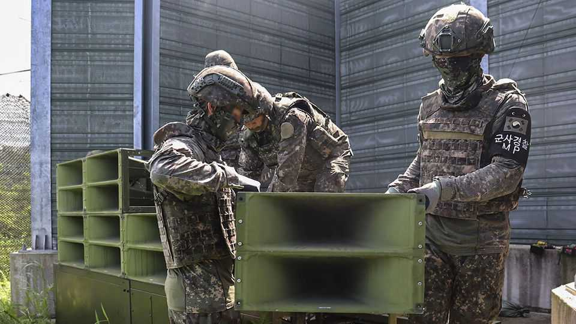

Asia | Asia’s audiowars
Why has the border between the Koreas fallen silent?
South Korea’s president wants to reduce tensions with the North
December 18th 2025

KIM CHANG-HWAN used to need earplugs when he went to bed at his home in Daedong-ri, a South Korean village near the border with North Korea. Eighteen months ago South Korean authorities began blasting K-pop and news reports into North Korea from a network of loudspeakers rigged up along the frontier. North Korea responded in kind, broadcasting animal cries and spooky whistles from its own set of loudspeakers. Then, earlier this year, the border fell silent. Mr Kim rejoiced. The calm reflects a new approach that Lee Jae Myung, South Korea’s president, has taken towards its menacing neighbour. Tensions between North and South mounted under his predecessor, Yoon Suk Yeol, a

conservative who held office between 2022 and 2024. Goings-on at the border reflected those worsening ties. South Korean activists wafted leaflets lambasting the North Korean regime over the frontier; the North sent back balloons filled with rubbish and excrement. Last year Mr Yoon upped the ante: he switched back on loudspeakers which had once been a regular feature at the border but had in fact not been used since 2018.

Mr Lee, a left-winger who became president in June, is trying to be more conciliatory. Silencing the loudspeakers was one of his first acts as president. The leafleting has also mostly stopped. Within a few days of this decision the North turned off its own noisemakers, too.

Not many people will miss the cacophony in the borderlands. Yet this is only one of the ways that Mr Lee has sought to pause activities that rile the North —and some of his other reforms are producing rather more disquiet. For years South Korea’s spy agency has broadcast radio into North Korea in the hope of giving ordinary citizens access to uncensored news.

This year its stations fell silent for the first time since 2010. This switch-off came not long after Donald Trump dismantled America’s state-funded news services, which had also broadcast into North Korea. As a result, the number of hours of programming entering the country from outside has fallen by roughly 80% since May, according to the Stimson Centre, an American think-tank.

The remaining broadcasters, a smattering of activist-run outfits, have transmitted in shortwave from countries including Taiwan, the Philippines and Uzbekistan. Transmitting from South Korea would make it more difficult for censors in the North to jam their signals. But the South Korean government will not allow it, laments one person involved.

So now activists are scratching their heads for new ways of reaching North Koreans. One defector from the North who lives in Seoul recently launched an internet-based radio station targeting North Koreans who reside outside the Korean peninsula, such as overseas students or labourers, in the hope that listeners will relay information they pick up from it to friends and family back home.

All this represents a fairly large concession to North Korea’s leaders, who consider uncensored information a big threat to their rule. The regime has been ramping up punishments for distributing and consuming foreign content. These now include lengthy prison sentences and (sometimes) execution. Just owning a foreign-made radio is illegal, unless the device has been registered with police and fixed so that it can only pick up state signals. But North Koreans nonetheless consider radio broadcasts a safer way of getting outside information than smuggled flash drives, which can be intercepted in transit. Radios are easier to hide from authorities than television sets and they can operate on batteries, which is useful in a country short of power.

Mr Lee has defended his decision to suspend broadcasts by painting radio as antiquated and wasteful. “Everything’s searchable on the internet,” he said last month. But the president doubtless knows that North Koreans cannot freely access the internet. Instead, Mr Lee appears to be hoping that this gesture, among others, can help coax Kim Jong Un, North Korea’s dictator, back to the negotiating table. “He’s looking for little things that can stop the situation from worsening,” says Jun Bong-geun, professor emeritus at the Korea National Diplomatic Academy.

Will that work? Having more or less earned the backing of China and Russia, the North Korean regime hardly looks desperate to sit down with the South. Indeed, its leader seems to believe he may soon be able to extract big concessions from America, perhaps even including acceptance of its nuclear arsenal. There is a growing expectation that Mr Trump may meet North Korea’s dictator in person, for a second time, next year. Much will ride on America’s president approaching that dialogue with caution and forethought. Just as well that South Koreans who live closest to the border are getting a chance to catch up on their sleep. ■

This article was downloaded by zlibrary from https://www.economist.com//asia/2025/12/15/why-has-the-border-between-the-koreas- fallen-silent