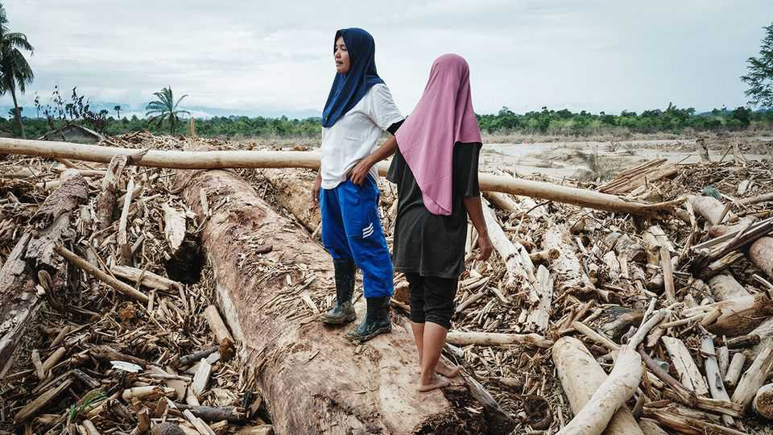
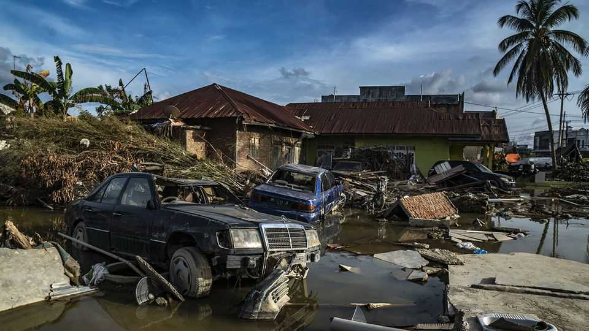

Asia | A flood of failures
The botched response to a devastating storm infuriates Indonesians
Nationalism impeded the arrival of help from abroad
December 18th 2025

Three weeks have passed since Cyclone Senyar ravaged Sumatra in western Indonesia, bringing enormous floods. But only in mid-December, as the waters have receded, has the scale of the destruction become clear. More than 1,000 people have been killed, around 150,000 homes damaged and nearly 1m people displaced. Scientists have described the storm as a once- in-70-year event. And yet it is not a national disaster—or at least not by the standards of the government in Jakarta, the capital. Officials have declined to formally designate it as one, even though doing so would hand authorities emergency powers and, importantly, make it much easier for them to accept foreign aid.

Politicians including Prabowo Subianto, the president, have insisted that Indonesia does not need outside help.

“The arrogance of this government has cost lives,” says Farwiza Farhan, who heads HAkA, an NGO working in Aceh, a province in Sumatra. When the floods struck, the head of Indonesia’s disaster agency suggested the devastation was not as bad as it looked on social media (he later apologised). Relief efforts have been slow and poorly co-ordinated, says Ms Farhan.

Officials think it will cost 52trn rupiah ($3.1bn) to rebuild damaged homes and infrastructure. For now, several communities remain stranded by collapsed roads and bridges, hundreds of people are still missing and diseases are spreading. Residents in Aceh have started hoisting white flags outside their homes as a symbol of their desperation and their anger at the central government’s response.

Mr Prabowo has dismissed some of the criticism as lies spread by foreign forces that, he says, have never liked Indonesia. He has apologised for delays in the provision of services and assistance to affected regions, but has also warned Indonesians that he does not have a “staff of Moses” that he can use to fix things straightaway.

Environmentalists say work to prevent the next such disaster needs to start immediately—and that none of it is magic. They say deforestation worsened the floods. Tree canopies collect water; tree roots stop soil sliding away. But since 2001 Sumatra has lost 4.4m hectares of forest, an area roughly the size of Denmark, mostly to palm-oil plantations and illegal logging.

Indonesia’s forests minister has admitted that poor forest management aggravated the floods. The environment ministry has suspended the operations of firms alleged to have cleared forest in areas where they took place. Yet environmentalists question the government’s sincerity. Mr Prabowo raised eyebrows among them when he said, in a speech given during the height of the flooding on December 5th, that Indonesia was lucky to be “blessed” with palm oil.

As climate change makes extreme weather more common, efforts to prevent and withstand disasters are growing more urgent everywhere. But the need in Indonesia is especially pressing. It ranks third globally in its vulnerability to natural disasters, according to an annual report from an alliance of German NGOs. The events in Sumatra suggest that it is badly equipped to handle the storms still to come. ■

This article was downloaded by zlibrary from https://www.economist.com//asia/2025/12/18/the-botched-response-to-a-devastating- storm-infuriates-indonesians

China

Jimmy Lai’s judgment day The Christmas-industrial complex centres on Yiwu