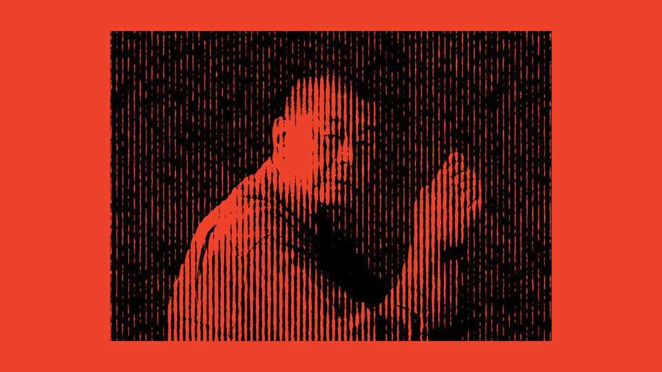

China | The verdict
Jimmy Lai’s judgment day
The tycoon’s conviction speaks to the state of Hong Kong’s civil liberties
December 18th 2025

Editor’s note (December 15th): Jimmy Lai was found guilty of conspiring to commit sedition and foreign collusion on December 15th. He will be sentenced at a later date. JIMMY LAI did not seem surprised when the verdict was read out. On December 15th three national-security judges found Hong Kong’s most famous media mogul guilty of collusion with foreign forces and of sedition. He spent 156 days on trial—52 of them on the witness stand. He has been behind bars for more than 1,800 days already, serving time for unauthorised assembly and fraud. When sentenced, Mr Lai could face life imprisonment.

Mr Lai has a long history of support for democratic causes in China; his involvement began after the Tiananmen Square protests of 1989. Through his outspoken newspapers the tycoon backed the millions of Hong Kongers who marched for democracy, first in 2014 and again in 2019. Mr Lai himself took to the streets in the more peaceful protests (some other demonstrations became violent). Foremost among his publications was Apple Daily, which critics found sensationalist. It had to close down almost a year after he was arrested in 2020.

Few believed he would be acquitted: national-security trials have a conviction rate of over 95% in Hong Kong (including defendants who plead guilty). Although receiving medical treatment in prison, his family fear that the 78-year-old, who suffers from diabetes, will die behind bars. Despite being a British citizen, he chose to stay put. “I must face the consequences of my actions, just or unjust,” he wrote from prison. “It is also a way to uphold the dignity of Hong Kong people, as one of the leaders for the fight of freedom.”

The judges saw things differently. In their 855-page judgment, they claimed Mr Lai was “obsessed” with “turning China into a lackey of the West”, and had published seditious articles to “undermine the legitimacy or authority” of the governments in both Hong Kong and Beijing. They said he had used his “personal influence” to call for foreign countries to impose sanctions on China. Notably, they suggested he had continued his “international lobbying” by “indirect and subtle means” even after the introduction of a national-security law (NSL) in 2020 made it a crime. The defence had argued that Mr Lai stopped all such activities when they became illegal. (Before the NSL was promulgated he met powerful potential supporters such as Mike Pence, who was America’s vice-president at the time.)

It is a febrile moment. A terrible fire last month in the Tai Po neighbourhood consumed seven apartment blocks, killing at least 160 people. A recent election saw the second-lowest turnout on record, and was taken by some as a tacit rebuke of the pro-government legislature. China’s Communist Party has changed a once defiant city—with barely a whimper from abroad. Mr Lai’s case, which is the first related to foreign collusion, looks likely to establish precedents both legally and socially.

The party’s control centres on the NSL. It was promulgated by the national parliament in Beijing in 2020 in the wake of the unrest in Hong Kong the year before. The NSL created sweeping, ambiguous categories of crime previously unknown in Hong Kong, such as subversion and the collusion of which Mr Lai was accused. Another set of rules passed last year, “Article 23 legislation”, introduced harsher sentences for national-security offences. Trials under both the NSL and Article 23 legislation can be held without juries and involve judges drawn from a special pool.

Hong Kong’s authorities seem on edge. On December 6th representatives of around a dozen international media outlets, including The Economist, were summoned by the national-security police and told not to publish over- critical accounts of the government that they said might sow discord. The warning explicitly concerned coverage of the Tai Po fire, but correspondents drew a broader message. On December 15th the spokesperson of the Commissioner’s Office of the Chinese Foreign Ministry in Hong Kong wrote to some outlets in the city “to draw…attention to some facts”, for example that Mr Lai’s case “has nothing to do with press freedom”.

It is unclear what the reverberations in Hong Kong will be. Supporters of Mr Lai queued overnight to watch the verdict’s delivery. A sense of resignation pervades the city. “A lot of people are just saying: ‘Oh well, [Mr Lai] he is gone,’” says one resident. Except for national-security cases, the territory’s common-law legal system, inherited from Britain, is still generally considered fair. Business leaders have broadly kept quiet about Mr Lai’s case. But aspects of his treatment have caused liberal types to raise their eyebrows.

Although protest has become more difficult at home, Mr Lai’s fortunes have attracted criticism abroad. Britain condemned Mr Lai’s “politically motivated persecution” and called for his release, as did the European Union. Marco Rubio, America’s secretary of state, lambasted “the enforcement of Beijing’s laws to silence those who seek to protect freedom of speech”. But both Sir Keir Starmer, Britain’s prime minister, and Donald Trump, America’s president, are planning to visit Beijing early next year. The leaders may wish to avoid provoking Xi Jinping, their Chinese counterpart, by pressing Mr Lai’s case. Britain is already wrangling with China over a new embassy in London and spying scandals. And Mr Trump

is keen for more dealmaking after a truce in Sino-American trade tensions was agreed in October.

Besides, China does not take kindly to others meddling in its domestic matters. After the verdict China’s foreign ministry warned other governments “not to interfere in Hong Kong’s judiciary or China’s internal affairs in any form”, while the central government’s liaison office in Hong Kong described the outcome as a “stern warning” to “anti-China” forces. It also decried “the political manipulation of Hong Kong by a small number of Western politicians and anti-China media under the guise of ‘human rights’ and ‘freedom’”.

Authorities in Hong Kong will hope that the world moves on quickly from the verdict. But for some Mr Lai will remain a symbol of the city’s transformation. He arrived on its shores as a 12-year-old refugee from mainland China, a penniless stowaway in a boat. His fortunes rose alongside those of Hong Kong, making him an emblem of its promise. Now he will be remembered by his supporters as a martyr to his convictions. ■

Subscribers can sign up to Drum Tower, our new weekly newsletter, to understand what the world makes of China—and what China makes of the world.

This article was downloaded by zlibrary from [https://www.economist.com//china/2025/12/14/jimmy-lais-judgment-day](https://www.economist.com//china/2025/12/14/jimmy-lais-judgment-day)