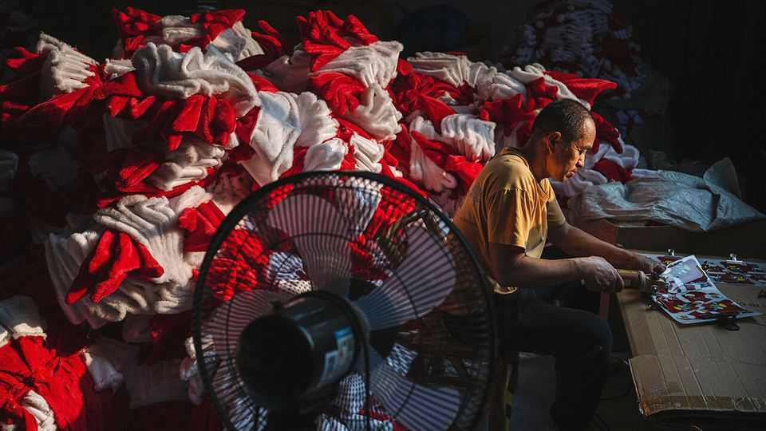

China | Snow globalisation
The Christmas-industrial complex centres on Yiwu
How Chinese traders beat out Lapland’s elves
December 18th 2025

YIWU IN EASTERN China is the world’s Christmas capital. The five main districts which contain its wholesale markets, each home to vast commercial buildings, stretch for miles on end. Masses of stalls are, for much of the year, dedicated to Christmas paraphernalia: trees, ornaments, hats, wreaths and candy canes. It hums in the summer months, when jolly fare is readied for elsewhere. By December each year it lies more quiet. The city’s wares will have contributed to China’s record $1trn trade surplus in the first 11 months of 2025. China dominates exports of the world’s Christmas decorations by value; in the recent past America has bought more than half of what China produced. But this year in the ten months to October China exported $5.1bn of the

trinkets, down from $5.8bn over the same period in 2024. America has been responsible for all of that decline and more, having imported about $940m less in festive fare from China than it did last year. That is thanks to President Donald Trump’s trade war and his introduction of painful tariffs, which though down from their peak still stand at 20% for Chinese goods.

The large number of banners, signs and decorations saying “Feliz Navidad” and “Buon Natale” suggests that many merchants are shifting to other markets in response. Data show exports to Germany and the Netherlands are up by 22% and 16%, respectively. And there are more grinchy ways of getting around the American tariffs, too. Dismembering Father Christmas and then shipping his head, limbs and torso to South-East Asia is one such ruse. Reassembling him, relabelling him and selling him on to America thereafter is more jolly.

Yiwu’s traders are a worldly sort, and not all about Christmas. They converse with visiting buyers from India, the Middle East and Russia. Arabic, Spanish and other tongues can be heard among its stalls. The criticism of Mr Trump in many languages is stinging. “America is crazy these days,” gripes Yang Jie, a local. “We can’t do business with them, it’s just impossible to plan,” she adds. “How can I set prices when I don’t know what the tariff will be when I ship?” asks a vendor in a stall blooming with artificial flowers.

Mr Trump is not the only problem. “The war in Ukraine has really been a headache for us,” says Wu Yunqing, a car-parts seller. Demand has dropped in Russia, and he has lost touch with customers in Ukraine. A woman selling shirts does business across the Middle East. The flare-up between Israel and Iran made her very nervous, she says.

Yet the mood still twinkles. Many have their eyes on the next round of orders. The city’s merchants make decorations for festivals Christian, Muslim and more. Ms Yang has just finished sending the last few shipments of decorations for Ramadan in February. What next? Chinese New Year, of course. ■

Subscribers can sign up to Drum Tower, our new weekly newsletter, to understand what the world makes of China—and what China makes of the

world.

This article was downloaded by zlibrary from https://www.economist.com//china/2025/12/18/the-christmas-industrial-complex- centres-on-yiwu

Middle East & Africa

Donald Trump’s peace plan is faltering in the chaos of Gaza Just 74 intensive-care beds remain in Gaza Ethiopia wants to build Africa’s biggest airport