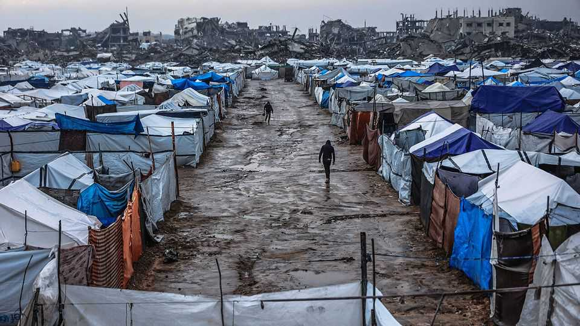
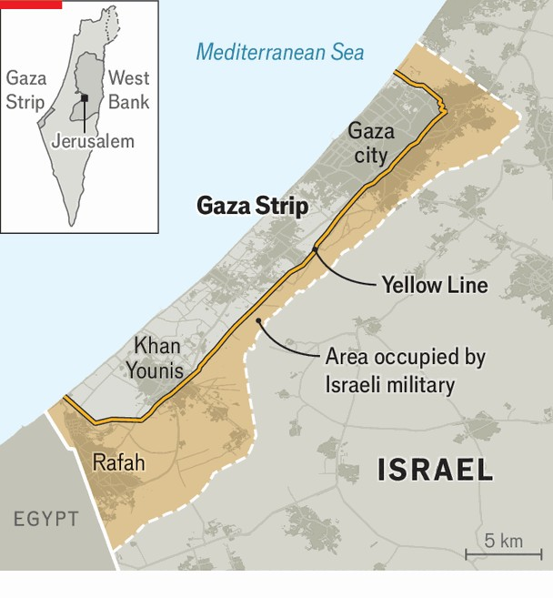

Middle East & Africa | What’s next for Gaza?
Donald Trump’s peace plan is faltering in the chaos of Gaza
But American officials insist the strip has a bright future
December 18th 2025

Rafah was once the third-largest city in the Gaza Strip. It was home to around 200,000 people. Today it is a desolate moonscape of rubble and twisted iron. The city and its suburbs were systematically destroyed by the Israel Defence Forces (idf) during the two-year war against Hamas. Rafah’s population was forced to move to tents in squalid refugee camps on the coast which are now being battered and flooded by winter storms. But to hear American officials talk, Rafah is about to become the bright new future of Gaza. The State Department recently posted a video showing it rising from the ashes. Boosters point to two Israeli engineering projects as evidence. First, the idf’s one to destroy the labyrinthine network of tunnels

built by Hamas, the Islamists who still control parts of the territory. Second, a plan, already started, to clear thousands of tonnes of rubble in two parts of what used to be eastern Rafah to make way for what the Americans are calling “planned communities”.

The Economist has recently visited the Yellow Zone—the half of Gaza’s territory still occupied by Israel—twice, both times accompanied by Israeli soldiers. idf officers were sceptical either project would ever be completed. “We’re still surprised at the size and complexity of tunnels we’re uncovering,” said one engineer. “We don’t have the capacity to destroy them all.” Israeli officers were even more dismissive of the new planned communities.

The ceasefire process that began in October as part of a 20-point plan presented by Donald Trump seems stuck in the mud and chaos of Gaza. In the first phase, Israel withdrew from the populated coastal areas. Israeli hostages and Palestinian prisoners were exchanged. Some aid deliveries resumed. But things have now stalled.

The second phase of Mr Trump’s plan was meant to include the deployment of an International Stabilisation Force (isf), the appointment of a technocratic civilian government and the disarmament of Hamas. So far

none of this has happened. The names of the technocrats have yet to be released. No country has publicly pledged to send troops for the isf. Hamas has reasserted its grip on the civilian population. It has made vague statements about disarming, but taken no steps to do so.

This was to be the prelude to the reconstruction of the devastated strip, which is expected to take years and cost tens of billions of dollars. But that will not happen without Hamas disarming and a new governing body being in place. Donors will not pay to rebuild things if they fear Israel could destroy it all in another war. And Israel will not allow building materials in.

Meanwhile, there have been multiple infractions of the ceasefire with ambushes of Israeli troops by Hamas along the Yellow Line and regular Israeli attacks there and deeper into Gaza. On December 13th an Israeli strike killed Raad Saed, a senior Hamas commander who Israel claims was working to rebuild the group’s missile-manufacturing capabilities and helped plan the October 7th attacks. Nearly 400 Palestinians are reported to have been killed by the IDF since the ceasefire began.

And yet despite all indications that the ceasefire has merely been a transition to a low-level bitter war of attrition, American officials seem convinced that Mr Trump’s plan is moving forward. The “Board of Peace” he plans to chair will be announced very soon, they promise. The isf and Gaza’s new technocratic government will materialise any day, they insist. American contractors with close ties to the administration have already visited the area, sniffing for opportunities.

Behind the scenes, however, disagreements between Israel and America on how to implement the next stage are deepening. The administration wants to use its planned communities—compounds of prefabricated homes that will include schools and clinics—as a proof of concept. These compounds will take months to build and provide homes for only a fraction of the population. But the administration believes they will show it can fulfil much more ambitious reconstruction plans. They envisage Israel withdrawing from the areas around the new compounds and isf troops securing them while talks continue over Hamas’s disarmament.

Israel sees things differently. It shows no sign of withdrawing. Lieutenant General Eyal Zamir, the idf’s chief of staff, has called the Yellow Line a new border. Binyamin Netanyahu, the prime minister, wants the idf to control access to the compounds and allow in only Gazans who have been screened by Israel. Sources close to Mr Netanyahu claim this is the only way to isolate Hamas and force it to disarm—though another military campaign, they say, may also be needed. Israel’s security types are less convinced. “There’s absolutely no way we’re going to get enough Gazans to move to the Yellow Zone” to allow for this, says one official.

Another major point of contention between the Israelis and the Americans is the inclusion of Turkey in the isf. For Israel, this is a red line. The Turkish government has hosted Hamas leaders and imposed a trade embargo on Israel. Mr Trump, however, has grown closer to Turkey’s president, Recep Tayyip Erdogan, and is eager to take advantage of his aspirations to be a power in Gaza.

Mr Trump has summoned Mr Netanyahu to Mar-a-Lago, his Florida home, on December 29th. The president is expected to press him to accept his version of the second stage of his peace plan. “Netanyahu can’t fold on the Turkish issue,” predicts one Israeli diplomat. “But he will have to concede on other matters.” Mr Trump, who wants some big announcements on Gaza in January, is losing patience. ■

Sign up to the Middle East Dispatch, a weekly newsletter that keeps you in the loop on a fascinating, complex and consequential part of the world.

This article was downloaded by zlibrary from https://www.economist.com//middle-east-and-africa/2025/12/17/donald-trumps-peace- plan-is-faltering-in-the-chaos-of-gaza