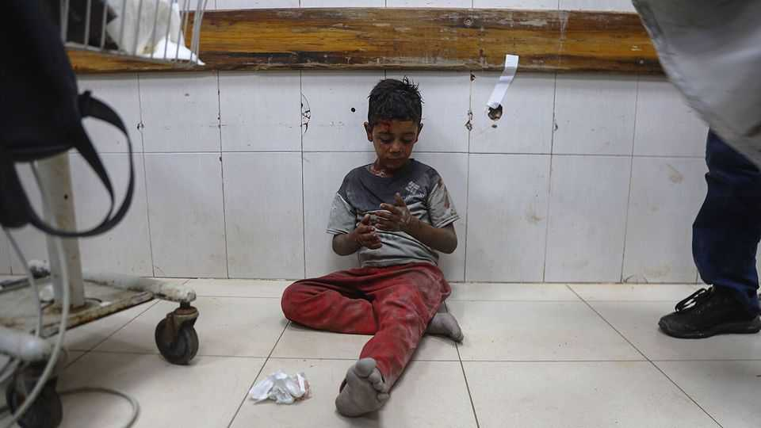
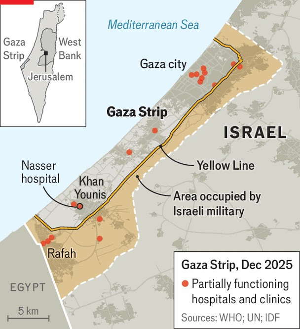

Middle East & Africa | On its knees
Just 74 intensive-care beds remain in Gaza
The health-care system is shattered and no one is rebuilding it
December 18th 2025

To grasp the magnitude of the task of rebuilding Gaza, look at its health-care system. From buildings to medics, it is shattered. Out of 35 hospitals and clinics in Gaza evaluated by the un, six have been flattened; 11 are out of commission; only parts of 18 can be used. Several hospitals are in the half of the strip controlled by Israel, out of reach for most Palestinians. Of the 18 partially functioning hospitals and clinics, 16 cannot dispose of infectious waste properly, 15 do not have dependable electricity, 13 lack decent toilets and sinks and 11 lack reliable clean water. In Gaza just 74 intensive-care beds and 215 emergency-room beds remain. Supplies of everything from fuel and drugs to bags of saline, syringe needles and gauze are scarce or non-existent. There are no mri machines in northern

Gaza and just one functional ct scanner. Newborns in critical condition have to share incubators. At Nasser hospital in Khan Younis, the largest in the south, the glass on the main autoclave, used to sterilise equipment, was shattered by a bullet during the war and has not been replaced. Medics dealing with amputations, burns and limb or spinal trauma have just five sets of skin-grafting surgical tools in the entire strip. “Normally each hospital would have at least four,” says Dr Victoria Rose, a British surgeon who has been into Gaza three times since October 2023.

Israel still prevents anything it considers “dual use” from entering Gaza. That includes surgical instruments, x-ray equipment and solar-powered refrigerators used to store drugs. The list of dual-use items is unclear and inconsistent. Aid workers say Israeli officials confiscate stethoscopes and operating glasses.

At least 1,722 health-care workers were killed during the war, about 10% of the workforce. About 80 who were arrested are thought to remain in Israeli jails. Many more fled. Those left have been working flat out, enduring the same air strikes, food and water shortages as all Gazans.

Nor can Gazans easily get medical help elsewhere. Before October 2023 between 50 and 100 patients would leave the strip every day for treatments

such as radiotherapy in East Jerusalem and elsewhere. Since then 10,600 patients have been evacuated, the equivalent of about 13 a day. More than 18,500, including 4,000 children, are waiting to leave for treatment, says the World Health Organisation (who). Between July 2024 and October 2025 more than 930 died waiting to be evacuated.

Telemedicine could provide some relief. Specialist teams outside Gaza can offer advice remotely on the right course of action for individual patients, an approach that was used before the latest conflict. Diagnostic tools such as the cad4tb software, which uses artificial intelligence to detect tuberculosis in digital chest x-rays, could speed up screening and treatment.

Nor is the damage only physical. Experts assume that every child in Gaza has suffered trauma that will have a severe impact on their behavioural, mental and emotional development. “They have all had to live under acute life threat every single day,” says Katrin Glatz Brubakk, a Norwegian child psychologist who has been to Gaza twice since August 2024. “They have all lost family members or friends. They have all [seen] people dismembered.”

Children with severe trauma form fewer neural connections in their prefrontal cortex, a part of the brain that is essential to everything from decision-making to learning, problem-solving and emotional regulation. To provide care, “you don’t only need psych wards,” says Dr Glatz Brubakk. “You need to rebuild homes and schools—preferably also a football field.” In other words, some kind of normal life.

Putting the health-care system back together will take years. The who puts the cost at $7bn-8bn. The Hamas-run ministry of health has drawn up a 49- page “early recovery plan” which estimates it will take five years to rebuild a “smarter and more sustainable” system. But removing Hamas from power is central to Donald Trump’s peace plan, so the ministry’s proposal may not be implemented any time soon. In the meantime, Gazans will suffer. ■

Sign up to the Middle East Dispatch, a weekly newsletter that keeps you in the loop on a fascinating, complex and consequential part of the world.

This article was downloaded by zlibrary from https://www.economist.com//middle-east-and-africa/2025/12/18/just-74-intensive- care-beds-remain-in-gaza